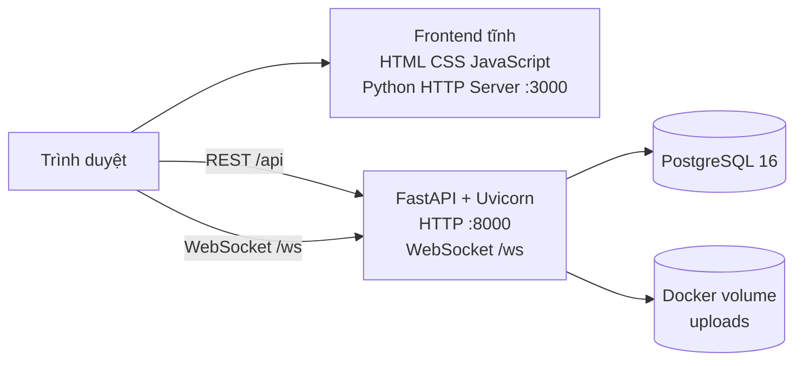
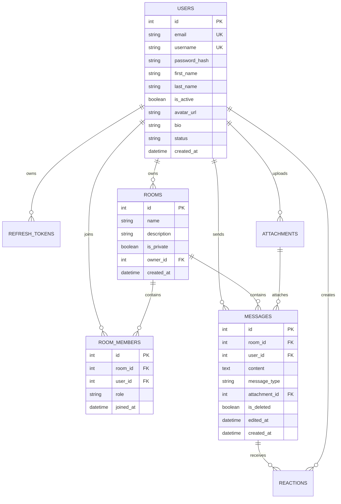

# Team Chat

Hệ thống chat nội bộ theo phòng, hỗ trợ xác thực người dùng, phân quyền thành viên, tin nhắn realtime qua WebSocket, tệp đính kèm, ảnh đại diện và reaction.

Tài liệu này mô tả kiến trúc, đặc tả kỹ thuật, giao diện API và quy trình triển khai của dự án.

## 1. Tổng quan

### 1.1. Mục tiêu

- Cung cấp không gian trao đổi theo phòng công khai hoặc riêng tư.
- Quản lý tài khoản, hồ sơ cá nhân và trạng thái online.
- Gửi tin nhắn văn bản, tệp đính kèm và biểu cảm.
- Cập nhật tin nhắn, thành viên và trạng thái typing theo thời gian thực.
- Tách biệt lớp API, nghiệp vụ, domain, persistence và hạ tầng để dễ bảo trì.

### 1.2. Phạm vi chức năng

| Nhóm | Chức năng |
| --- | --- |
| Tài khoản | Đăng ký, đăng nhập, làm mới phiên, quản lý hồ sơ và avatar |
| Phòng chat | Tạo, xem, cập nhật, xóa phòng; tham gia/rời phòng |
| Thành viên | Mời, xóa, xem danh sách và thay đổi vai trò thành viên |
| Tin nhắn | Gửi, đọc, xóa mềm tin nhắn văn bản hoặc tin nhắn có file |
| Realtime | Kết nối WebSocket, subscribe phòng, typing, cập nhật sự kiện |
| Tệp | Upload attachment, lưu persistent, tải/stream theo quyền truy cập |
| Phản ứng | Toggle reaction trên tin nhắn |

## 2. Kiến trúc hệ thống

Hệ thống gồm ba thành phần triển khai chính:



### 2.1. Backend

Backend chạy bằng FastAPI và Uvicorn, được tổ chức theo các lớp:

```text
backend/app/
├── api/                 # Router, schema HTTP, middleware, dependency wiring
├── domain/              # Entity và interface nghiệp vụ
├── services/            # Use case và luật nghiệp vụ
├── repositories/        # Adapter truy cập dữ liệu qua SQLAlchemy
├── infra/
│   ├── db/              # Engine, session, ORM model
│   ├── realtime/        # ConnectionManager cho WebSocket
│   ├── security/        # JWT và hash mật khẩu
│   └── storage/         # Lưu file cục bộ
└── main.py              # Khởi tạo FastAPI và đăng ký router
```

Luồng xử lý HTTP tiêu chuẩn:

```text
Request
  -> Middleware xác thực
  -> Router
  -> Dependency injection
  -> Service
  -> Domain interface / Repository / Infrastructure adapter
  -> PostgreSQL hoặc file storage
  -> Response schema
```

Service không phụ thuộc trực tiếp vào FastAPI hoặc SQLAlchemy cho logic nghiệp vụ. Repository chịu trách nhiệm chuyển đổi giữa ORM model và domain model.

### 2.2. Frontend

Frontend là ứng dụng tĩnh, không dùng bundler hoặc framework JavaScript:

```text
frontend/
├── index.html       # Layout đăng nhập, chat, modal và các view chính
├── css/style.css    # CSS bổ sung
└── js/
    ├── api.js       # REST client, token, refresh, upload/download
    ├── app.js       # Vòng đời ứng dụng và điều phối sự kiện
    ├── messages.js  # Tin nhắn, file, reaction, typing
    ├── profile.js   # Hồ sơ người dùng và avatar
    ├── rooms.js     # Phòng và thành viên
    ├── ui.js        # Tiện ích giao diện
    └── ws.js        # WebSocket, reconnect và subscribe phòng
```

Frontend dùng Tailwind CDN trong `index.html` kết hợp với `frontend/css/style.css`. Địa chỉ backend được suy ra từ hostname hiện tại:

```text
REST:      http://<hostname>:8000/api
WebSocket: ws://<hostname>:8000/ws
```

Do đó, khi chạy theo cấu hình hiện tại, frontend và backend cần được truy cập qua cùng hostname và backend phải lắng nghe ở cổng `8000`.

### 2.3. Docker và triển khai

`docker-compose.yml` định nghĩa hai service:

| Service | Công nghệ | Cổng | Persistent data |
| --- | --- | --- | --- |
| `db` | PostgreSQL 16 Alpine | Host `5432` -> container `5432` | Volume `pgdata` |
| `backend` | Python 3.11 + Uvicorn | Host `${PORT:-8000}` -> container `8000` | Volume `uploads` |

Đặc điểm container backend:

- Chờ database đạt trạng thái healthy trước khi khởi động.
- Chạy bằng user non-root `appuser`.
- Mount mã nguồn `./backend:/app` trong môi trường phát triển.
- Lưu file tại `/app/uploads` và ánh xạ vào named volume `uploads`.
- Frontend chưa chạy trong Docker Compose; phải chạy riêng bằng Python HTTP Server.

## 3. Đặc tả giao diện

### 3.1. Địa chỉ dịch vụ

| Thành phần | URL mặc định | Mô tả |
| --- | --- | --- |
| Frontend | `http://localhost:3000` | Giao diện người dùng |
| Backend API | `http://localhost:8000` | REST API |
| Swagger UI | `http://localhost:8000/docs` | Tài liệu API tương tác |
| ReDoc | `http://localhost:8000/redoc` | Tài liệu API dạng ReDoc |
| OpenAPI | `http://localhost:8000/api/openapi.json` | Đặc tả OpenAPI |
| Health check | `http://localhost:8000/health` | Kiểm tra trạng thái backend |
| WebSocket | `ws://localhost:8000/ws` | Kênh realtime |

### 3.2. REST API

Các endpoint nghiệp vụ đều nằm dưới prefix `/api`. Những endpoint cần xác thực nhận header:

```http
Authorization: Bearer <access_token>
```

#### Xác thực

| Method | Endpoint | Mô tả |
| --- | --- | --- |
| `POST` | `/api/auth/register` | Tạo tài khoản |
| `POST` | `/api/auth/login` | Đăng nhập và cấp token |
| `POST` | `/api/auth/refresh` | Rotation refresh token |

#### Phòng và thành viên

| Method | Endpoint | Mô tả |
| --- | --- | --- |
| `POST` | `/api/rooms` | Tạo phòng |
| `GET` | `/api/rooms` | Liệt kê phòng được phép xem |
| `GET` | `/api/rooms/{room_id}` | Xem thông tin phòng |
| `PATCH` | `/api/rooms/{room_id}` | Cập nhật tên/mô tả |
| `DELETE` | `/api/rooms/{room_id}` | Xóa phòng |
| `POST` | `/api/rooms/{room_id}/join` | Tham gia phòng công khai |
| `DELETE` | `/api/rooms/{room_id}/leave` | Rời phòng |
| `GET` | `/api/rooms/{room_id}/members` | Liệt kê thành viên |
| `POST` | `/api/rooms/{room_id}/members` | Mời thành viên |
| `DELETE` | `/api/rooms/{room_id}/members/{user_id}` | Xóa thành viên |
| `PATCH` | `/api/rooms/{room_id}/members/{user_id}/role` | Đổi vai trò |

Quyền thành viên theo thứ tự: `OWNER > ADMIN > MEMBER`. Phòng công khai có thể được tìm thấy bởi mọi user đã đăng nhập; phòng riêng chỉ hiển thị với thành viên.

#### Tin nhắn và file

| Method | Endpoint | Mô tả |
| --- | --- | --- |
| `POST` | `/api/rooms/{room_id}/messages` | Gửi tin nhắn văn bản |
| `POST` | `/api/rooms/{room_id}/messages/upload` | Gửi tin nhắn kèm file |
| `GET` | `/api/rooms/{room_id}/messages` | Lấy lịch sử tin nhắn |
| `DELETE` | `/api/messages/{message_id}` | Xóa mềm tin nhắn |
| `POST` | `/api/messages/{message_id}/reactions` | Toggle reaction |
| `GET` | `/api/attachments/{attachment_id}` | Stream hoặc tải file |

Giới hạn nghiệp vụ chính:

- Nội dung tin nhắn tối đa 4000 ký tự.
- File đính kèm tối đa 25 MB.
- Reaction hợp lệ: `👍`, `❤️`, `😂`, `😮`, `😢`, `🎉`.
- File ảnh, video và audio được stream inline; loại file khác được tải xuống.

#### Người dùng

| Method | Endpoint | Mô tả |
| --- | --- | --- |
| `GET` | `/api/users/me` | Lấy hồ sơ hiện tại |
| `PATCH` | `/api/users/me` | Cập nhật hồ sơ |
| `POST` | `/api/users/me/avatar` | Upload avatar |
| `GET` | `/api/users/search?q=...` | Tìm người dùng |
| `GET` | `/api/users/online` | Danh sách user online |
| `GET` | `/api/users/{user_id}` | Xem hồ sơ người dùng |
| `GET` | `/api/users/{user_id}/avatar` | Lấy avatar |

Avatar chỉ nhận JPEG, PNG, GIF hoặc WEBP, tối đa 5 MB. Endpoint avatar được thiết kế public để trình duyệt có thể tải ảnh trực tiếp.

### 3.3. WebSocket protocol

Kết nối bằng access token trên query string:

```text
ws://<host>:8000/ws?token=<access_token>
```

Token nằm trên query string vì trình duyệt không cho tùy biến header `Authorization` khi khởi tạo WebSocket.

Các action client gửi:

```json
{"action":"subscribe","room_id":1}
{"action":"unsubscribe","room_id":1}
{"action":"typing","room_id":1}
{"action":"ping"}
```

Các event server phát:

- `connected`
- `message.created`
- `message.deleted`
- `reaction.updated`
- `user.typing`
- `room.member_joined`
- `room.member_left`
- `room.role_changed`
- `room.updated`
- `room.deleted`
- `error`

`ConnectionManager` lưu kết nối, subscription và trạng thái online trong memory của process backend hiện tại.

## 4. Xác thực và bảo mật

### 4.1. Luồng xác thực

1. Đăng ký tạo user mới; mật khẩu được hash bằng Passlib/bcrypt.
2. Đăng nhập kiểm tra email và mật khẩu.
3. Backend cấp JWT access token và refresh token ngẫu nhiên.
4. Database chỉ lưu SHA-256 hash của refresh token.
5. Middleware xác thực access token và gắn `request.state.user_id`.
6. Frontend lưu access token, refresh token và user hiện tại trong `localStorage`.
7. Khi nhận HTTP `401`, frontend gọi `/api/auth/refresh`, cập nhật token và retry request một lần.
8. Refresh token được rotation và có thời hạn 7 ngày.

Access token hiện được tạo với thời hạn 60 phút trong `backend/app/infra/security/jwt.py`. Biến `ACCESS_TOKEN_EXPIRE_MINUTES` có trong cấu hình nhưng cần được kiểm tra nếu muốn dùng làm nguồn cấu hình thực tế.

### 4.2. Lưu trữ file

- `LocalFileStorage` lưu file trong `UPLOAD_DIR`.
- Tên vật lý trên đĩa được thay bằng UUID và giữ phần mở rộng.
- Có kiểm tra path traversal.
- Attachment lưu metadata trong database.
- Docker named volume `uploads` giúp dữ liệu file tồn tại qua lần recreate container.

## 5. Mô hình dữ liệu



Các bảng chính:

- `users`: tài khoản và hồ sơ cá nhân.
- `refresh_tokens`: refresh token đã hash, thời hạn và trạng thái thu hồi.
- `rooms`: thông tin phòng và chủ phòng.
- `room_members`: quan hệ nhiều-nhiều giữa user và room, kèm role.
- `messages`: nội dung tin nhắn, loại tin, trạng thái xóa mềm và attachment.
- `attachments`: metadata file và người upload.
- `reactions`: reaction theo user và emoji.

Ràng buộc đáng chú ý:

- Email và username là duy nhất.
- Một user chỉ có một membership trong một room.
- Một user chỉ thả một reaction cùng loại trên một message.
- Quan hệ user/room/message chính dùng `ON DELETE CASCADE`.
- Khi attachment bị xóa, `messages.attachment_id` được đặt thành `NULL`.
- Schema được tạo bằng `Base.metadata.create_all()`; dự án hiện chưa dùng migration framework.

## 6. Cấu hình môi trường

Tạo file `.env` từ `.env.example` và thay các giá trị bí mật trước khi triển khai.

| Biến | Mặc định/ý nghĩa |
| --- | --- |
| `PROJECT_NAME` | Tên API |
| `ENVIRONMENT` | Môi trường chạy |
| `PORT` | Cổng host map vào backend, mặc định `8000` |
| `POSTGRES_USER` | User PostgreSQL |
| `POSTGRES_PASSWORD` | Mật khẩu PostgreSQL |
| `POSTGRES_DB` | Tên database |
| `POSTGRES_HOST` | Host database |
| `POSTGRES_PORT` | Cổng database |
| `DATABASE_URL` | Chuỗi kết nối SQLAlchemy |
| `JWT_SECRET_KEY` | Secret ký JWT, phải đủ dài và bí mật |
| `JWT_ALGORITHM` | Thuật toán JWT, mặc định `HS256` |
| `ACCESS_TOKEN_EXPIRE_MINUTES` | Cấu hình thời hạn access token |
| `UPLOAD_DIR` | Thư mục lưu file, mặc định `/app/uploads` |
| `MAX_UPLOAD_BYTES` | Kích thước upload tối đa, mặc định 25 MB |
| `CORS_ORIGINS` | Danh sách origin phân tách bằng dấu phẩy; `*` cho development |

Không commit `.env` hoặc secret thật vào repository.

## 7. Khởi động hệ thống

### 7.1. Điều kiện

- Docker Engine và Docker Compose.
- Python 3.11 trở lên nếu chạy frontend ngoài Docker.
- Cổng `3000`, `8000` và `5432` không bị tiến trình khác chiếm.

### 7.2. Khởi động backend và database

```bash
docker compose up -d
docker compose ps
```

Nạp dữ liệu mẫu:

```bash
docker compose exec backend python seed_users.py
```

`seed_users.py` tạo các tài khoản demo, phòng mẫu, membership và tin nhắn mẫu. Mật khẩu demo hiện là `password123`; chỉ dùng trong môi trường kiểm thử.

### 7.3. Khởi động frontend

```bash
cd frontend
python3 -m http.server 3000 --bind 0.0.0.0
```

Mở `http://localhost:3000`. Thiết bị trong cùng mạng LAN dùng `http://<IP-máy-chạy-server>:3000`.

`http.server` của Python đã bật `allow_reuse_address`. Nếu vẫn gặp `Address already in use`, kiểm tra và dừng tiến trình cũ:

```bash
ss -ltnp | grep ':3000'
kill <PID>
```

### 7.4. Dừng hoặc reset dữ liệu

```bash
# Dừng container, giữ nguyên volume
docker compose down

# Xóa cả volume database và upload; dữ liệu sẽ mất
docker compose down -v
```

## 8. Cây thư mục rút gọn

```text
team-chat/
├── backend/
│   ├── app/
│   │   ├── api/
│   │   ├── domain/
│   │   ├── infra/
│   │   ├── repositories/
│   │   ├── services/
│   │   └── main.py
│   ├── Dockerfile
│   ├── requirements.txt
│   └── seed_users.py
├── frontend/
│   ├── index.html
│   ├── css/style.css
│   └── js/
├── docker-compose.yml
├── .env.example
├── RUN_GUIDE.md
└── README.md
```

## 9. Giới hạn và lưu ý triển khai

- CORS mặc định là `*`, phù hợp development nhưng cần giới hạn origin khi production.
- Frontend hiện dùng `http://` và `ws://`; khi triển khai HTTPS cần reverse proxy và `https://`/`wss://` tương ứng.
- Presence và WebSocket chỉ lưu trong memory của một backend process; chưa có Redis Pub/Sub, vì vậy chưa phù hợp scale ngang nhiều instance.
- Chưa có migration framework. Thay đổi schema cần có quy trình migration riêng hoặc reset database trong development.
- Backend container map cổng host theo `PORT`, trong khi Uvicorn bên trong container vẫn lắng nghe cổng `8000`.
- Attachment cần Bearer token khi truy cập. Quyền truy cập attachment nên được rà soát thêm nếu triển khai production nhiều tenant/phòng.
- Secret JWT, mật khẩu PostgreSQL và tài khoản demo phải được thay đổi trong môi trường thật.

## 10. Tài liệu liên quan

- [Hướng dẫn vận hành chi tiết](RUN_GUIDE.md)
- [Cấu hình mẫu](.env.example)
- [Docker Compose](docker-compose.yml)
- [Backend entrypoint](backend/app/main.py)
- [Database models](backend/app/infra/db/models.py)
