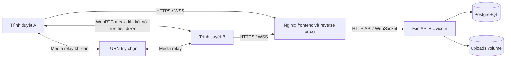
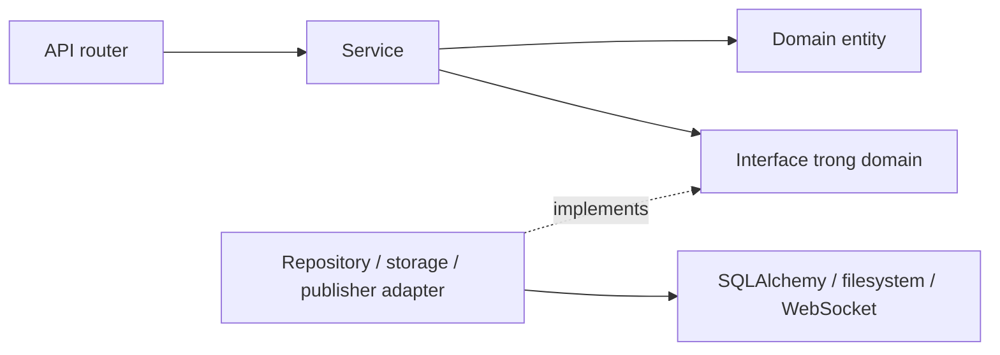
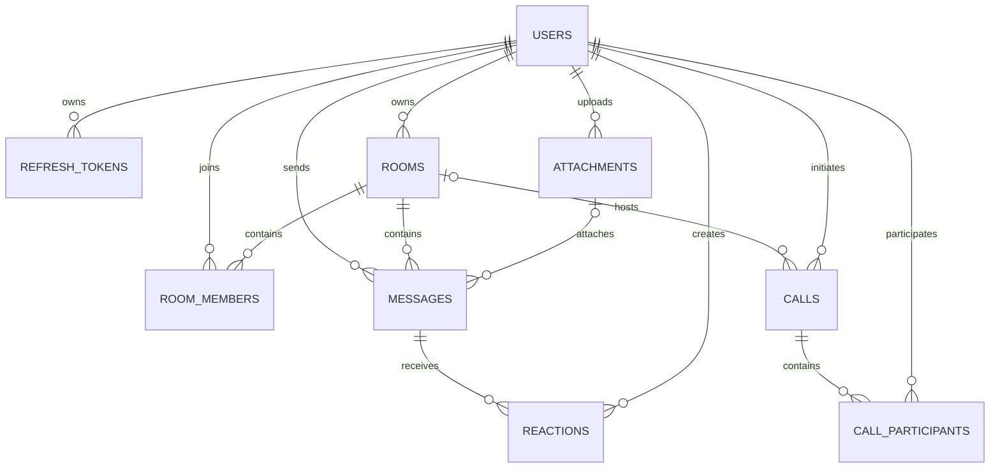

# Team Chat

Ứng dụng chat nội bộ theo phòng. Hệ thống có tài khoản, phòng công khai/riêng tư, phân quyền thành viên, tin nhắn và tệp đính kèm, cập nhật realtime qua WebSocket, gọi thoại/video qua WebRTC.

Backend là **monolith có phân tầng**, sử dụng FastAPI, PostgreSQL và SQLAlchemy. Frontend HTML/CSS/JavaScript được Nginx phục vụ qua HTTPS. Docker Compose chạy ba service mặc định: `db`, `backend`, `web`; có thêm `turn` tùy chọn.

## 1. Chức năng và công nghệ

| Nhóm | Phần đã triển khai trong mã |
|---|---|
| Tài khoản | Đăng ký, đăng nhập email/mật khẩu, Google ID token login, access JWT và rotation refresh token |
| Hồ sơ | Xem/sửa hồ sơ, avatar, bio, trạng thái cá nhân, tìm kiếm người dùng |
| Phòng | Phòng công khai/riêng tư, danh sách phòng, sửa/xóa, tham gia/rời phòng, avatar và màu phòng|
| Thành viên | Mời/xóa thành viên, vai trò OWNER/ADMIN/MEMBER, nickname theo phòng |
| Tin nhắn | Gửi/đọc, trả lời, chỉnh sửa, xóa mềm, ghim/bỏ ghim, tin SYSTEM |
| File và reaction | Tin nhắn có file, tải/stream attachment, danh sách media, bật/tắt reaction |
| Realtime | Sự kiện message/room/user/call, online/offline, typing, reconnect và subscribe phòng |
| Cuộc gọi | Gọi thoại/video 1–1 và theo phòng, tham gia/rời nhóm, lịch sử cuộc gọi, signaling WebRTC |

Giới hạn hiện tại: nội dung tin nhắn tối đa **4.000 ký tự tại API schema**; attachment tối đa **25 MiB**; avatar tối đa **5 MiB**, nhận JPEG/PNG/GIF/WEBP; cuộc gọi nhóm tối đa **6 người**. Reaction hợp lệ: 👍 ❤️ 😂 😮 😢 🎉.

| Thành phần | Công nghệ |
|---|---|
| Backend | Python 3.11 trong Docker, FastAPI, Uvicorn |
| Validation/config | Pydantic, pydantic-settings |
| Persistence | PostgreSQL 16, SQLAlchemy, Psycopg 3 |
| Security | bcrypt trực tiếp, PyJWT, google-auth |
| Frontend | HTML, CSS, JavaScript thuần, Tailwind CDN; không có bước build frontend |
| Realtime/media | WebSocket, WebRTC mesh, STUN/TURN |
| Triển khai | Docker Compose, Nginx, OpenSSL; coturn tùy chọn |

## 2. Chạy bằng Docker Compose

### 2.1. Chuẩn bị

- Docker Engine/Desktop và Docker Compose đang hoạt động.
- Các cổng mặc định `80`, `443`, `8000`, `5432` và cổng tunnel trên loopback `8080` còn trống, hoặc đổi cổng trong `.env`.
- Có mạng để tải image, dependency và các tài nguyên CDN/dịch vụ bên ngoài.

Nếu chưa có source:

```bash
git clone https://github.com/Dungx1107/team-chat.git
cd team-chat
```

Các lệnh Compose bên dưới chạy tại thư mục chứa `docker-compose.yml`.

### 2.2. Tạo cấu hình lần đầu

Chỉ sao chép khi chưa có `.env`; giữ cấu hình hiện có nếu project đã được thiết lập.

PowerShell:

```powershell
Copy-Item .env.example .env
```

Bash:

```bash
cp .env.example .env
```

### 2.3. Khởi động

```bash
docker compose up -d --build
docker compose up -d --build
docker compose ps
docker compose logs --tail=100 backend web
```

`backend` chờ `db` healthy. Khi khởi động, backend tạo các bảng chưa có và thực hiện một số câu ALTER tương thích schema. Nginx tạo chứng chỉ tự ký khi volume `certs` chưa có chứng chỉ.

| Địa chỉ mặc định | Mục đích |
|---|---|
| `https://localhost` | Giao diện qua Nginx |
| `https://localhost/docs` | Swagger UI |
| `https://localhost/redoc` | ReDoc |
| `https://localhost/api/openapi.json` | OpenAPI |
| `https://localhost/health` | Trạng thái process backend |
| `wss://localhost/ws?token=<access_token>` | Kết nối realtime |
| `http://localhost:8000/docs` | Truy cập backend trực tiếp khi phát triển |

Chứng chỉ mặc định là tự ký; thiết bị demo cần tin cậy/chấp nhận chứng chỉ và cấp quyền camera/micro. `/health` trả trạng thái ứng dụng và số user online trong process, **không phải** kiểm tra toàn diện DB/storage/media.

### 2.4. Dữ liệu mẫu

Sau khi backend khởi động thành công:

```bash
docker compose exec backend python seed_users.py
```

Trên DB mới, script tạo các tài khoản dưới đây, dùng chung mật khẩu demo **`password123`**:

| Email | Username | Vai trò trong Phòng Kiến Trúc |
|---|---|---|
| `user1@example.com` | `dungx` | OWNER |
| `user2@example.com` | `namtv` | ADMIN |
| `user3@example.com` | `anhlh` | MEMBER |
| `user4@example.com` | `maipt` | Chưa được script thêm vào phòng |

Script còn tạo phòng riêng tư **Nhóm Trưởng** cho user1 và user2, cùng tin nhắn mẫu. Script bỏ qua tài khoản/phòng đã tồn tại; không bảo đảm sửa lại mọi trạng thái nếu dữ liệu demo đã bị thay đổi. 

### 2.5. Dừng và chạy lại

```bash
docker compose down
docker compose up -d
```

`down` giữ named volume. **`docker compose down -v` xóa cả dữ liệu PostgreSQL, file upload và chứng chỉ trong các volume của project**; không dùng lệnh này như bước cập nhật schema thông thường.

## 3. Cấu hình môi trường

Nguồn cấu hình: `.env.example`, `backend/app/config.py` và `docker-compose.yml`. Có biến được code hỗ trợ nhưng chưa có dòng mẫu trong `.env.example`; có thể bổ sung vào `.env`.

| Biến | Vai trò và hành vi hiện tại |
|---|---|
| `PROJECT_NAME` | Tên hiển thị của API |
| `ENVIRONMENT` | Có trong file mẫu; chưa được `Settings` sử dụng để bật/tắt chế độ ứng dụng |
| `PORT` | Cổng host của backend, mặc định 8000; Uvicorn trong container luôn nghe 8000 |
| `POSTGRES_USER`, `POSTGRES_PASSWORD`, `POSTGRES_DB` | Khởi tạo PostgreSQL và dựng URL kết nối của backend trong Compose |
| `POSTGRES_PORT` | Cổng PostgreSQL trên host, mặc định 5432; backend trong Docker vẫn gọi `db:5432` |
| `POSTGRES_HOST` | Có trong file mẫu; Compose hiện cố định host backend kết nối là `db` |
| `DATABASE_URL` | URL SQLAlchemy; khi chạy Compose bị giá trị `backend.environment` ghi đè |
| `JWT_SECRET_KEY`, `JWT_ALGORITHM` | Secret và thuật toán ký/kiểm tra JWT, mặc định thuật toán HS256 |
| `ACCESS_TOKEN_EXPIRE_MINUTES` | `Settings` mặc định 1440, nhưng hàm cấp access token hiện dùng 60 phút; chỉnh biến này chưa tự đổi TTL |
| `UPLOAD_DIR` | Thư mục file; Compose ghi đè thành `/app/uploads` và gắn volume `uploads` |
| `MAX_UPLOAD_BYTES` | Có trong Settings nhưng giới hạn attachment hiện nằm tại entity, 25 MiB |
| `CORS_ORIGINS` | `*` hoặc danh sách origin phân cách bằng dấu phẩy; mặc định `*` |
| `GOOGLE_CLIENT_ID` | Audience dùng xác minh Google ID token; cần đồng bộ với client ID phía frontend |
| `WS_IDLE_TIMEOUT_SECONDS` | Thời gian không nhận frame từ client trước khi đóng socket, mặc định 90 giây |
| `HTTPS_PORT`, `HTTP_PORT` | Cổng host Nginx, mặc định 443/80 |
| `CERT_IPS` | Danh sách IP LAN cách nhau bằng dấu phẩy, dùng khi tạo chứng chỉ lần đầu |
| `TUNNEL_PORT` | Cổng HTTP Nginx chỉ map trên `127.0.0.1`, mặc định 8080 |
| `ICE_SERVERS` | Danh sách STUN/TURN cho WebRTC |
| `TURN_EXTERNAL_IP`, `TURN_USER`, `TURN_PASSWORD` | Cấu hình coturn khi bật profile `turn` |

### Google login

Backend nhận `credential` từ frontend, xác minh Google ID token rồi cấp bộ token của ứng dụng. Để dùng OAuth client của nhóm:

1. Cấu hình origin truy cập ứng dụng trong OAuth client Google của nhóm.
2. Đặt `GOOGLE_CLIENT_ID` tương ứng ở backend.
3. Cập nhật `client_id` trong `initGoogleSignIn()` của `frontend/js/app.js` cho trùng nhau.
4. Recreate backend sau khi thay `.env` và tải lại frontend.

Frontend hiện chứa client ID trực tiếp trong JavaScript; chỉ sửa `.env` chưa cập nhật được phía frontend. Đăng nhập email/mật khẩu là luồng riêng, không cần cấu hình Google.

### STUN/TURN

Code chấp nhận dạng ngắn:

```dotenv
ICE_SERVERS=stun:stun.l.google.com:19302,turn:turn.example.com:3478|USERNAME|PASSWORD
```

Hoặc JSON một dòng:

```dotenv
ICE_SERVERS=[{"urls":"stun:stun.l.google.com:19302"},{"urls":"turn:turn.example.com:3478","username":"USERNAME","credential":"PASSWORD"}]
```

Để thử coturn kèm project, đặt IP/credential của máy chủ, thêm URL TURN tương ứng vào `ICE_SERVERS`, rồi chạy:

```bash
docker compose --profile turn up -d
docker compose exec backend python check_turn.py
```

Bật container `turn` **không tự thêm** TURN vào `ICE_SERVERS`. Service này dùng `network_mode: host`; khả năng truy cập phụ thuộc cấu hình Docker/network của máy. Coturn được cấu hình cổng 3478 và dải relay 50000–50010. Chẩn đoán STUN/TURN không thay thế việc thử media giữa hai thiết bị thực tế.

## 4. Kiến trúc và tổ chức mã nguồn

### 4.1. Sơ đồ triển khai

```mermaid
flowchart LR
    A[Trình duyệt A] -->|HTTPS / WSS| W[Nginx: frontend và reverse proxy]
    B[Trình duyệt B] -->|HTTPS / WSS| W
    W -->|HTTP API / WebSocket| API[FastAPI + Uvicorn]
    API --> DB[(PostgreSQL)]
    API --> F[(uploads volume)]
    A <-->|WebRTC media khi kết nối trực tiếp được| B
    A <-->|Media relay khi cần| T[TURN tùy chọn]
    T <-->|Media relay| B
```

Nginx phục vụ frontend, kết thúc TLS và proxy `/api`, `/ws`, tài liệu API và health sang backend. Compose cũng publish cổng backend và DB ra host, nên Nginx không phải đường truy cập duy nhất được cấu hình. Backend xử lý nghiệp vụ và signaling; không chuyển tiếp luồng âm thanh/video như SFU.

### 4.2. Phân tầng và hướng phụ thuộc

| Phần | Trách nhiệm | Thành phần |
|---|---|---|
| API | HTTP/WS, schema, status code, nhận danh tính, wiring dependency | Router, 28 schema Pydantic, middleware, dependency factory |
| Service | Điều phối use case, quyền, phối hợp repository/storage/event | 5 service |
| Domain | Entity, hành vi nghiệp vụ, contract truy cập hạ tầng | 9 entity và 9 interface |
| Repository | Query SQLAlchemy, ghi dữ liệu, mapping domain ↔ ORM | 7 implementation |
| Infrastructure | Session/ORM, JWT/bcrypt, filesystem, socket | DB, security, LocalFileStorage, ConnectionManager |


```mermaid
flowchart LR
    API[API router] --> S[Service]
    S --> D[Domain entity]
    S --> P[Interface trong domain]
    R[Repository / storage / publisher adapter] -. implements .-> P
    R --> I[SQLAlchemy / filesystem / WebSocket]
```

Sơ đồ trên biểu diễn **phụ thuộc mã nguồn**. Khi thực thi, service gọi phương thức interface trên object implementation đã được inject, rồi implementation thao tác DB/file/socket.

| Service | Dependency nghiệp vụ/hạ tầng được inject |
|---|---|
| `AuthService` | IUserRepository, IRefreshTokenRepository, IRoomRepository |
| `RoomService` | IRoomRepository, IUserRepository, IEventPublisher, IFileStorage |
| `MessageService` | IMessageRepository, IRoomRepository, IAttachmentRepository, IReactionRepository, IFileStorage, IEventPublisher |
| `UserService` | IUserRepository, IFileStorage, IEventPublisher |
| `CallService` | ICallRepository, IRoomRepository, IUserRepository, IEventPublisher |

Các factory `get_auth_service`, `get_room_service`, `get_message_service`, `get_user_service`, `get_call_service` tạo implementation và truyền vào constructor. `get_db` cấp/đóng session. `LocalFileStorage` implement `IFileStorage`; `ConnectionManager` và `NullEventPublisher` implement `IEventPublisher`.

Các cơ chế được áp dụng: Service Layer, Repository, Data Mapper, DI, DIP qua interface, một số ranh giới ports/adapters, DTO/schema, middleware, RBAC theo phòng, publish/subscribe trong process, Null Object và state machine cuộc gọi.

Ranh giới hiện chưa hoàn toàn nhất quán: router phòng còn truy cập repository và điều phối nickname; WebSocket tự mở session và kiểm tra quyền phòng; AuthService import trực tiếp security/config/Google. Vì vậy cách mô tả phù hợp là **monolith có phân tầng và nhiều yếu tố theo hướng Clean Architecture**. Nhiều container không làm các class service trở thành microservices.

### 4.3. Cấu trúc thư mục

```text
team-chat/
├── backend/
│   ├── app/
│   │   ├── api/
│   │   │   ├── routers/       # auth, rooms, messages, users, calls, ws
│   │   │   ├── schemas/       # Contract Pydantic
│   │   │   ├── middlewares/  # AuthenticationMiddleware
│   │   │   └── dependencies.py
│   │   ├── domain/
│   │   │   ├── models/        # Entity nghiệp vụ
│   │   │   └── interfaces/    # Repository, storage, event ports
│   │   ├── services/          # Auth, Room, Message, User, Call
│   │   ├── repositories/     # Implementation dùng SQLAlchemy
│   │   ├── infra/
│   │   │   ├── db/            # ORM model, engine, session
│   │   │   ├── realtime/      # ConnectionManager
│   │   │   ├── security/      # JWT, password
│   │   │   └── storage/       # LocalFileStorage
│   │   ├── config.py
│   │   └── main.py
│   ├── seed_users.py
│   ├── check_turn.py
│   ├── requirements.txt
│   └── Dockerfile
├── frontend/
│   ├── index.html
│   ├── css/style.css
│   └── js/                   # api, app, rooms, messages, profile, ui, ws, call
├── deploy/nginx/              # Nginx config, Dockerfile, tạo chứng chỉ
├── docs/                     # Tài liệu kỹ thuật theo chủ đề
├── .env.example
├── docker-compose.yml
├── RUN_GUIDE.md
└── README.md
```

## 5. Luồng xử lý chính

### Đăng nhập và gọi API có xác thực

1. Frontend gửi email/mật khẩu tới `POST /api/auth/login`.
2. Router validate schema và gọi AuthService.
3. Service lấy user qua repository, kiểm tra mật khẩu bằng bcrypt và trạng thái tài khoản.
4. Backend cấp access JWT; tạo refresh token ngẫu nhiên và lưu SHA-256 hash vào DB.
5. Frontend lưu token/user trong localStorage. Request sau gửi `Authorization: Bearer <access_token>`.
6. Middleware kiểm tra JWT và gắn `request.state.user_id`; endpoint lấy danh tính qua `get_current_user_id`.
7. Khi request nhận 401, REST client thử refresh và gửi lại một lần. Refresh token cũ bị thu hồi khi rotation thành công.

Access token hiện mặc định **60 phút**, refresh token **7 ngày**. Logout phía frontend xóa phiên cục bộ; chưa có endpoint logout thu hồi phiên phía server.

### Gửi tin nhắn

1. Client gửi `POST /api/rooms/{room_id}/messages` với JSON và Bearer token.
2. MessageService kiểm tra phòng, membership; phòng công khai có thể tự thêm người gửi, phòng riêng tư cần được mời.
3. Nếu trả lời một tin nhắn, service kiểm tra tin gốc thuộc cùng phòng.
4. Tạo domain Message; MessageRepository chuyển sang ORM, lưu DB rồi trả domain entity.
5. Service phát `message.created` và `room.summary_updated` qua IEventPublisher.
6. ConnectionManager chuyển event tới các socket đang subscribe; API đồng thời trả response cho người gửi.

### Gửi file

API nhận multipart → service kiểm tra quyền → LocalFileStorage ghi file bằng tên vật lý UUID → Attachment kiểm tra metadata/size → lưu attachment → lưu message loại FILE → phát event. File không hợp lệ được dọn trong nhánh validation; lỗi DB ở bước sau chưa có cơ chế rollback chung với filesystem.

### Tạo phòng và quản lý thành viên

Ý định use case: tạo Room → lưu phòng → thêm membership OWNER → trả kết quả. Các thao tác sửa/xóa/mời/đổi vai trò kiểm tra RoomMember của người thực hiện.

### Gọi thoại/video

REST tạo/nhận/từ chối/kết thúc call → CallService kiểm tra quyền và chuyển trạng thái domain Call → repository lưu trạng thái/participants → publisher thông báo client. Offer/answer/ICE đi qua action WebSocket `call.signal`. Browser trao đổi media qua WebRTC trực tiếp hoặc TURN. Gọi nhóm dùng mesh, giới hạn 6 người; project chưa có SFU.

## 6. Mô hình dữ liệu

| Domain entity | ORM model | Bảng | Nội dung |
|---|---|---|---|
| User | UserModel | `users` | Tài khoản và hồ sơ |
| RefreshToken | RefreshTokenModel | `refresh_tokens` | Token hash, hạn và trạng thái thu hồi |
| Room | RoomModel | `rooms` | Phòng, owner, quyền riêng tư, avatar, màu |
| RoomMember | RoomMemberModel | `room_members` | Membership, role, nickname |
| Message | MessageModel | `messages` | TEXT/FILE/SYSTEM, reply, pin, trạng thái xóa mềm |
| Attachment | AttachmentModel | `attachments` | Metadata và tên vật lý file |
| Reaction | ReactionModel | `reactions` | User, message và emoji |
| Call | CallModel | `calls` | DIRECT/GROUP, AUDIO/VIDEO, trạng thái và các mốc thời gian |
| CallParticipant | CallParticipantModel | `call_participants` | Người tham gia, trạng thái, thời điểm vào/rời |


```mermaid
erDiagram
    USERS ||--o{ REFRESH_TOKENS : owns
    USERS ||--o{ ROOMS : owns
    USERS ||--o{ ROOM_MEMBERS : joins
    ROOMS ||--o{ ROOM_MEMBERS : contains
    USERS ||--o{ MESSAGES : sends
    ROOMS ||--o{ MESSAGES : contains
    USERS ||--o{ ATTACHMENTS : uploads
    ATTACHMENTS o|--o{ MESSAGES : attaches
    MESSAGES ||--o{ REACTIONS : receives
    USERS ||--o{ REACTIONS : creates
    ROOMS o|--o{ CALLS : hosts
    USERS ||--o{ CALLS : initiates
    CALLS ||--o{ CALL_PARTICIPANTS : contains
    USERS ||--o{ CALL_PARTICIPANTS : participates
```

Email và username là duy nhất. Các cặp/bộ `room_id + user_id`, `message_id + user_id + emoji`, `call_id + user_id` có unique constraint tương ứng. Message có index theo phòng/thời gian và phòng/trạng thái ghim. Các trường `reply_to_id`, `forwarded_from_id` tham chiếu message; có trường trong model không đồng nghĩa đã có đầy đủ API/UI sử dụng trường đó.

Domain chứa luật/hành vi; ORM chứa cấu trúc persistence; Pydantic schema chứa hợp đồng API. Repository ánh xạ giữa domain và ORM. `RoomRepository` quản lý cả membership; `CallRepository` quản lý cả participant, nên số repository không bằng số bảng.

Schema hiện được khởi tạo bằng `create_all()` và một số ALTER tại startup, chưa có migration version. `create_all()` không tự nâng cấp mọi cột/constraint của bảng đã tồn tại.

## 7. Xác thực và phân quyền

HTTP dùng AuthenticationMiddleware kiểm tra access JWT tập trung; `get_current_user_id` lấy danh tính đã được middleware gắn. WebSocket xác thực token riêng lúc mở kết nối. CORSMiddleware xử lý chính sách origin, không thay thế xác thực.

Các endpoint auth, GET avatar user/room, health và tài liệu API được miễn access JWT; login/Google/refresh vẫn tự kiểm tra credential của luồng tương ứng. OPTIONS được cho qua để xử lý preflight. 

| Quyền trong phòng | OWNER | ADMIN | MEMBER |
|---|---|---|---|
| Gửi tin khi có membership hợp lệ | Có | Có | Có |
| Sửa tin của chính mình | Có | Có | Có |
| Xóa tin của chính mình | Có | Có | Có |
| Moderation tin của người khác, ghim/bỏ ghim | Có | Có | Không |
| Sửa thông tin phòng | Có | Có | Không |
| Quản lý thành viên | Có | Có, còn xét thứ bậc mục tiêu | Không |
| Đổi vai trò | Có | Không | Không |
| Xóa phòng | Có | Không | Không |

Vai trò thuộc membership từng phòng, không phải một role toàn hệ thống. Phòng công khai có thể được thấy bởi người đã đăng nhập; phòng riêng chỉ hiển thị cho thành viên. Luồng đọc lịch sử/tải attachment kiểm tra membership.

Mật khẩu được hash bằng bcrypt; code hiện cắt đầu vào ở 72 byte UTF-8 trước khi hash/verify. Refresh token lưu dạng hash trong DB; access JWT chứa `sub`, `exp`, `type`. Tên file vật lý được thay bằng UUID và adapter có kiểm tra đường dẫn. Cơ chế này chưa thay thế việc rà soát phiên, quyền và upload trước triển khai thực tế.

## 8. Danh mục REST API

Có **47 endpoint REST nghiệp vụ**: Auth 4, Rooms 16, Messages 10, Users 7, Calls 10; gồm GET 17, POST 20, PATCH 5, DELETE 5. Ngoài ra có `GET /health`, `/ws` và tài liệu do FastAPI cung cấp.

Các API dùng JSON, trừ upload multipart và response stream/file. Header cho request cần danh tính:

```http
Authorization: Bearer <access_token>
```

Ký hiệu **JWT** dưới đây nghĩa là cần danh tính; quyền tài nguyên vẫn được kiểm tra ở bước nghiệp vụ. **Public** nghĩa là không cần access JWT.

### Auth

| Method | Endpoint | Xác thực | Chức năng |
|---|---|---|---|
| POST | `/api/auth/register` | Public | Đăng ký |
| POST | `/api/auth/login` | Public | Đăng nhập |
| POST | `/api/auth/google` | Public | Xác minh Google credential và đăng nhập |
| POST | `/api/auth/refresh` | Public | Đổi refresh token lấy bộ token mới |

### Rooms và members

| Method | Endpoint | Xác thực | Chức năng |
|---|---|---|---|
| POST | `/api/rooms` | JWT | Tạo phòng |
| GET | `/api/rooms` | JWT | Danh sách phòng được thấy |
| GET | `/api/rooms/{room_id}` | JWT | Chi tiết phòng |
| PATCH | `/api/rooms/{room_id}` | JWT | Sửa phòng — màu|
| DELETE | `/api/rooms/{room_id}` | JWT | Xóa phòng |
| POST | `/api/rooms/{room_id}/avatar` | Guard | Upload avatar phòng |
| GET | `/api/rooms/{room_id}/avatar` | Public | Stream avatar phòng |
| GET | `/api/rooms/{room_id}/active-call` | JWT | Call nhóm đang hoạt động |
| GET | `/api/rooms/{room_id}/media` | JWT | Danh sách media |
| POST | `/api/rooms/{room_id}/join` | JWT | Tham gia phòng công khai |
| DELETE | `/api/rooms/{room_id}/leave` | JWT | Rời phòng |
| GET | `/api/rooms/{room_id}/members` | JWT | Danh sách thành viên |
| POST | `/api/rooms/{room_id}/members` | JWT | Thêm thành viên |
| DELETE | `/api/rooms/{room_id}/members/{user_id}` | JWT | Xóa thành viên |
| PATCH | `/api/rooms/{room_id}/members/{user_id}/role` | JWT | Đổi vai trò |
| PATCH | `/api/rooms/{room_id}/members/{user_id}/nickname` | JWT | Đổi nickname |

### Messages, attachment và reaction

| Method | Endpoint | Xác thực | Chức năng |
|---|---|---|---|
| POST | `/api/rooms/{room_id}/messages` | JWT | Gửi tin văn bản/trả lời |
| POST | `/api/rooms/{room_id}/messages/upload` | JWT | Gửi file qua multipart |
| GET | `/api/rooms/{room_id}/messages` | JWT | Lịch sử tin nhắn |
| GET | `/api/rooms/{room_id}/pinned-messages` | JWT | Danh sách tin ghim |
| DELETE | `/api/messages/{message_id}` | JWT | Xóa mềm tin nhắn |
| PATCH | `/api/messages/{message_id}` | JWT | Sửa tin nhắn |
| POST | `/api/messages/{message_id}/pin` | JWT | Ghim tin |
| DELETE | `/api/messages/{message_id}/pin` | JWT | Bỏ ghim |
| POST | `/api/messages/{message_id}/reactions` | JWT | Toggle reaction |
| GET | `/api/attachments/{attachment_id}` | JWT | Tải/stream attachment |

### Users

| Method | Endpoint | Xác thực | Chức năng |
|---|---|---|---|
| GET | `/api/users/me` | JWT | Hồ sơ hiện tại |
| PATCH | `/api/users/me` | JWT | Sửa hồ sơ |
| POST | `/api/users/me/avatar` | JWT | Upload avatar cá nhân |
| GET | `/api/users/search` | JWT | Tìm user qua query `q` |
| GET | `/api/users/online` | JWT | User online trong process |
| GET | `/api/users/{user_id}` | JWT | Hồ sơ công khai của user |
| GET | `/api/users/{user_id}/avatar` | Public | Stream avatar cá nhân |

### Calls

| Method | Endpoint | Xác thực | Chức năng |
|---|---|---|---|
| GET | `/api/calls/config` | JWT | ICE server, thời gian đổ chuông, giới hạn nhóm |
| POST | `/api/calls` | JWT | Tạo call 1–1 |
| POST | `/api/calls/group` | JWT | Tạo call nhóm |
| POST | `/api/calls/{call_id}/join` | JWT | Tham gia call nhóm |
| POST | `/api/calls/{call_id}/leave` | JWT | Rời call nhóm |
| GET | `/api/calls` | JWT | Lịch sử call |
| GET | `/api/calls/{call_id}` | JWT | Chi tiết call |
| POST | `/api/calls/{call_id}/accept` | JWT | Nhận call |
| POST | `/api/calls/{call_id}/decline` | JWT | Từ chối call |
| POST | `/api/calls/{call_id}/end` | JWT | Kết thúc call |

Chi tiết trường đầu vào/đầu ra xem OpenAPI và schema trong mã. Các mã lỗi thường gặp: 400 dữ liệu/nghiệp vụ không hợp lệ, 401 chưa xác thực, 403 thiếu quyền, 404 không tìm thấy, 409 xung đột call, 422 validation schema.

Middleware JWT chưa khai báo thành security scheme trong OpenAPI; Swagger hiển thị endpoint/schema nhưng chưa có luồng Authorize Bearer tự động tương ứng. Dùng REST client gửi header để thử các endpoint có bảo vệ.

## 9. WebSocket và WebRTC

Qua Nginx, URL socket là `wss://<host>/ws?token=<access_token>`. Frontend dùng cùng origin với trang khi không chạy ở cổng 3000. Khi frontend chạy riêng ở cổng 3000, code chuyển sang backend `http://<hostname>:8000` và `ws://<hostname>:8000`.

Các action client gửi:

```json
{"action":"subscribe","room_id":1}
{"action":"unsubscribe","room_id":1}
{"action":"typing.start","room_id":1}
{"action":"typing.stop","room_id":1}
{"action":"ping"}
{"action":"call.signal","call_id":1,"to_user_id":2,"signal":{"type":"offer","sdp":"..."}}
```

Mỗi dòng là một thông điệp riêng; ID và SDP ở trên chỉ minh họa hình dạng. Server dùng envelope:

```json
{"event":"message.created","data":{"message":{"id":123}}}
```

Payload đầy đủ phụ thuộc event; ví dụ trên được rút gọn. Các nhóm event trong mã:

| Nhóm | Event |
|---|---|
| Kết nối | `connected`, `subscribed`, `pong`, `error` |
| Tin nhắn | `message.created`, `message.updated`, `message.deleted`, `message.reaction`, `message.pinned` |
| Phòng | `room.summary_updated`, `room.updated`, `room.deleted`, `room.avatar_updated`, `room.nickname_updated`, `room.member_joined`, `room.member_left`, `room.role_changed` |
| User/typing | `user.updated`, `user.online`, `user.offline`, `typing.start`, `typing.stop` |
| Cuộc gọi | `call.incoming`, `call.accepted`, `call.ended`, `call.signal`, `call.error`, `call.room_started`, `call.room_updated`, `call.room_ended`, `call.participant_joined`, `call.participant_left` |

Token được kiểm tra lúc handshake. Server chờ frame với timeout mặc định 90 giây; frontend gửi ping định kỳ. Khi socket cuối cùng của một user mất kết nối, server có logic dọn call dở dang.

Vòng đời gọi trực tiếp: `RINGING → ACTIVE → ENDED`, với các nhánh `REJECTED`, `MISSED`, `CANCELED`. Gọi nhóm mở ở `ACTIVE`; người cuối rời làm kết thúc call. Participant có trạng thái `INVITED`, `JOINED`, `DECLINED`, `LEFT`. Giá trị đổ chuông 30 giây được trả qua API config và frontend sử dụng; không có dịch vụ scheduler timeout cuộc gọi độc lập.

Media không đi qua REST hay message WebSocket. STUN hỗ trợ tìm đường kết nối; TURN relay khi cần. HTTPS tunnel cho web/signaling cũng không tự thay thế TURN cho media.
