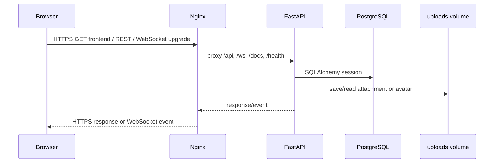
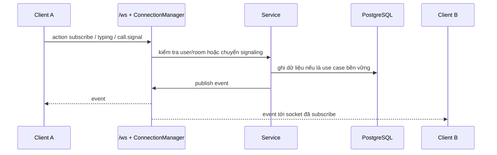

# 1. Tổng quan hệ thống

## Mục đích

Hệ thống cung cấp không gian trao đổi theo phòng công khai/riêng tư cho người dùng nội bộ. Người dùng đăng nhập, tham gia phòng, gửi tin nhắn, file, reaction, quản lý thành viên và gọi trực tiếp hoặc gọi nhóm.

## Actor và component

- **User/browser**: render `frontend/index.html`, gọi REST, duy trì WebSocket và thực hiện WebRTC ở client.
- **Nginx (`web`)**: terminate HTTPS, phục vụ frontend tĩnh, proxy `/api`, `/ws`, `/docs`, `/redoc`, `/health`.
- **FastAPI (`backend`)**: xác thực, use case, REST, WebSocket, signaling và truy cập persistence.
- **PostgreSQL (`db`)**: dữ liệu user, room, message, call, token và metadata file.
- **Local file storage**: file vật lý trong `UPLOAD_DIR`, được giữ bởi named volume `uploads`.

## Giao tiếp

REST dùng cho thao tác bền vững và truy vấn. WebSocket dùng cho presence, typing, event thay đổi message/room và call signaling; lịch sử message vẫn lấy qua REST.

## Request realtime

`ConnectionManager` giữ socket, subscription, online và typing trong memory của một process. Vì vậy realtime không tự đồng bộ giữa nhiều backend process.

## Phạm vi đã xác định

Có authentication, refresh token, profile/avatar, room/member role, message CRUD mềm, attachment, reaction, pin, presence/typing và calls. Không thấy SFU, TURN server, Redis/PubSub hay migration framework.
