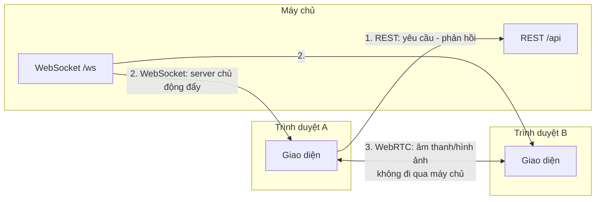
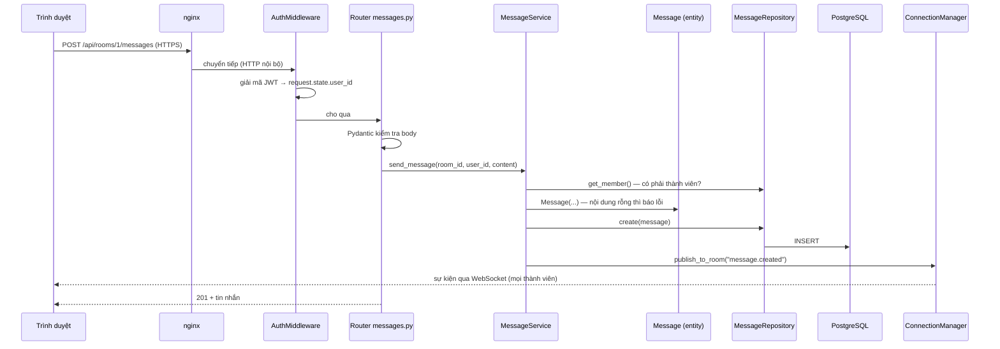

# 1. Tổng quan hệ thống

## Bối cảnh

Team Chat là đồ án môn Kiến trúc phần mềm. Pha 1 dựng hệ thống nền với đủ tính năng;
pha 2 cải tiến kiến trúc và đo hiệu năng trước/sau. Vì vậy code được tổ chức để **thay
được hạ tầng mà không sửa nghiệp vụ** — xem [02 - Kiến trúc](02-architecture.md).

## Các thành phần chạy

Hệ thống gồm ba container chạy mặc định và một container tùy chọn, định nghĩa trong
`docker-compose.yml`:

| Container | Image | Vai trò | Cổng |
|---|---|---|---|
| `web` | nginx (build từ `deploy/nginx/`) | Kết thúc TLS, phục vụ `frontend/`, chuyển `/api` và `/ws` về backend | 443, 80, 127.0.0.1:8080 |
| `backend` | Python 3.11 (build từ `backend/`) | FastAPI: REST, WebSocket, nghiệp vụ | 8000 |
| `db` | `postgres:16-alpine` | Lưu toàn bộ dữ liệu có cấu trúc | 5432 |
| `turn` | `coturn/coturn` | Máy chủ TURN để thử gọi giữa hai mạng | 3478 — **chỉ chạy khi bật profile `turn`** |

Ngoài ra có hai thứ nằm **ngoài** hệ thống nhưng hệ thống phụ thuộc vào khi gọi qua Internet:
dịch vụ TURN bên ngoài (Metered) và Cloudflare Tunnel. Xem [15](15-third-party-services.md).

## Ba kênh giao tiếp

Đây là điều quan trọng nhất cần nắm: dữ liệu đi theo **ba đường khác nhau**, mỗi đường
hợp với một loại việc.

```mermaid
flowchart LR
    subgraph Trình duyệt A
        UA[Giao diện]
    end
    subgraph Máy chủ
        API[REST /api]
        WS[WebSocket /ws]
    end
    subgraph Trình duyệt B
        UB[Giao diện]
    end
    UA -->|1. REST: yêu cầu - phản hồi| API
    WS -->|2. WebSocket: server chủ động đẩy| UA
    WS -->|2.| UB
    UA <-->|3. WebRTC: âm thanh/hình ảnh<br/>không đi qua máy chủ| UB
```

| Kênh | Dùng cho | Vì sao chọn kênh này |
|---|---|---|
| **REST** (`/api/...`) | Mọi thao tác thay đổi dữ liệu: gửi tin, tạo phòng, đăng nhập | Có mã trạng thái rõ ràng, dễ kiểm tra quyền, dễ đo hiệu năng |
| **WebSocket** (`/ws`) | Server báo cho client: tin mới, ai đang gõ, ai vào phòng; chuyển tín hiệu bắt tay cuộc gọi | Server cần chủ động đẩy; trước đây client hỏi lại mỗi 2 giây |
| **WebRTC** | Âm thanh và hình ảnh cuộc gọi | Đi thẳng giữa hai trình duyệt, độ trễ thấp, máy chủ không phải gánh băng thông |

Một quy ước xuyên suốt: **ghi qua REST, nhận thay đổi qua WebSocket**. Ví dụ gửi tin:
client gọi `POST /api/rooms/{id}/messages`, và tất cả thành viên (kể cả người gửi) nhận
tin mới qua sự kiện `message.created`. WebSocket gần như không dùng để ghi dữ liệu — ngoại
lệ duy nhất là tín hiệu WebRTC (`call.signal`), vì ICE candidate sinh ra liên tục thành nhiều
gói nhỏ.

## Công nghệ

| Lớp | Công nghệ | Ghi chú |
|---|---|---|
| Ngôn ngữ backend | Python 3.11 | |
| Framework | FastAPI trên Starlette | Starlette cho phép REST và WebSocket chạy chung một tiến trình |
| Máy chủ ứng dụng | Uvicorn (ASGI) | **Một worker** — xem giới hạn ở [02](02-architecture.md#giới-hạn-khi-mở-rộng) |
| Kiểm tra dữ liệu | Pydantic v2, pydantic-settings | Schema vào/ra, đọc `.env` |
| ORM | SQLAlchemy 2.x (đồng bộ) | Chỉ xuất hiện ở tầng repository và infra |
| Driver | psycopg 3 | |
| CSDL | PostgreSQL 16 | |
| Bảo mật | PyJWT, passlib + bcrypt, google-auth | |
| Frontend | HTML + JavaScript thuần, Tailwind CSS qua CDN | Không có bước build |
| Gọi | WebRTC của trình duyệt, mô hình mesh | |
| Hạ tầng | Docker Compose, nginx, OpenSSL, coturn | |

Chi tiết từng thư viện backend làm gì: [03 - Backend](03-backend.md#thư-viện).

## Phạm vi tính năng

**Tài khoản:** đăng ký, đăng nhập bằng email + mật khẩu, đăng nhập bằng Google, làm mới
phiên, hồ sơ (họ tên, trạng thái, giới thiệu), ảnh đại diện, tìm người dùng.

**Phòng:** phòng công khai và riêng tư; phòng công khai **chỉ hiện khi tìm theo tên hoặc đã
tham gia**; ba vai trò OWNER > ADMIN > MEMBER; thêm, xóa, đổi vai trò thành viên; người bị
xóa **không tự vào lại được**; lời mời có chấp nhận/từ chối; biệt danh trong phòng; màu chủ
đề và ảnh đại diện phòng; thư viện tệp của phòng.

**Tin nhắn:** văn bản, tệp đính kèm (ảnh, video, âm thanh, tài liệu đến 25 MB), sửa, xóa
mềm, ghim, sáu loại biểu cảm, tin nhắn hệ thống, đang gõ, trạng thái online. Trả lời tin
mới có ở backend, giao diện chưa dùng.

**Cuộc gọi:** thoại hoặc video; 1-1 có đổ chuông; nhóm trong phòng tối đa 6 người; đi
thẳng hoặc qua TURN; chế độ `?relay=1` để kiểm tra TURN.

Mô tả hành vi chi tiết: [09](09-chat-features.md) và [10](10-call-features.md).

## Một request đi qua những đâu

Ví dụ: người dùng gửi tin "chào" vào phòng 1.

```mermaid
sequenceDiagram
    participant B as Trình duyệt
    participant N as nginx
    participant M as AuthMiddleware
    participant R as Router messages.py
    participant S as MessageService
    participant E as Message (entity)
    participant P as MessageRepository
    participant D as PostgreSQL
    participant W as ConnectionManager
    B->>N: POST /api/rooms/1/messages (HTTPS)
    N->>M: chuyển tiếp (HTTP nội bộ)
    M->>M: giải mã JWT → request.state.user_id
    M->>R: cho qua
    R->>R: Pydantic kiểm tra body
    R->>S: send_message(room_id, user_id, content)
    S->>P: get_member() — có phải thành viên?
    S->>E: Message(...) — nội dung rỗng thì báo lỗi
    S->>P: create(message)
    P->>D: INSERT
    S->>W: publish_to_room("message.created")
    W-->>B: sự kiện qua WebSocket (mọi thành viên)
    R-->>B: 201 + tin nhắn
```

Luồng này đi qua cả bốn tầng; [02](02-architecture.md) giải thích vì sao chia như vậy, còn
[14](14-code-flow.md) có thêm các luồng khác.
