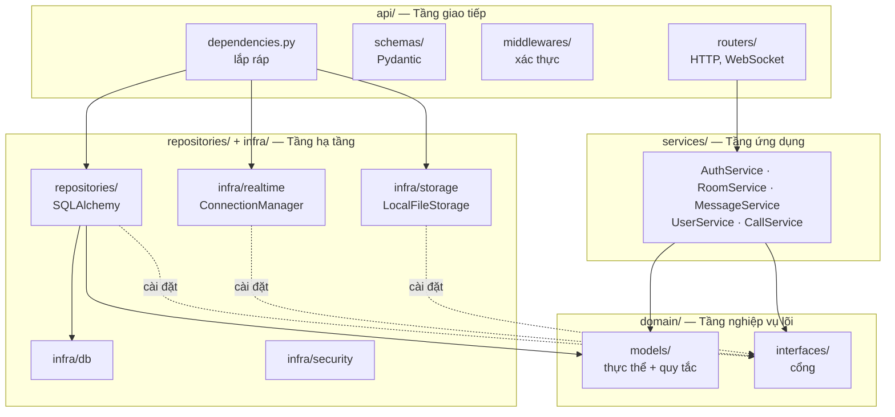
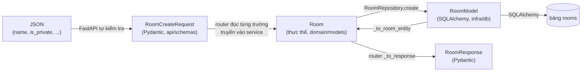

# 2. Kiến trúc

Backend là một **khối nguyên (monolith) phân tầng** theo tinh thần Clean Architecture:
nghiệp vụ nằm ở giữa và không phụ thuộc vào bất kỳ công nghệ nào; công nghệ (web, ORM,
WebSocket, ổ đĩa) nằm ở vòng ngoài và phụ thuộc ngược vào nghiệp vụ qua các interface.

## Bốn tầng



| Tầng | Thư mục | Trách nhiệm | Được biết đến | **Không** được biết đến |
|---|---|---|---|---|
| Giao tiếp | `api/` | Nhận HTTP/WebSocket, kiểm tra định dạng, đổi kết quả thành JSON và mã trạng thái | services, schemas, domain | SQL, cách lưu tệp |
| Ứng dụng | `services/` | Điều phối một ca sử dụng: kiểm tra quyền, gọi thực thể, lưu, phát sự kiện | domain (thực thể + interface) | FastAPI, SQLAlchemy, WebSocket |
| Nghiệp vụ lõi | `domain/` | Thực thể và quy tắc bất biến; khai báo các cổng | Thư viện chuẩn Python | Mọi thứ khác |
| Hạ tầng | `repositories/`, `infra/` | Cài đặt các cổng bằng công nghệ cụ thể | domain | services, api |

### Đã kiểm chứng bằng `grep`

Đây không chỉ là ý định — có thể kiểm tra trên code hiện tại:

```bash
# domain/ chỉ import thư viện chuẩn và chính nó
grep -rhoE "^(from|import) [a-z_.]+" backend/app/domain/ | sort -u
# -> abc, datetime, typing, app.domain.*

# services/ không import framework hay ORM
grep -rnE "^(from|import) (fastapi|sqlalchemy|starlette)" backend/app/services/
# -> (không có kết quả)
```

**Ngoại lệ duy nhất:** `AuthService` import thẳng `app.infra.security.password`,
`app.infra.security.jwt` và thư viện `google.oauth2`. Nó phụ thuộc vào cài đặt cụ thể
thay vì một cổng. Muốn sạch hoàn toàn thì cần thêm `IPasswordHasher`, `ITokenIssuer`,
`IGoogleVerifier` vào `domain/interfaces/`. Đây là điểm cải tiến nhỏ, có ghi ở
[Nợ kỹ thuật](#nợ-kỹ-thuật).

## Quy tắc phụ thuộc

Mũi tên phụ thuộc **chỉ hướng vào trong**, về phía `domain/`:

```
api  ──►  services  ──►  domain  ◄──  repositories / infra
```

Điểm mấu chốt là mũi tên ở bên phải: **hạ tầng phụ thuộc vào nghiệp vụ, không phải ngược
lại**. `RoomRepository` import `IRoomRepository` từ domain để cài đặt nó; `RoomService` chỉ
biết `IRoomRepository`. Đây là nguyên lý **Dependency Inversion** (chữ D trong SOLID).

Hệ quả thực tế:

| Muốn thay | Phải sửa | Không phải sửa |
|---|---|---|
| PostgreSQL → MongoDB | Viết lại `repositories/` | services, domain, api |
| WebSocket trong bộ nhớ → Redis Pub/Sub | Viết lớp mới cài đặt `IEventPublisher` | services, domain |
| Ổ đĩa local → S3 / MinIO | Viết lớp mới cài đặt `IFileStorage` | services, domain |
| FastAPI → framework khác | Viết lại `api/` | services, domain, repositories |
| Kiểm thử service không cần DB | Viết repository giả trong bộ nhớ, dùng `NullEventPublisher` | service cần kiểm thử |

## Cổng và bộ chuyển đổi

Mỗi phụ thuộc ra ngoài của nghiệp vụ đều đi qua một **cổng** (interface ở
`domain/interfaces/`) và được cắm một **bộ chuyển đổi** (cài đặt ở hạ tầng).

| Cổng (domain) | Bộ chuyển đổi (hạ tầng) | Dùng bởi |
|---|---|---|
| `IUserRepository` | `repositories/user_repo.py` → `UserRepository` | Auth, User, Room, Call |
| `IRefreshTokenRepository` | `repositories/refresh_token_repo.py` | Auth |
| `IRoomRepository` | `repositories/room_repo.py` → `RoomRepository` | Room, Message, Call |
| `IMessageRepository` | `repositories/message_repo.py` → `MessageRepository` | Message |
| `IAttachmentRepository` | `repositories/message_repo.py` → `AttachmentRepository` | Message |
| `IReactionRepository` | `repositories/message_repo.py` → `ReactionRepository` | Message |
| `ICallRepository` | `repositories/call_repo.py` → `CallRepository` | Call |
| `IEventPublisher` | `infra/realtime/connection_manager.py` → `ConnectionManager` | Room, Message, User, Call |
| | `domain/interfaces/event_publisher.py` → `NullEventPublisher` | Mặc định khi không cắm gì (kiểm thử) |
| `IFileStorage` | `infra/storage/local_storage.py` → `LocalFileStorage` | Room, Message, User |

`IEventPublisher` là cổng đáng chú ý nhất cho pha 2. Nó có bốn thao tác:

| Thao tác | Ý nghĩa |
|---|---|
| `publish_to_room(room_id, event, payload)` | Gửi cho mọi người đang theo dõi phòng |
| `publish_to_user(user_id, event, payload)` | Gửi cho mọi tab đang mở của một người |
| `publish_to_user_rooms(user_id, event, payload)` | Gửi cho mọi phòng người đó đang theo dõi (ví dụ đổi ảnh đại diện) |
| `revoke_room_access(user_id, room_id)` | Ngừng gửi sự kiện của phòng cho người vừa mất quyền (bị xóa, tự rời) |

Service không biết bên dưới là WebSocket. Thay `ConnectionManager` bằng một lớp dùng
Redis Pub/Sub là chạy được nhiều tiến trình, và không service nào phải sửa.

## Quy tắc nghiệp vụ nằm ở đâu

Có hai nơi, phân theo phạm vi của quy tắc:

**Trong thực thể** — quy tắc chỉ cần dữ liệu của chính thực thể đó:

| Thực thể | Quy tắc |
|---|---|
| `RoomMember` | Thứ bậc OWNER > ADMIN > MEMBER; `can_manage_members()`, `can_manage_roles()`, `can_moderate_messages()`, `outranks()` |
| `Call` | Toàn bộ máy trạng thái: chỉ `accept()` khi đang `RINGING`, người gọi không tự nhận, nhóm tối đa 6, người cuối rời thì kết thúc |
| `Message` | Tin văn bản không được rỗng; tin tệp phải có tệp; `edit()` cập nhật `edited_at` |
| `Attachment` | Tối đa 25 MB, không rỗng; tự phân loại ảnh/video/âm thanh/tệp theo MIME |
| `Reaction` | Chỉ 6 biểu cảm được phép |
| `Room` | Tên không rỗng |
| `User` | Họ tên không rỗng; giới thiệu ≤ 500 ký tự; trạng thái ≤ 100 ký tự |
| `RefreshToken` | `is_valid()` = chưa thu hồi và chưa hết hạn |

**Trong service** — quy tắc cần nhiều thực thể hoặc cần truy vấn:

| Service | Ví dụ quy tắc |
|---|---|
| `RoomService` | Người bị xóa không được tự tham gia lại (cần bảng chặn); quản trị viên không xóa được quản trị viên khác (so sánh hai `RoomMember`) |
| `MessageService` | Phải là thành viên mới đọc/gửi; chỉ người gửi được sửa; người gửi hoặc ADMIN trở lên được xóa |
| `CallService` | Mỗi người tối đa một cuộc gọi đang mở; chỉ gọi được cho người cùng phòng; chỉ chuyển tín hiệu giữa hai người cùng cuộc gọi |

Nhờ vậy service đọc như một kịch bản: lấy dữ liệu → hỏi thực thể "có được không" → lưu →
phát sự kiện. Ví dụ `RoomService.remove_member()`:

```python
actor = self.require_membership(room_id, actor_id)
if not actor.can_manage_members():                 # hỏi thực thể
    raise PermissionError(...)
if not actor.outranks(target) and actor_id != target_user_id:   # so sánh hai thực thể
    raise PermissionError(...)
removed = self.room_repo.remove_member(room_id, target_user_id)  # lưu qua cổng
if actor_id != target_user_id:
    self.room_repo.add_ban(room_id, target_user_id, banned_by=actor_id)
self._publish_member_event(room_id, target_user_id, "room.member_left")  # phát qua cổng
self.events.revoke_room_access(target_user_id, room_id)
```

## Một dữ liệu, ba hình dạng

Một căn phòng tồn tại dưới ba dạng ở ba tầng, và mỗi lần đi qua ranh giới tầng đều có một
bước chuyển đổi tường minh:



| Dạng | Ở đâu | Biết gì |
|---|---|---|
| `RoomCreateRequest` / `RoomResponse` | `api/schemas/room.py` | Định dạng trên dây: trường nào bắt buộc, độ dài tối đa, mã màu hợp lệ |
| `Room` | `domain/models/room.py` | Quy tắc: tên không rỗng, `is_owner()` |
| `RoomModel` | `infra/db/models.py` | Cột, khóa ngoại, chỉ mục, quan hệ |

Ai chuyển đổi:

- **JSON → schema:** FastAPI tự làm khi khai báo `body: RoomCreateRequest`.
- **Schema → thực thể:** router đọc trường từ schema và truyền tham số vào service; service tạo thực thể.
- **Thực thể ↔ model:** repository, qua các hàm `_to_room_entity()`, `_to_member_entity()`, ...
- **Thực thể → schema phản hồi:** router, qua `_to_response()`.

Vì sao phải ba dạng mà không dùng chung một lớp? Vì nếu thực thể chính là `RoomModel` thì
tầng nghiệp vụ phải import SQLAlchemy, và mọi quy tắc bị trói vào ORM. Cái giá là phải viết
hàm chuyển đổi — chấp nhận được.

Bảng ánh xạ đầy đủ giữa thực thể và bảng: [05 - Thực thể và database](05-database.md).

## Lắp ráp: ai nối các tầng lại với nhau

Không tầng nào tự tạo phụ thuộc của mình. Việc lắp ráp nằm tập trung ở
`api/dependencies.py` — đây là **composition root** của hệ thống:

```python
def get_message_service(db: Session = Depends(get_db)) -> MessageService:
    return MessageService(
        message_repo=MessageRepository(db),      # cắm bộ chuyển đổi SQLAlchemy
        room_repo=RoomRepository(db),
        attachment_repo=AttachmentRepository(db),
        reaction_repo=ReactionRepository(db),
        file_storage=file_storage,                # LocalFileStorage dùng chung
        event_publisher=connection_manager,       # ConnectionManager dùng chung
    )
```

Router chỉ khai báo nó cần gì:

```python
def send_message(..., msg_service: MessageService = Depends(get_message_service)):
```

FastAPI gọi `get_db()` → tạo phiên SQLAlchemy mới cho request → truyền vào các repository
→ truyền repository vào service → truyền service vào router. Hết request, `get_db()` đóng
phiên.

Hai đối tượng được **dùng chung cho cả tiến trình** thay vì tạo mới mỗi request:
`file_storage` (không có trạng thái) và `connection_manager` (giữ danh sách kết nối — phải
dùng chung, nếu không mỗi request sẽ thấy một danh sách rỗng).

## Ngôn ngữ chung giữa service và API

Service không biết HTTP, nên nó báo lỗi bằng exception của Python. Router dịch sang mã HTTP:

| Service ném | Ý nghĩa | Router trả |
|---|---|---|
| `ValueError` | Dữ liệu sai hoặc không tìm thấy | `400` hoặc `404` (tùy endpoint) |
| `PermissionError` | Không đủ quyền | `403` |
| `RuntimeError` | Xung đột trạng thái (đang bận cuộc gọi khác) | `409` |

Nhờ vậy cùng một service có thể dùng từ WebSocket (`ws.py` bắt `ValueError` và
`PermissionError` rồi gửi sự kiện `call.error`) mà không phải sửa gì.

## Cầu nối đồng bộ – bất đồng bộ

Endpoint REST viết bằng `def` thường, vì SQLAlchemy ở đây là loại đồng bộ. FastAPI chạy
chúng trong **threadpool**, nơi không có event loop. Nhưng gửi qua WebSocket lại là thao
tác `async`, cần event loop.

Cách giải: lúc khởi động, `main.py` đưa event loop chính cho `ConnectionManager`:

```python
connection_manager.bind_loop(asyncio.get_running_loop())
```

Sau đó mọi `publish_*` từ code đồng bộ đều đi qua `_dispatch()`, dùng
`asyncio.run_coroutine_threadsafe()` để đẩy việc gửi sang loop chính. Service gọi
`self.events.publish_to_room(...)` như một hàm thường và không cần biết chuyện này.

## Nợ kỹ thuật

Những chỗ hiện **chưa** theo đúng kiến trúc trên. Ghi ra để không ai tưởng là thiết kế
có chủ đích, và để làm cải tiến pha 2.

| # | Chỗ | Vấn đề | Hướng sửa |
|---|---|---|---|
| 1 | Lời mời thành viên (`routers/rooms.py`: `invite_member`, `accept_invite`, `reject_invite`, `list_invites`) | Toàn bộ nghiệp vụ nằm trong router; `InviteRepository` không có interface, trả thẳng `RoomInviteModel` của SQLAlchemy lên router; router tự gọi `connection_manager` thay vì qua `IEventPublisher` | Thêm thực thể `RoomInvite`, cổng `IInviteRepository`, chuyển logic vào `RoomService` |
| 2 | Biệt danh (`update_member_nickname`) và thư viện tệp (`list_room_media`) | Logic trong router, gọi thẳng `room_service.room_repo` | Chuyển thành phương thức của `RoomService` |
| 3 | Nhiều endpoint phòng đọc `room_service.room_repo` để lấy vai trò, đếm thành viên | Router với tay xuyên qua service xuống repository | Service trả về một đối tượng tổng hợp |
| 4 | `ws.py` tự tạo `RoomRepository` để kiểm tra quyền theo dõi phòng | Kiểm tra quyền nằm ngoài service | Gọi `RoomService.require_membership` |
| 5 | `main.py` chạy `ALTER TABLE` thô khi khởi động | Thay đổi schema không có phiên bản, không lùi lại được, nằm ngoài mọi tầng | Alembic |
| 6 | `AuthService` import thẳng `infra.security` và `google.oauth2` | Service phụ thuộc cài đặt cụ thể | Thêm cổng cho băm mật khẩu, cấp token, xác minh Google |
| 7 | Không có kiểm thử tự động | `NullEventPublisher` đã sẵn sàng nhưng chưa được dùng | `pytest` cho tầng service với repository giả |

## Giới hạn khi mở rộng

| Giới hạn | Nguyên nhân | Ảnh hưởng | Hướng cải tiến |
|---|---|---|---|
| Chỉ chạy được **một** tiến trình backend | `ConnectionManager` giữ kết nối và đăng ký phòng trong bộ nhớ | Chạy 2 worker là người ở worker 1 không nhận sự kiện từ worker 2 | Bộ chuyển đổi Redis Pub/Sub cho `IEventPublisher` |
| Gọi nhóm tối đa 6 người | Mesh: mỗi máy tải lên n−1 luồng | Máy yếu hoặc mạng upload kém sẽ giật | SFU (mediasoup, LiveKit) |
| Tệp nằm trên ổ đĩa một máy | `LocalFileStorage` | Không chia sẻ được giữa nhiều máy chủ | Bộ chuyển đổi S3/MinIO cho `IFileStorage` |
| Truy vấn danh sách phòng N+1 | Router gọi `get_member`, `count_members`, `get_last_message_summary` cho từng phòng | Chậm khi người dùng ở nhiều phòng | Một truy vấn gộp trong repository |

Ba hướng cải tiến đầu đều chỉ là **viết thêm một bộ chuyển đổi cho cổng có sẵn** — đây là
bằng chứng cụ thể nhất cho việc tách tầng có giá trị thật.
