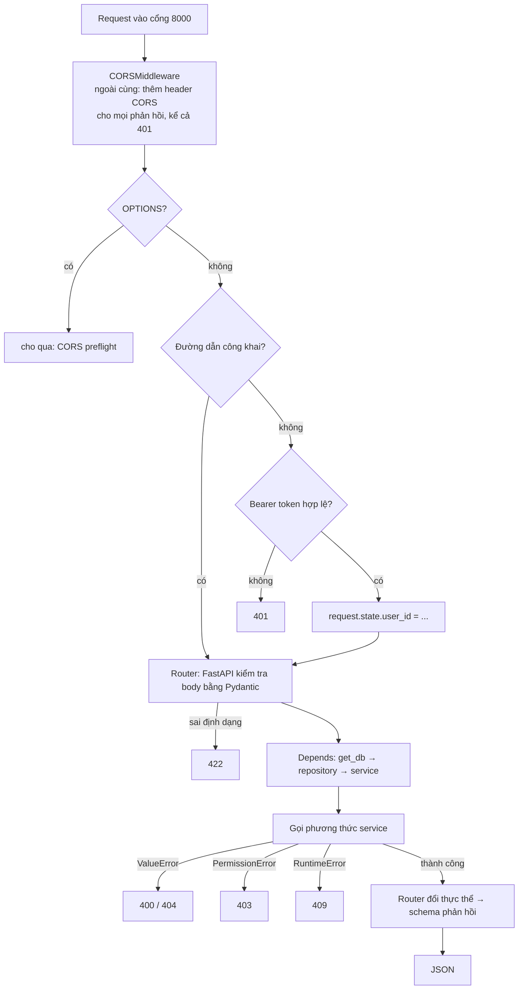

# 3. Backend

## Cấu trúc thư mục

```
backend/
├── Dockerfile               # python:3.11-slim, chạy bằng user appuser (không phải root)
├── requirements.txt
├── seed_users.py            # tạo 4 tài khoản và 2 phòng mẫu, đi qua service
├── check_turn.py            # kiểm tra máy chủ TURN có phản hồi không
└── app/
    ├── main.py              # điểm khởi động: tạo bảng, middleware, router
    ├── config.py            # đọc .env bằng pydantic-settings
    │
    ├── api/                 # ── TẦNG GIAO TIẾP ──
    │   ├── dependencies.py  # lắp ráp repository + adapter vào service
    │   ├── middlewares/
    │   │   └── auth_middleware.py
    │   ├── routers/         # auth, users, rooms, messages, calls, ws
    │   └── schemas/         # Pydantic: auth, user, room, message, call
    │
    ├── services/            # ── TẦNG ỨNG DỤNG ──
    │   ├── auth_service.py
    │   ├── user_service.py
    │   ├── room_service.py
    │   ├── message_service.py
    │   └── call_service.py
    │
    ├── domain/              # ── TẦNG NGHIỆP VỤ LÕI ──
    │   ├── models/          # User, RefreshToken, Room, RoomMember,
    │   │                    # Message, Attachment, Reaction, Call, CallParticipant
    │   └── interfaces/      # I*Repository, IEventPublisher, IFileStorage
    │
    ├── repositories/        # ── TẦNG HẠ TẦNG: cài đặt cổng bằng SQLAlchemy ──
    │   ├── user_repo.py, refresh_token_repo.py, room_repo.py
    │   ├── message_repo.py  # Message, Attachment, Reaction
    │   ├── call_repo.py
    │   └── invite_repo.py   # không có interface — xem 02, nợ kỹ thuật #1
    │
    └── infra/               # ── TẦNG HẠ TẦNG: công nghệ cụ thể ──
        ├── db/              # engine, session, ORM models
        ├── realtime/        # ConnectionManager (cài đặt IEventPublisher)
        ├── storage/         # LocalFileStorage (cài đặt IFileStorage)
        └── security/        # jwt.py, password.py
```

## Khởi động

Khi Uvicorn nạp `app.main:app`, các việc sau chạy **theo thứ tự**:

| # | Việc | Ở đâu | Ghi chú |
|---|---|---|---|
| 1 | Đọc cấu hình | `config.py` | Từ `.env` và biến môi trường của Compose |
| 2 | Tạo engine kết nối DB | `infra/db/session.py` | `pool_pre_ping=True`: kiểm tra kết nối trước khi dùng |
| 3 | `Base.metadata.create_all()` | `main.py` | Tạo **bảng còn thiếu**. Không sửa bảng đã có |
| 4 | Chạy 4 câu `ALTER TABLE` | `main.py` | Bù cho bước 3: thêm cột `theme_color`, `nickname`, bỏ NOT NULL ở `password_hash`. Chạy lại mỗi lần khởi động, an toàn vì dùng `IF NOT EXISTS` |
| 5 | Tạo thư mục `UPLOAD_DIR` | `main.py` | |
| 6 | Tạo ứng dụng FastAPI | `main.py` | `/docs`, `/redoc`, `/api/openapi.json` |
| 7 | Gắn middleware | `main.py` | Thêm `AuthenticationMiddleware` rồi `CORSMiddleware`. Starlette bọc ngược thứ tự thêm, nên khi chạy thì **CORS ở ngoài cùng, chạy trước** |
| 8 | Gắn router | `main.py` | 5 router dưới `/api`, riêng `ws` ở gốc `/ws` |
| 9 | Sự kiện `startup` | `main.py` | `connection_manager.bind_loop(...)` — xem [02](02-architecture.md#cầu-nối-đồng-bộ--bất-đồng-bộ) |

Bảng mới hoàn toàn (như `room_bans`, `room_invites`) được bước 3 tự tạo. **Cột mới trên
bảng đã có** thì phải thêm một câu ở bước 4 — nếu quên, máy nào có DB cũ sẽ lỗi
`column ... does not exist`.

## Vòng đời một request REST



**Đường dẫn công khai** (không cần token), khai báo ở `auth_middleware.py`:

- Mọi phương thức: `/docs`, `/redoc`, `/api/openapi.json`, `/health`,
  `/api/auth/login`, `/api/auth/register`, `/api/auth/google`, `/api/auth/refresh`, `/ws`
- **Chỉ GET:** `/api/users/{id}/avatar`, `/api/rooms/{id}/avatar` — vì thẻ `` không gửi
  kèm được header `Authorization`. Giới hạn GET để không ai `POST` lên đường dẫn này mà lọt
  qua xác thực.

`/ws` công khai ở tầng middleware vì WebSocket không đi qua HTTP middleware; nó tự kiểm tra
token trong query string — xem [08](08-websocket-realtime.md).

## Phiên làm việc với DB

- Mỗi request REST nhận **một** phiên SQLAlchemy mới từ `get_db()`, đóng khi xong.
- Mọi repository trong cùng request dùng chung phiên đó.
- Repository tự `commit()` sau mỗi thao tác ghi. Không có giao dịch bao trùm cả ca sử dụng —
  nếu service ghi hai lần và lần thứ hai lỗi, lần thứ nhất vẫn được lưu.
- WebSocket không có `Depends`, nên `ws.py` tự mở và đóng phiên cho từng thao tác qua
  `SessionLocal()` và hàm `_with_call_service()`.

## Năm service

| Service | Phụ thuộc (qua cổng) | Trách nhiệm |
|---|---|---|
| `AuthService` | `IUserRepository`, `IRefreshTokenRepository` | Đăng ký, đăng nhập, đăng nhập Google, luân chuyển refresh token |
| `UserService` | `IUserRepository`, `IFileStorage`, `IEventPublisher` | Hồ sơ, ảnh đại diện, tìm người dùng |
| `RoomService` | `IRoomRepository`, `IUserRepository`, `IEventPublisher`, `IFileStorage` | Phòng, thành viên, vai trò, chặn, tìm phòng, ảnh phòng |
| `MessageService` | `IMessageRepository`, `IRoomRepository`, `IAttachmentRepository`, `IReactionRepository`, `IFileStorage`, `IEventPublisher` | Tin nhắn, tệp, biểu cảm, ghim, tin hệ thống |
| `CallService` | `ICallRepository`, `IRoomRepository`, `IUserRepository`, `IEventPublisher` | Vòng đời cuộc gọi, chuyển tiếp tín hiệu WebRTC |

Các phụ thuộc tùy chọn (`Optional[...] = None`) có giá trị mặc định an toàn: không truyền
`event_publisher` thì dùng `NullEventPublisher`. Nhờ vậy dựng service để kiểm thử chỉ cần
truyền repository.

## Cấu hình

`config.py` đọc các biến sau từ `.env`:

| Biến | Mặc định | Ý nghĩa |
|---|---|---|
| `DATABASE_URL` | `postgresql://...@db:5432/teamchat_db` | Compose ghi đè từ `POSTGRES_*` |
| `JWT_SECRET_KEY` | chuỗi mẫu | **Phải đổi** khi triển khai thật |
| `JWT_ALGORITHM` | `HS256` | |
| `ACCESS_TOKEN_EXPIRE_MINUTES` | `1440` | ⚠️ Hiện **không có tác dụng** — `jwt.py` cố định 60 phút |
| `GOOGLE_CLIENT_ID` | Client ID của nhóm | Client ID không phải bí mật, frontend cũng chứa giá trị này |
| `UPLOAD_DIR` | `/app/uploads` | Gắn volume `uploads` |
| `MAX_UPLOAD_BYTES` | 25 MB | ⚠️ Hiện **không có tác dụng** — giới hạn thật nằm cứng trong `Attachment.MAX_SIZE_BYTES` |
| `CORS_ORIGINS` | `*` | Danh sách origin, phân cách bằng dấu phẩy |
| `WS_IDLE_TIMEOUT_SECONDS` | `90` | Không nhận gì từ client quá lâu thì đóng kết nối |
| `ICE_SERVERS` | STUN của Google | Hai định dạng — xem [10](10-call-features.md#máy-chủ-ice) |

## Thư viện

| Thư viện | Làm gì trong dự án |
|---|---|
| `fastapi` | Định tuyến, `Depends`, sinh tài liệu `/docs` |
| `uvicorn[standard]` | Máy chủ ASGI; `[standard]` kèm `websockets` và `uvloop` |
| `pydantic`, `pydantic-settings` | Schema request/response; đọc `.env` |
| `email-validator` | Cho kiểu `EmailStr` |
| `python-multipart` | Đọc `multipart/form-data` — thiếu thì không upload được tệp |
| `sqlalchemy` | ORM, chỉ dùng trong `repositories/` và `infra/db/` |
| `psycopg[binary]` | Driver PostgreSQL bản 3, biên dịch sẵn |
| `pyjwt` | Ký và đọc JWT |
| `passlib[bcrypt]`, `bcrypt` | Băm mật khẩu |
| `google-auth`, `requests` | Xác minh ID token của Google; `requests` là phương tiện để `google-auth` lấy khóa công khai |
| `websockets` | Giao thức WebSocket cho Uvicorn |

## Thêm một tính năng backend — làm theo thứ tự này

1. **Thực thể** trong `domain/models/` nếu có khái niệm mới. Đặt quy tắc chỉ cần dữ liệu của chính nó vào đây.
2. **Cổng** trong `domain/interfaces/` nếu cần truy cập dữ liệu mới.
3. **Bảng** trong `infra/db/models.py`. Nếu là cột mới trên bảng cũ, thêm `ALTER TABLE ... IF NOT EXISTS` vào `main.py`.
4. **Repository** trong `repositories/`, cài đặt cổng, kèm hàm chuyển model ↔ thực thể.
5. **Phương thức service** — kiểm tra quyền, gọi thực thể, lưu qua cổng, phát sự kiện qua `self.events`.
6. **Schema** trong `api/schemas/` cho request và response.
7. **Endpoint** trong `api/routers/` — chỉ đọc request, gọi service, dịch exception sang mã HTTP.
8. Nếu service cần phụ thuộc mới, nối dây trong `api/dependencies.py`.
9. Cập nhật [07](07-rest-api.md), [08](08-websocket-realtime.md) nếu có endpoint hoặc sự kiện mới.

Lỗi hay gặp: thêm trường vào một nơi mà quên nơi khác. Ví dụ `theme_color` từng có ở bảng,
thực thể, repository, `update_room` và `RoomUpdateRequest`, nhưng thiếu ở `create_room` và
`RoomCreateRequest` — kết quả là tạo phòng nào cũng lỗi 500.
