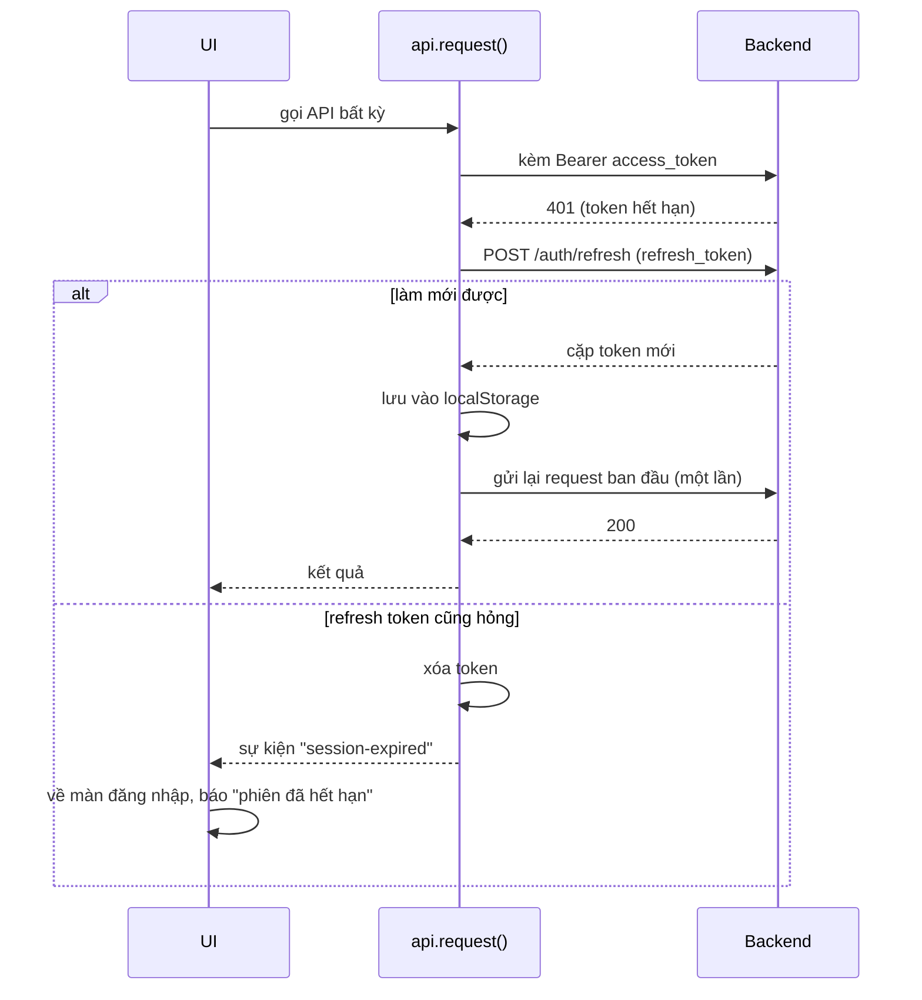

# 4. Frontend

Frontend là **HTML + JavaScript thuần**, không framework, không bước build. nginx phục vụ
thẳng thư mục `frontend/`; sửa file xong chỉ cần `Ctrl + F5`.

## Các file

| File | Dòng | Trách nhiệm |
|---|---|---|
| `index.html` | ~300 | Khung giao diện: màn đăng nhập, sidebar, vùng chat, khung cuộc gọi, các vùng chứa modal/toast |
| `css/style.css` | ~200 | Phần CSS mà Tailwind không phủ: avatar, chấm online, thanh cuộn, hiệu ứng |
| `js/api.js` | ~390 | Mọi lời gọi REST; giữ token; tự làm mới phiên khi gặp 401 |
| `js/ui.js` | ~240 | Hàm dùng chung: **chống XSS** (`escapeHtml`), avatar, định dạng thời gian, toast, modal, giao diện sáng/tối |
| `js/ws.js` | ~190 | Đối tượng `realtime`: mở WebSocket, nối lại, ping, đăng ký phòng, phân phát sự kiện |
| `js/profile.js` | ~170 | Hồ sơ của mình và xem hồ sơ người khác |
| `js/rooms.js` | ~720 | Danh sách phòng, tìm phòng/người, chọn phòng, thành viên, vai trò, cài đặt phòng |
| `js/messages.js` | ~510 | Hiển thị, gửi, sửa, xóa, ghim, biểu cảm, tệp, đang gõ |
| `js/call.js` | ~1540 | Toàn bộ cuộc gọi: WebRTC, mesh nhiều người, giao diện cuộc gọi |
| `js/app.js` | ~450 | Khởi động; đăng nhập (kể cả Google); **đăng ký mọi bộ xử lý sự kiện realtime**; lời mời |

## Thứ tự nạp

Các file dùng **biến toàn cục** của nhau, nên thứ tự trong `index.html` là bắt buộc:

```
Tailwind (CDN) → Google Identity (CDN)
  → api.js → ui.js → ws.js → profile.js → rooms.js → messages.js → call.js → app.js
```

`app.js` nạp cuối vì nó dùng hàm của tất cả các file khác. Đổi thứ tự là lỗi
`... is not defined`.

```mermaid
flowchart BT
    api[api.js<br/>REST + token]
    ui[ui.js<br/>tiện ích]
    ws[ws.js<br/>realtime]
    profile[profile.js]
    rooms[rooms.js]
    messages[messages.js]
    call[call.js]
    app[app.js<br/>khởi động + sự kiện]
    ws --> api
    ui --> api
    profile --> api & ui
    rooms --> api & ui & ws
    messages --> api & ui & ws & rooms
    call --> api & ui & ws & rooms
    app --> api & ui & ws & rooms & messages & profile & call
```

## Trạng thái phía client

Không có thư viện quản lý trạng thái; trạng thái là các biến toàn cục:

| Biến | File | Giữ gì |
|---|---|---|
| `currentRoom` | `rooms.js` | Phòng đang mở, kèm `my_role` |
| `roomsCache` | `rooms.js` | Danh sách phòng đã tham gia |
| `membersCache` | `rooms.js` | Thành viên phòng đang mở |
| `searchedRooms` | `rooms.js` | Phòng công khai vừa tìm được, chưa tham gia |
| `messagesCache` | `messages.js` | Tin nhắn phòng đang mở |
| `pinnedMessagesCache` | `messages.js` | Tin đã ghim |
| `roomInvites` | `app.js` | Lời mời đang chờ trả lời |
| `callUI.peers` | `call.js` | `user_id → { RTCPeerConnection, luồng, tín hiệu đang chờ }` |
| `localStorage` | `api.js` | `access_token`, `refresh_token`, `current_user`, `theme` |

## Kết nối tới backend

`api.js` tự quyết định địa chỉ backend:

```javascript
const USE_SAME_ORIGIN = window.location.port !== "3000";
```

- Vào qua nginx (`https://localhost`, IP LAN, đường hầm Cloudflare): gọi cùng origin — `/api` và `/ws`.
- Chạy kiểu cũ bằng `python -m http.server 3000`: gọi thẳng `http://<host>:8000`.

### Token và làm mới phiên



Trước khi có cơ chế `session-expired`, ứng dụng nuốt lỗi 401: người dùng bấm gửi mà không
có gì xảy ra, không biết vì sao.

## Realtime: `ws.js`

Đối tượng `realtime` bọc một WebSocket và hoạt động như một bộ phân phát sự kiện:

```javascript
realtime.on("message.created", (data) => { ... });   // đăng ký
realtime.emit(msg.event, msg.data);                   // ws.js gọi khi nhận tin
```

| Hành vi | Chi tiết |
|---|---|
| Ping | Mỗi 30 giây gửi `{"action": "ping"}`. Server đóng kết nối nếu 90 giây không nhận gì |
| Nối lại | Chờ 1 s, tăng dần ×1,6, tối đa 15 s |
| Đăng ký lại phòng | Kết nối lại xong tự `subscribe` lại phòng đang mở |
| Mã đóng `4001` | Token bị từ chối → đăng xuất, không nối lại |
| Mã đóng `4002` | Server cắt vì im lặng quá lâu → nối lại ngay |
| Thất bại liên tiếp | Chưa từng kết nối được mà thất bại 4 lần → coi như hết phiên |
| Chấm trạng thái | Xanh: đã nối; vàng: đang nối lại; đỏ: mất kết nối |

Gần như mọi bộ xử lý sự kiện được đăng ký trong `app.js` (phòng, tin nhắn, đang gõ, hồ sơ,
lời mời) và `call.js` (cuộc gọi). Danh sách đầy đủ: [08](08-websocket-realtime.md#sự-kiện).

## Các luồng giao diện chính

**Mở app:** có token trong `localStorage` → vào màn chat → `realtime.connect()` →
`loadRooms()` → nạp lời mời đang chờ.

**Tìm và tham gia phòng** (`rooms.js`): gõ vào ô tìm kiếm → lọc tại chỗ danh sách phòng đã
tham gia, đồng thời sau 300 ms gọi song song `GET /rooms/search` và `GET /users/search` → hiện
hai mục "Phòng công khai" và "Người dùng" → bấm phòng → `POST /rooms/{id}/join` → nạp lại
danh sách → mở phòng.

**Chọn phòng** (`selectRoom`): hủy đăng ký phòng cũ → `subscribe` phòng mới → nạp tin nhắn,
tin ghim, thành viên, cuộc gọi nhóm đang diễn ra.

**Bị xóa khỏi phòng đang mở:** nhận `room.member_left` với `user_id` của mình → báo "Bạn đã
bị xóa khỏi phòng này" → `resetChatArea()` (hủy đăng ký kênh) → nạp lại danh sách phòng.

## Bảo mật phía client

- **Mọi dữ liệu do người dùng nhập** phải qua `escapeHtml()` trước khi ghép vào HTML. Trước
  đây tin nhắn chèn thẳng bằng `innerHTML`, nên gửi `` là chạy được
  mã trên máy người khác.
- Tệp đính kèm cần token để tải, nên ảnh trong tin nhắn được tải bằng `fetch` có header rồi
  hiển thị qua `blob:` URL, không đặt thẳng vào ``.
- Ảnh đại diện thì ngược lại: là đường dẫn công khai (chỉ GET) để dùng được trong ``.
- Token nằm trong `localStorage`, nên đọc được bằng JavaScript — chống XSS là lớp bảo vệ
  quan trọng nhất cho token.
