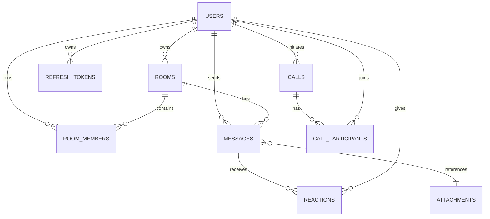

# 5. Database

ORM nằm trong `backend/app/infra/db/models.py`; domain entities nằm trong `backend/app/domain/models/`. SQLAlchemy tạo bảng ở startup bằng `Base.metadata.create_all()`.

## Entity và quan hệ

| Entity/table | Khóa chính | Quan hệ chính |
| --- | --- | --- |
| `UserModel` / `users` | user id | sở hữu room, có memberships, messages, tokens, calls |
| `RefreshTokenModel` / `refresh_tokens` | token id | nhiều token thuộc một user |
| `RoomModel` / `rooms` | room id | một owner, nhiều `RoomMember`, messages |
| `RoomMemberModel` / `room_members` | member id | nối User-Room; unique `(room_id,user_id)`; role |
| `AttachmentModel` / `attachments` | attachment id | uploader; message có thể tham chiếu attachment |
| `MessageModel` / `messages` | message id | room, sender, optional attachment, reply/forward, reactions |
| `ReactionModel` / `reactions` | reaction id | message + user + emoji; unique `(message_id,user_id,emoji)` |
| `CallModel` / `calls` | call id | initiator, optional room, participants, status |
| `CallParticipantModel` / `call_participants` | participant id | nối Call-User; unique `(call_id,user_id)` |

## Constraint và xóa

Role có `OWNER`, `ADMIN`, `MEMBER`. Foreign key/cascade được khai báo cho user, room, message, reaction và call participant; attachment reference dùng `ON DELETE SET NULL`. Message delete là soft delete ở service: nội dung được thay bằng chuỗi rỗng/metadata deleted thay vì xóa ngay bản ghi.

Không có migration file. `create_all()` chỉ tạo bảng thiếu, không quản lý thay đổi schema hiện hữu; chi tiết column type/default cần mở trực tiếp `models.py` nếu cần migration production.
