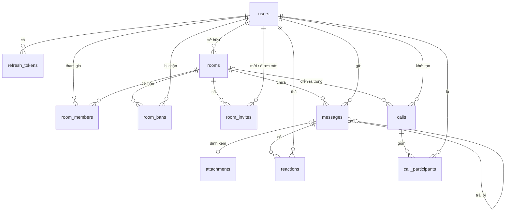

# 5. Thực thể và database

Hệ thống có hai mô hình dữ liệu song song, và tài liệu này mô tả cả hai cùng cách chúng
nối với nhau:

- **Thực thể domain** (`backend/app/domain/models/`) — lớp Python thuần, mang quy tắc nghiệp vụ.
- **Bảng** (`backend/app/infra/db/models.py`) — model SQLAlchemy, mô tả cách lưu.

Repository là nơi duy nhất biết cả hai và chuyển đổi qua lại. Vì sao tách: [02](02-architecture.md#một-dữ-liệu-ba-hình-dạng).

---

## Phần A — Thực thể domain

Chín thực thể, không thực thể nào import SQLAlchemy hay FastAPI.

### `User` — người dùng

| Thuộc tính | Kiểu | Ghi chú |
|---|---|---|
| `id` | int | |
| `email`, `username` | str | Duy nhất |
| `password_hash` | str \| None | `None` với tài khoản chỉ đăng nhập bằng Google |
| `first_name`, `last_name` | str | |
| `is_active` | bool | |
| `avatar_url` | str \| None | Tên tệp đã lưu, không phải URL đầy đủ |
| `bio`, `status` | str \| None | |
| `created_at` | datetime | |

| Hành vi | Quy tắc |
|---|---|
| `full_name` | `"{họ} {tên}"` — kiểu Việt Nam, họ trước |
| `initials` | Chữ cái đầu, dùng làm avatar khi chưa có ảnh |
| `update_profile()` | Họ/tên không rỗng; giới thiệu ≤ 500; trạng thái ≤ 100; chuỗi rỗng → `None` |
| `set_avatar()`, `activate()`, `deactivate()` | |

### `RefreshToken`

| Thuộc tính | Ghi chú |
|---|---|
| `user_id`, `token_hash`, `expires_at`, `is_revoked`, `created_at` | Chỉ lưu **hash** SHA-256 của token |

Hành vi: `is_expired()`, `revoke()`, `is_valid()` = chưa thu hồi và chưa hết hạn.

### `Room` — phòng

| Thuộc tính | Ghi chú |
|---|---|
| `id`, `name`, `owner_id` | |
| `description` | Chuỗi rỗng được chuẩn hóa thành `None` |
| `is_private` | |
| `avatar_url` | Tên tệp đã lưu |
| `theme_color` | Mã màu `#rrggbb` |
| `created_at` | |

Hành vi: tên không được rỗng (cả khi tạo và `rename()`); `is_owner(user_id)`.

### `RoomMember` — tư cách thành viên và vai trò

| Thuộc tính | Ghi chú |
|---|---|
| `room_id`, `user_id` | |
| `role` | `OWNER`, `ADMIN` hoặc `MEMBER` — giá trị khác bị từ chối ngay khi tạo |
| `nickname` | Biệt danh trong phòng này |
| `joined_at` | |

Đây là thực thể chứa **toàn bộ quy tắc phân quyền**:

| Phương thức | OWNER | ADMIN | MEMBER |
|---|:---:|:---:|:---:|
| `rank` | 3 | 2 | 1 |
| `can_delete_room()` | ✅ | | |
| `can_manage_roles()` | ✅ | | |
| `can_manage_members()` | ✅ | ✅ | |
| `can_moderate_messages()` | ✅ | ✅ | |
| `can_update_room()` | ✅ | ✅ | |
| `can_send_message()` | ✅ | ✅ | ✅ |
| `outranks(other)` | so sánh `rank` | | |

### `Message` — tin nhắn

| Thuộc tính | Ghi chú |
|---|---|
| `room_id`, `user_id`, `content` | |
| `message_type` | `TEXT`, `FILE` hoặc `SYSTEM` |
| `attachment_id` | Chỉ với `FILE` |
| `reply_to_id` | Tin đang trả lời |
| `forwarded_from_id` | Có cột nhưng **chưa có tính năng chuyển tiếp** |
| `is_deleted`, `deleted_at` | Xóa mềm |
| `edited_at` | |
| `pinned`, `pinned_at`, `pinned_by` | |
| `sender_name`, `username`, `avatar_url`, `attachment`, `reactions` | Dữ liệu **phụ để hiển thị**, repository điền sẵn khi đọc |

| Hành vi | Quy tắc |
|---|---|
| Khởi tạo | `TEXT` và `SYSTEM` phải có nội dung; `FILE` phải có tệp |
| `edit()` | Nội dung mới không rỗng; đặt `edited_at` |
| `soft_delete()` | `is_deleted = True`, xóa nội dung |
| `is_sent_by(user_id)` | |

### `Attachment` — tệp đính kèm

| Thuộc tính | Ghi chú |
|---|---|
| `filename` | Tên gốc người dùng tải lên |
| `stored_name` | Tên trên ổ đĩa: UUID + phần mở rộng |
| `content_type`, `size_bytes`, `uploaded_by` | |

Quy tắc: tên không rỗng; không được rỗng; tối đa **25 MB**. Thuộc tính `kind` tự phân loại
`IMAGE` / `VIDEO` / `AUDIO` / `FILE` theo MIME để frontend biết cách hiển thị.

### `Reaction` — biểu cảm

`message_id`, `user_id`, `emoji`. Chỉ chấp nhận 6 biểu cảm: 👍 ❤️ 😂 😮 😢 🎉 — giá trị khác
bị từ chối ngay khi tạo.

### `Call` và `CallParticipant` — cuộc gọi

`Call`: `initiator_id`, `kind` (`AUDIO`/`VIDEO`), `mode` (`DIRECT`/`GROUP`), `room_id`,
`status`, `created_at`, `answered_at`, `ended_at`, `participants`.

`CallParticipant`: `call_id`, `user_id`, `state` (`INVITED`/`JOINED`/`DECLINED`/`LEFT`),
`joined_at`, `left_at`.

Cuộc gọi được mô hình hóa bằng **danh sách người tham gia**, không phải cặp người gọi–người
nghe. Gọi 1-1 chỉ là trường hợp có hai người, nên mở rộng sang gọi nhóm không phải đổi cấu
trúc dữ liệu. `Call` chứa toàn bộ máy trạng thái — xem [10](10-call-features.md#máy-trạng-thái).

### Khái niệm chưa có thực thể

| Khái niệm | Hiện ở đâu | Ghi chú |
|---|---|---|
| Lệnh chặn khỏi phòng | Chỉ có bảng `room_bans`, thao tác qua `IRoomRepository.add_ban/remove_ban/is_banned` | Đủ đơn giản để không cần thực thể: chỉ là "có hay không" |
| Lời mời vào phòng | Chỉ có bảng `room_invites` và `InviteRepository` | Nên có thực thể `RoomInvite` — xem [02, nợ kỹ thuật #1](02-architecture.md#nợ-kỹ-thuật) |

---

## Phần B — Bảng

11 bảng, đều tạo bởi `Base.metadata.create_all()`.

### Sơ đồ quan hệ


```mermaid
erDiagram
    users ||--o{ refresh_tokens : "có"
    users ||--o{ rooms : "sở hữu"
    users ||--o{ room_members : "tham gia"
    rooms ||--o{ room_members : "có"
    rooms ||--o{ room_bans : "chặn"
    users ||--o{ room_bans : "bị chặn"
    rooms ||--o{ room_invites : "có"
    users ||--o{ room_invites : "mời / được mời"
    rooms ||--o{ messages : "chứa"
    users ||--o{ messages : "gửi"
    messages |o--o| attachments : "đính kèm"
    messages ||--o{ reactions : "có"
    users ||--o{ reactions : "thả"
    messages |o--o{ messages : "trả lời"
    rooms |o--o{ calls : "diễn ra trong"
    users ||--o{ calls : "khởi tạo"
    calls ||--o{ call_participants : "gồm"
    users ||--o{ call_participants : "là"
```

### `users`

| Cột | Kiểu | Ràng buộc |
|---|---|---|
| `id` | integer | PK |
| `email` | varchar(255) | UNIQUE, NOT NULL, chỉ mục |
| `username` | varchar(50) | UNIQUE, NOT NULL, chỉ mục |
| `password_hash` | varchar(255) | **cho phép NULL** (tài khoản Google) |
| `first_name`, `last_name` | varchar(50) | NOT NULL |
| `is_active` | boolean | NOT NULL, mặc định true |
| `avatar_url` | varchar(255) | |
| `bio` | varchar(500) | |
| `status` | varchar(100) | |
| `created_at` | timestamp | NOT NULL |

### `refresh_tokens`

| Cột | Ràng buộc |
|---|---|
| `id` | PK |
| `user_id` | FK → `users`, **CASCADE**, chỉ mục |
| `token_hash` | UNIQUE, chỉ mục |
| `expires_at`, `is_revoked`, `created_at` | NOT NULL |

### `rooms`

| Cột | Kiểu | Ràng buộc |
|---|---|---|
| `id` | integer | PK |
| `name` | varchar(150) | NOT NULL |
| `description` | varchar(300) | |
| `is_private` | boolean | NOT NULL, chỉ mục |
| `owner_id` | integer | FK → `users`, **CASCADE** |
| `avatar_url` | varchar(500) | |
| `theme_color` | varchar(20) | thêm bằng `ALTER TABLE` lúc khởi động |
| `created_at` | timestamp | NOT NULL |

### `room_members`

| Cột | Ràng buộc |
|---|---|
| `id` | PK |
| `room_id` | FK → `rooms`, **CASCADE**, chỉ mục |
| `user_id` | FK → `users`, **CASCADE**, chỉ mục |
| `role` | varchar(20), NOT NULL, mặc định `MEMBER` |
| `nickname` | varchar(100) — thêm bằng `ALTER TABLE` lúc khởi động |
| `joined_at` | NOT NULL |
| | **UNIQUE (`room_id`, `user_id`)** — một người chỉ một tư cách trong một phòng |

### `room_bans`

| Cột | Ràng buộc |
|---|---|
| `id` | PK |
| `room_id` | FK → `rooms`, **CASCADE**, chỉ mục |
| `user_id` | FK → `users`, **CASCADE**, chỉ mục — người bị chặn |
| `banned_by` | FK → `users`, **SET NULL** — người xóa; người đó xóa tài khoản thì lệnh chặn vẫn còn |
| `created_at` | NOT NULL |
| | **UNIQUE (`room_id`, `user_id`)** |

### `room_invites`

| Cột | Ràng buộc |
|---|---|
| `id` | PK |
| `room_id` | FK → `rooms`, **CASCADE** |
| `inviter_id`, `invitee_id` | FK → `users`, **CASCADE** |
| `status` | `PENDING`, `ACCEPTED` hoặc `REJECTED`; chỉ mục |
| `created_at`, `responded_at` | |
| | UNIQUE (`room_id`, `invitee_id`, `status`) |

🐞 **Lỗi đã xác minh.** Ràng buộc duy nhất có cả `status`, nên với cùng một người và một phòng
chỉ tồn tại được **một** lời mời `ACCEPTED` và **một** `REJECTED` trong lịch sử. Tái hiện:

1. Mời A vào phòng → A chấp nhận → A tự rời phòng.
2. Mời A lần nữa (`201`) → A chấp nhận → **`500`** `UniqueViolation: uq_room_invite_status`.

Vì `add_member` đã commit trước bước cập nhật lời mời, A **vẫn vào được phòng** nhưng nhận
thông báo lỗi, và lời mời thứ hai kẹt ở `PENDING`. Ý định của ràng buộc là "mỗi người chỉ
có một lời mời đang chờ cho mỗi phòng"; cách diễn đạt đúng là chỉ mục duy nhất **một phần**:

```sql
ALTER TABLE room_invites DROP CONSTRAINT uq_room_invite_status;
CREATE UNIQUE INDEX uq_room_invite_pending ON room_invites (room_id, invitee_id)
    WHERE status = 'PENDING';
```

### `attachments`

| Cột | Ràng buộc |
|---|---|
| `id` | PK |
| `filename` | varchar(255), NOT NULL |
| `stored_name` | varchar(255), UNIQUE, chỉ mục |
| `content_type` | varchar(120) |
| `size_bytes` | bigint |
| `uploaded_by` | FK → `users`, **CASCADE** |
| `created_at` | |

### `messages`

| Cột | Ràng buộc |
|---|---|
| `id` | PK |
| `room_id` | FK → `rooms`, **CASCADE** |
| `user_id` | FK → `users`, **CASCADE** |
| `content` | text, NOT NULL, mặc định `''` |
| `message_type` | varchar(20), mặc định `TEXT` |
| `attachment_id` | FK → `attachments`, **SET NULL** |
| `reply_to_id` | FK → `messages` (tự tham chiếu), **SET NULL** |
| `forwarded_from_id` | FK → `messages`, **SET NULL** |
| `is_deleted`, `deleted_at`, `edited_at` | |
| `pinned`, `pinned_at` | |
| `pinned_by` | FK → `users`, **SET NULL** |
| `created_at` | NOT NULL, chỉ mục |
| | Chỉ mục **(`room_id`, `created_at`)** — cho truy vấn "tin mới nhất của phòng" |
| | Chỉ mục **(`room_id`, `pinned`)** — cho danh sách tin ghim |

### `reactions`

| Cột | Ràng buộc |
|---|---|
| `id` | PK |
| `message_id` | FK → `messages`, **CASCADE** |
| `user_id` | FK → `users`, **CASCADE** |
| `emoji` | varchar(16) |
| | **UNIQUE (`message_id`, `user_id`, `emoji`)** — mỗi người thả mỗi loại một lần; thả lại là gỡ |

### `calls`

| Cột | Ràng buộc |
|---|---|
| `id` | PK |
| `room_id` | FK → `rooms`, **SET NULL** — xóa phòng vẫn giữ lịch sử cuộc gọi |
| `initiator_id` | FK → `users`, **CASCADE** |
| `kind` | `AUDIO`/`VIDEO` |
| `mode` | `DIRECT`/`GROUP`, chỉ mục |
| `status` | chỉ mục |
| `created_at` | chỉ mục |
| `answered_at`, `ended_at` | |

### `call_participants`

| Cột | Ràng buộc |
|---|---|
| `id` | PK |
| `call_id` | FK → `calls`, **CASCADE** |
| `user_id` | FK → `users`, **CASCADE** |
| `state` | mặc định `INVITED` |
| `joined_at`, `left_at` | |
| | **UNIQUE (`call_id`, `user_id`)** |

### Xóa thì cái gì đi theo

| Xóa | Kéo theo |
|---|---|
| Một người dùng | refresh token, phòng người đó sở hữu (và mọi thứ trong phòng), tư cách thành viên, tin nhắn, biểu cảm, lệnh chặn và lời mời liên quan, cuộc gọi người đó khởi tạo |
| Một phòng | thành viên, lệnh chặn, lời mời, tin nhắn (và biểu cảm của chúng). Cuộc gọi trong phòng **giữ lại** với `room_id = NULL` |
| Một tin nhắn (xóa cứng) | biểu cảm. Tin trả lời nó giữ lại với `reply_to_id = NULL` |

⚠️ **Tệp trên ổ đĩa không bị xóa theo** khi xóa tin nhắn hay phòng. Bản ghi `attachments`
còn lại và tệp vẫn nằm trong volume `uploads`.

---

## Phần C — Ánh xạ thực thể ↔ bảng

| Thực thể | Bảng | Repository chuyển đổi | Khác biệt đáng chú ý |
|---|---|---|---|
| `User` | `users` | `UserRepository` | |
| `RefreshToken` | `refresh_tokens` | `RefreshTokenRepository` | |
| `Room` | `rooms` | `RoomRepository._to_room_entity` | |
| `RoomMember` | `room_members` | `RoomRepository._to_member_entity` | |
| *(không có)* | `room_bans` | `RoomRepository.add_ban / remove_ban / is_banned` | Chỉ trả về `bool`, không có thực thể |
| *(không có)* | `room_invites` | `InviteRepository` | Trả thẳng `RoomInviteModel` — vi phạm ranh giới tầng |
| `Message` | `messages` + `users` + `attachments` + `reactions` | `MessageRepository._to_entity` | Một thực thể gom dữ liệu từ 4 bảng |
| `Attachment` | `attachments` | `_attachment_to_entity` | |
| `Reaction` | `reactions` | `_reaction_to_entity` | |
| `Call` | `calls` + `call_participants` | `CallRepository` | Một thực thể gom 2 bảng |
| `CallParticipant` | `call_participants` | `CallRepository` | |

### Ví dụ: một `Message` được dựng thế nào

`Message` là trường hợp phức tạp nhất, vì giao diện cần tên người gửi, tệp và biểu cảm cùng
lúc. `MessageRepository.get_by_room_id()` nạp tất cả **trong một truy vấn**:

```python
self.db.query(MessageModel)
    .options(
        joinedload(MessageModel.sender),       # users
        joinedload(MessageModel.attachment),   # attachments
        joinedload(MessageModel.reactions),    # reactions
    )
    .filter(MessageModel.room_id == room_id)
    .order_by(MessageModel.created_at.desc(), MessageModel.id.desc())
    .offset(offset).limit(limit)
```

Không có `joinedload`, mỗi tin sinh thêm 3 truy vấn phụ — 50 tin thành 151 truy vấn (bài toán
**N+1**). Truy vấn sắp xếp **mới nhất trước** rồi mới cắt, sau đó đảo lại để trả về theo thứ
tự cũ → mới. Sắp xếp ngược lại từng là lỗi: khi phòng có hơn 50 tin, tin vừa gửi không có
trong kết quả và biến mất khi tải lại trang.

## Thay đổi schema

Không có framework migration. Hai cơ chế hiện có:

1. **Bảng mới:** `create_all()` tự tạo khi backend khởi động. Không phải làm gì.
2. **Cột mới trên bảng cũ:** `create_all()` **không** làm. Phải thêm vào khối `ALTER TABLE` trong
   `main.py`, dùng `IF NOT EXISTS` để chạy lại nhiều lần vẫn an toàn.

Hiện khối đó gồm: `password_hash` bỏ NOT NULL; thêm `rooms.theme_color`; thêm
`room_members.nickname`.

Xóa sạch và tạo lại từ đầu (mất toàn bộ dữ liệu):

```bash
docker compose down
docker volume rm team-chat_pgdata
docker compose up -d
docker compose exec backend python seed_users.py
```
