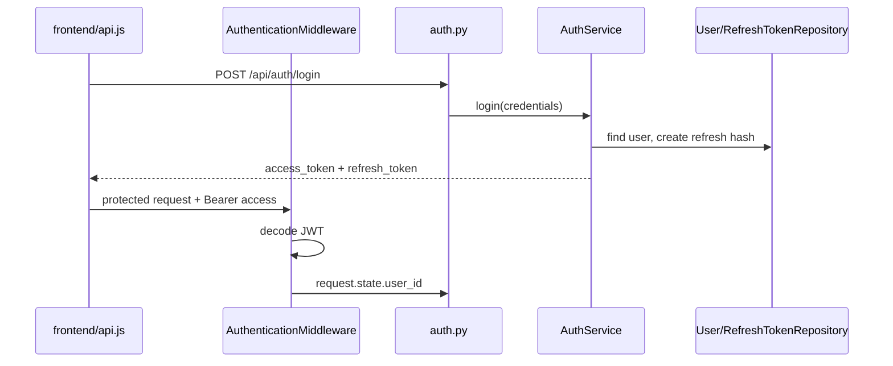

# 6. Authentication và authorization

## Register/login

`auth.py` nhận `RegisterRequest`/`LoginRequest` và gọi `AuthService`. `register()` kiểm tra user trùng, dùng `hash_password()` trong `infra/security/password.py`, tạo user và trả token response. `login()` verify password, tạo access JWT và refresh token ngẫu nhiên.

Refresh token dạng raw chỉ ở client; backend lưu SHA-256 hash trong `refresh_tokens`. `POST /api/auth/refresh` kiểm tra hash/expiry, rotate token cũ và cấp cặp token mới. Refresh token hết hạn sau 7 ngày theo implementation service.

## Access token và middleware

`infra/security/jwt.py` ký HS256 với secret settings. `AuthenticationMiddleware` đọc `Authorization: Bearer`, decode token và đặt `request.state.user_id`. `PUBLIC_PATHS` loại trừ các endpoint công khai như auth, health, docs, avatar; router/dependency tiếp tục bảo vệ nghiệp vụ.

Access token trong implementation hiện có lifetime hardcode 60 phút trong `create_access_token()`. `ACCESS_TOKEN_EXPIRE_MINUTES` trong settings không được dùng tại điểm này.

## Authorization

Services kiểm tra user identity và membership/role. `OWNER > ADMIN > MEMBER`: owner/admin quản lý room/member và moderate/pin message; chỉ owner đổi role hoặc xóa room. Private room giới hạn cho member; public room có thể join theo logic service.

WebSocket xác thực token query parameter trong `ws.py`; subscribe room phải qua kiểm tra quyền. Đây là authentication, còn quyền từng hành động vẫn do websocket/service xử lý.
