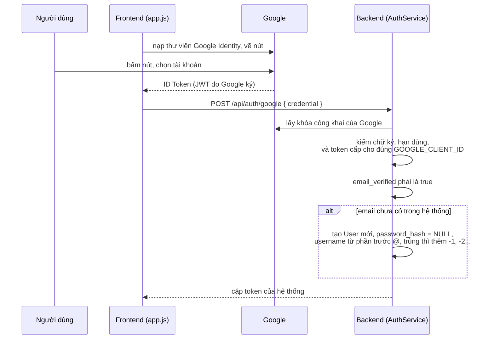
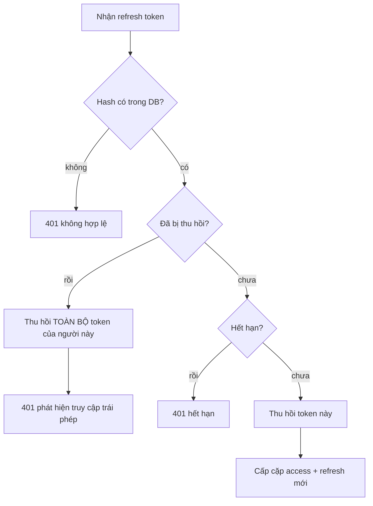

# 6. Xác thực và phân quyền

Hai câu hỏi khác nhau, giải ở hai nơi khác nhau:

| Câu hỏi | Gọi là | Ai trả lời |
|---|---|---|
| Bạn là ai? | Xác thực (authentication) | `AuthenticationMiddleware` — một chỗ cho toàn bộ API |
| Bạn được làm gì? | Phân quyền (authorization) | Service + thực thể `RoomMember` — theo từng ca sử dụng |

## Phần A — Xác thực

### Ba cách lấy phiên đăng nhập

| Cách | Endpoint | `AuthService` | Kết quả |
|---|---|---|---|
| Đăng ký | `POST /api/auth/register` | `register()` | Tạo tài khoản. **Không** cấp token — phải đăng nhập tiếp |
| Email + mật khẩu | `POST /api/auth/login` | `login()` | Cặp token + thông tin người dùng |
| Google | `POST /api/auth/google` | `login_with_google()` | Cặp token + thông tin người dùng |

Đăng nhập luôn bằng **email**, không phải username.

### Đăng ký và đăng nhập bằng mật khẩu

**Đăng ký** (`register`):

1. Email trùng → `400 "Email đã tồn tại trên hệ thống"`
2. Username trùng → `400 "Username đã được sử dụng"`
3. Băm mật khẩu bằng **bcrypt** (12 vòng, có muối ngẫu nhiên) → lưu `password_hash`

Mật khẩu gốc không bao giờ được lưu hay ghi log.

**Đăng nhập** (`login`):

1. Tìm theo email. Không có, **hoặc tài khoản không có mật khẩu** (tạo bằng Google), hoặc sai
   mật khẩu → cùng một thông báo `"Email hoặc mật khẩu không chính xác"`. Gộp chung để không
   tiết lộ email nào đã tồn tại.
2. Tài khoản bị vô hiệu hóa → từ chối.
3. Cấp cặp token.

### Đăng nhập bằng Google


```mermaid
sequenceDiagram
    participant U as Người dùng
    participant F as Frontend (app.js)
    participant G as Google
    participant B as Backend (AuthService)
    F->>G: nạp thư viện Google Identity, vẽ nút
    U->>G: bấm nút, chọn tài khoản
    G-->>F: ID Token (JWT do Google ký)
    F->>B: POST /api/auth/google { credential }
    B->>G: lấy khóa công khai của Google
    B->>B: kiểm chữ ký, hạn dùng,<br/>và token cấp cho đúng GOOGLE_CLIENT_ID
    B->>B: email_verified phải là true
    alt email chưa có trong hệ thống
        B->>B: tạo User mới, password_hash = NULL,<br/>username từ phần trước @, trùng thì thêm -1, -2...
    end
    B-->>F: cặp token của hệ thống
```

Những điểm quan trọng:

- **Backend không tin token từ trình duyệt.** Nó tự kiểm chữ ký bằng khóa công khai của Google
  qua thư viện `google-auth`.
- **Kiểm tra Client ID là bắt buộc.** Thiếu bước này thì ID Token cấp cho *ứng dụng khác* cũng
  đăng nhập được vào hệ thống.
- **Gộp tài khoản theo email.** Nếu email Google đã có tài khoản mật khẩu, người dùng đăng nhập
  vào đúng tài khoản đó. An toàn vì Google đã xác minh quyền sở hữu email (`email_verified`).
- Đăng nhập Google **không** tự thêm người dùng vào phòng nào. (Bản trước có, và nó cho người
  bị xóa khỏi phòng vào lại chỉ bằng cách đăng nhập lại.)
- Client ID **không phải bí mật** — nó nằm công khai trong `frontend/js/app.js`. Client Secret
  không được dùng ở đâu cả.

**Giới hạn khi chạy:** Google chỉ cho nút đăng nhập hoạt động trên các origin đã khai báo
trong *Authorized JavaScript origins*. `https://localhost` dùng được ngay; địa chỉ
`*.trycloudflare.com` đổi mỗi lần chạy đường hầm nên **không khai báo trước được** — qua
đường hầm phải đăng nhập bằng mật khẩu.

### Hai loại token

| | Access token | Refresh token |
|---|---|---|
| Dạng | JWT, ký HS256 bằng `JWT_SECRET_KEY` | 32 byte ngẫu nhiên (64 ký tự hex) — **không** phải JWT |
| Nội dung | `{"sub": user_id, "exp": ..., "type": "access"}` | Không có nội dung, chỉ là chuỗi ngẫu nhiên |
| Sống | **60 phút** (cố định trong `infra/security/jwt.py`) | 7 ngày |
| Lưu ở server | Không lưu — tự kiểm bằng chữ ký | Chỉ lưu **hash SHA-256** trong `refresh_tokens` |
| Dùng để | Gửi kèm mọi request: `Authorization: Bearer ...` | Duy nhất để đổi lấy cặp token mới |

Vì sao refresh token không phải JWT và chỉ lưu hash: server cần **thu hồi được** nó (JWT thì
không thu hồi được trước khi hết hạn), và kể cả lộ database thì kẻ tấn công cũng không có
token gốc để dùng.

⚠️ `ACCESS_TOKEN_EXPIRE_MINUTES` trong `config.py` hiện **không có tác dụng** — `jwt.py` cố
định 60 phút.

### Luân chuyển refresh token và phát hiện đánh cắp

Mỗi refresh token **chỉ dùng được một lần**. `POST /api/auth/refresh`:


```mermaid
flowchart TB
    A[Nhận refresh token] --> B{Hash có trong DB?}
    B -- không --> X1[401 không hợp lệ]
    B -- có --> C{Đã bị thu hồi?}
    C -- rồi --> D[Thu hồi TOÀN BỘ token của người này]
    D --> X2[401 phát hiện truy cập trái phép]
    C -- chưa --> E{Hết hạn?}
    E -- rồi --> X3[401 hết hạn]
    E -- chưa --> F[Thu hồi token này]
    F --> G[Cấp cặp access + refresh mới]
```

Nhánh thứ hai là cơ chế **phát hiện dùng lại**: một token đã đổi rồi mà còn ai đó đem ra dùng
nghĩa là nó đã bị sao chép. Hệ thống không biết bản nào là của chủ thật, nên thu hồi hết và
bắt đăng nhập lại.

### Middleware kiểm tra token

`api/middlewares/auth_middleware.py` chạy trước mọi router:

1. Request `OPTIONS` (CORS preflight) → cho qua.
2. Đường dẫn công khai → cho qua. Xem danh sách ở [03](03-backend.md#vòng-đời-một-request-rest).
3. Không có header `Authorization: Bearer ...` → `401`.
4. JWT sai chữ ký, hết hạn, hoặc `type` không phải `access` → `401`.
5. Hợp lệ → `request.state.user_id = ...`, cho qua.

Router lấy người dùng hiện tại bằng `Depends(get_current_user_id)` — đọc lại
`request.state.user_id`. Không endpoint nào tự giải mã token: kiểm tra token chỉ viết một lần.

### WebSocket

Trình duyệt không gửi được header khi mở WebSocket, nên token đi qua query string:
`/ws?token=...`. `ws.py` tự kiểm tra trước khi nhận kết nối; sai thì đóng với mã `4001`.
Chi tiết: [08](08-websocket-realtime.md).

## Phần B — Phân quyền

### Ba vai trò trong phòng

Vai trò gắn với **từng phòng**, không phải toàn hệ thống: một người có thể là OWNER phòng
này và MEMBER phòng khác. Lưu ở `room_members.role`.

```
OWNER (3)  >  ADMIN (2)  >  MEMBER (1)
```

Người tạo phòng luôn là OWNER. Mỗi phòng có đúng một OWNER — không có chức năng chuyển quyền
sở hữu.

### Ma trận quyền

| Hành động | OWNER | ADMIN | MEMBER | Không phải thành viên | Bị chặn |
|---|:---:|:---:|:---:|:---:|:---:|
| Thấy phòng công khai khi tìm | ✅ | ✅ | ✅ | ✅ | ❌ |
| Xem tên, mô tả, số thành viên phòng công khai | ✅ | ✅ | ✅ | ✅ | ❌ |
| Tự tham gia phòng công khai | — | — | — | ✅ | ❌ |
| Đọc tin nhắn, tin ghim, tệp | ✅ | ✅ | ✅ | ❌ | ❌ |
| Theo dõi realtime (`subscribe`) | ✅ | ✅ | ✅ | ❌ | ❌ |
| Gửi tin nhắn, tệp | ✅ | ✅ | ✅ | ❌ | ❌ |
| Thả biểu cảm | ✅ | ✅ | ✅ | ❌ | ❌ |
| Sửa tin của **mình** | ✅ | ✅ | ✅ | | |
| Sửa tin của người khác | ❌ | ❌ | ❌ | | |
| Xóa tin của mình | ✅ | ✅ | ✅ | | |
| Xóa tin của người khác | ✅ | ✅ | ❌ | | |
| Ghim / bỏ ghim | ✅ | ✅ | ❌ | | |
| Đặt biệt danh cho thành viên | ✅ | ✅ | ✅ | | |
| Đổi tên, mô tả, màu, ảnh phòng | ✅ | ✅ | ❌ | | |
| Thêm thành viên / gửi lời mời | ✅ | ✅ | ❌ | | |
| Xóa MEMBER | ✅ | ✅ | ❌ | | |
| Xóa ADMIN | ✅ | ❌ | ❌ | | |
| Đổi vai trò (ADMIN ↔ MEMBER) | ✅ | ❌ | ❌ | | |
| Xóa phòng | ✅ | ❌ | ❌ | | |
| Tự rời phòng | ❌ | ✅ | ✅ | | |
| Gọi 1-1 cho người cùng phòng | ✅ | ✅ | ✅ | ❌ | ❌ |
| Mở / tham gia cuộc gọi nhóm | ✅ | ✅ | ✅ | ❌ | ❌ |

Với phòng **riêng tư**: người ngoài không thấy phòng khi tìm, không xem được thông tin, không
tự tham gia được — chỉ vào được khi được thêm hoặc chấp nhận lời mời.

Ghi chú:

- **OWNER không rời phòng được** — phải xóa phòng.
- **Không ai xóa được OWNER** và không ai đổi được vai trò của OWNER.
- **ADMIN không xóa được ADMIN khác** — chỉ xóa được người có vai trò thấp hơn mình
  (`RoomMember.outranks()`).
- **Biệt danh** hiện không giới hạn theo vai trò: thành viên nào cũng đặt được biệt danh cho
  bất kỳ ai trong phòng. Mỗi lần đặt sinh một tin nhắn hệ thống, nên ai đặt cũng công khai.

### Chặn người bị xóa

Khi OWNER/ADMIN xóa một người khỏi phòng, hệ thống ghi một dòng vào `room_bans`. Từ đó người
này bị cột "Bị chặn" ở bảng trên. Chỉ có hai cách gỡ:

1. OWNER/ADMIN thêm lại trực tiếp (`POST /rooms/{id}/members`)
2. Người đó chấp nhận một lời mời do OWNER/ADMIN gửi

**Tự rời phòng không bị chặn** — muốn quay lại thì tìm và tham gia như thường.

Đóng mọi cửa vào là phần khó: hệ thống từng có ba cửa vào phòng công khai, và lệnh chặn chỉ
có ý nghĩa nếu cả ba đều kiểm tra. Giờ chỉ còn một:

| Cửa vào | Trước | Bây giờ |
|---|---|---|
| `POST /rooms/{id}/join` | Không kiểm tra chặn | Kiểm tra chặn — **cửa duy nhất** |
| Gửi tin vào phòng chưa tham gia | Tự thêm vào phòng | Từ chối `403` — phải tham gia trước |
| Đăng nhập Google | Tự thêm vào **mọi** phòng công khai | Không thêm vào phòng nào |

Ngoài ra, kết nối WebSocket đang mở của người bị xóa bị server thu hồi kênh của phòng ngay
lập tức (`IEventPublisher.revoke_room_access`), nên họ không nhận thêm tin nào.

### Phân quyền được kiểm ở đâu

Không có lớp phân quyền tập trung kiểu decorator. Mỗi phương thức service tự kiểm tra ở đầu,
theo cùng một khuôn:

```python
member = self.require_membership(room_id, user_id)   # 403 nếu không phải thành viên
if not member.can_moderate_messages():                # hỏi thực thể
    raise PermissionError("Chỉ OWNER hoặc ADMIN mới được ghim tin nhắn")
```

Ưu điểm: quy tắc nằm ngay cạnh ca sử dụng, đọc là hiểu. Nhược điểm: thêm endpoint mà quên
gọi `require_membership` là thủng — chính là cách lỗi "gửi tin tự vào phòng" đã xảy ra.
