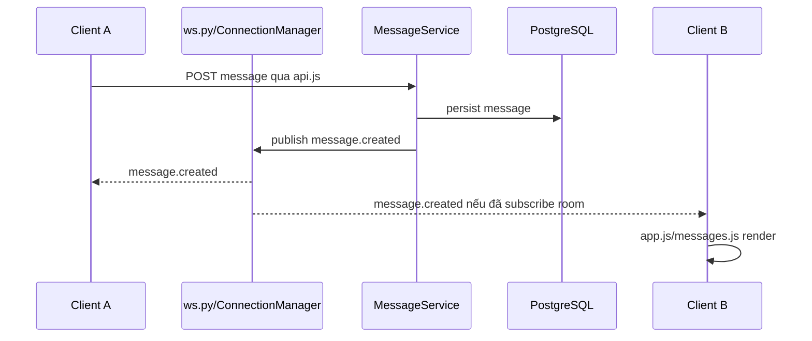

# 8. WebSocket và realtime

## Kết nối

Client trong `frontend/js/ws.js` mở `wss://host/ws?token=<access_token>` khi chạy HTTPS (hoặc `ws://` khi chạy HTTP trực tiếp). `ws.py` decode token, đăng ký socket với `ConnectionManager`, gửi `connected`, xử lý message loop và unregister khi disconnect. Client có reconnect và heartbeat `ping`/`pong`.

## Client actions

```json
{"action":"subscribe","room_id":1}
{"action":"unsubscribe","room_id":1}
{"action":"typing.start","room_id":1}
{"action":"typing.stop","room_id":1}
{"action":"call.signal","call_id":1,"to_user_id":2,"signal":{}}
{"action":"ping"}
```

## Server event

Payload có dạng `{"event":"message.created","data":{...}}`. Event thực tế: `connected`, `subscribed`, `pong`, `error`; `user.online/offline`; `typing.start/stop`; `message.created/updated/deleted/pinned/reaction`; `room.summary_updated/updated/deleted/avatar_updated`; `room.member_joined/member_left/role_changed`; `user.updated`; và nhóm call `call.incoming`, `accepted`, `ended`, `signal`, `participant_joined/left`, `room_started/updated/ended`, `error`.

## Gửi message và broadcast

REST message service ghi message vào DB rồi publish event. `ConnectionManager` gửi event đến các socket đã subscribe room. `app.js`/`messages.js` cập nhật cache và DOM; client vẫn dùng REST để load lịch sử ban đầu.



## Presence và giới hạn

Online/subscription/typing là process memory. Một user có thể có nhiều socket; manager giữ tập socket theo user. Disconnect xóa socket và phát offline khi không còn connection. Không có broker nên nhiều replica sẽ có trạng thái/event không nhất quán.
