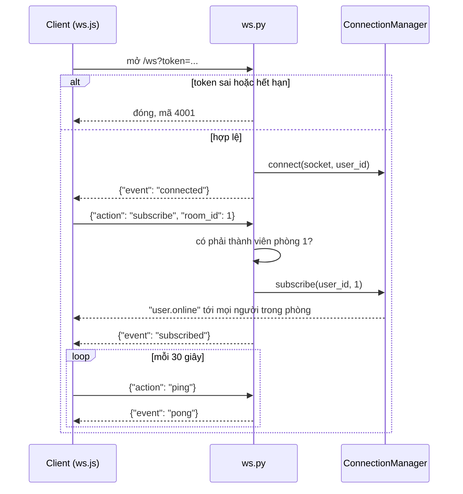

# 8. WebSocket và realtime

Một kết nối WebSocket mỗi tab, mở suốt phiên làm việc. Server dùng nó để **chủ động báo**
cho client; client dùng nó để đăng ký phòng, báo đang gõ, giữ kết nối và chuyển tín hiệu
WebRTC.

Trước khi có WebSocket, mỗi client hỏi lại API mỗi 2 giây — 30 request/phút/người kể cả khi
không có gì mới.

## Các thành phần

| Thành phần | File | Vai trò |
|---|---|---|
| Endpoint | `backend/app/api/routers/ws.py` | Bắt tay, kiểm tra token, đọc hành động từ client |
| `ConnectionManager` | `backend/app/infra/realtime/connection_manager.py` | Giữ danh sách kết nối; cài đặt cổng `IEventPublisher` |
| `IEventPublisher` | `backend/app/domain/interfaces/event_publisher.py` | Cổng mà service dùng để phát sự kiện |
| `realtime` | `frontend/js/ws.js` | Mở, nối lại, phân phát sự kiện tới bộ xử lý |

## Kết nối

```
wss://<host>/ws?token=<access_token>
```

Trình duyệt không gửi được header khi mở WebSocket, nên token nằm trong query string.


```mermaid
sequenceDiagram
    participant C as Client (ws.js)
    participant W as ws.py
    participant M as ConnectionManager
    C->>W: mở /ws?token=...
    alt token sai hoặc hết hạn
        W-->>C: đóng, mã 4001
    else hợp lệ
        W->>M: connect(socket, user_id)
        W-->>C: {"event": "connected"}
        C->>W: {"action": "subscribe", "room_id": 1}
        W->>W: có phải thành viên phòng 1?
        W->>M: subscribe(user_id, 1)
        M-->>C: "user.online" tới mọi người trong phòng
        W-->>C: {"event": "subscribed"}
        loop mỗi 30 giây
            C->>W: {"action": "ping"}
            W-->>C: {"event": "pong"}
        end
    end
```

### Mã đóng kết nối

| Mã | Ai đóng | Lý do | Client làm gì |
|---|---|---|---|
| `4001` | Server | Token không hợp lệ | Đăng xuất, không nối lại |
| `4002` | Server | 90 giây không nhận được gì | Nối lại ngay |
| khác | Mạng | Rớt mạng, server khởi động lại | Nối lại, chờ 1 s → ×1,6 → tối đa 15 s |

Mã `4001` được gửi **trước khi** bắt tay xong, nên tùy trình duyệt có thể chỉ thấy mã `1006`.
Vì vậy `ws.js` có thêm lưới an toàn: chưa từng kết nối thành công mà thất bại **4 lần liên
tiếp** thì coi như phiên đã hết.

### Vì sao có hạn 90 giây

Khi client tắt máy hay rớt mạng, TCP có thể **không báo gì cả** — nhất là khi đi qua proxy
hoặc đường hầm. Server sẽ tưởng người đó vẫn online mãi, và nếu họ đang trong cuộc gọi thì
không ai gọi được họ nữa ("đang bận trong cuộc gọi khác"). Client ping mỗi 30 giây, nên 90
giây là lỡ 3 nhịp mới cắt — đủ rộng cho tab chạy nền bị trình duyệt làm chậm đồng hồ.

Khi người dùng mất **kết nối cuối cùng** (đóng tab cuối), `ws.py` tự kết thúc cuộc gọi dở
dang của họ qua `CallService.end_calls_of_user()`.

## Hành động client gửi lên

Định dạng: `{"action": "...", ...}`

| Hành động | Trường | Server làm gì |
|---|---|---|
| `subscribe` | `room_id` | **Chỉ thành viên** mới được. Thêm vào danh sách theo dõi phòng; báo `user.online` cho phòng; trả `subscribed`. Không phải thành viên → `error` |
| `unsubscribe` | `room_id` | Bỏ khỏi danh sách theo dõi |
| `typing.start` | `room_id` | Kiểm tra thành viên, phát `typing.start` (kèm tên, avatar) tới **người khác** trong phòng |
| `typing.stop` | `room_id` | Phát `typing.stop` tới người khác trong phòng |
| `call.signal` | `call_id`, `to_user_id`, `signal` | `CallService.relay_signal()` kiểm tra rồi chuyển cho đúng một người. Lỗi → `call.error` |
| `ping` | | Trả `pong` |

`subscribe` từng cho phép **bất kỳ ai** theo dõi phòng công khai. Hệ quả là người bị xóa khỏi
phòng chỉ cần gửi lại `subscribe` là tiếp tục đọc được tin mới. Giờ phải là thành viên.

## Sự kiện

Định dạng: `{"event": "...", "data": {...}}`

### Phát tới cả phòng (`publish_to_room`)

Người nhận: mọi kết nối đang `subscribe` phòng đó.

| Sự kiện | Phát từ | Khi | Dữ liệu chính | Frontend xử lý ở |
|---|---|---|---|---|
| `message.created` | `MessageService` | Tin mới (văn bản, tệp, hệ thống) | `message` (toàn bộ tin) | `app.js` |
| `message.updated` | `MessageService` | Sửa tin | `message` | `app.js` |
| `message.deleted` | `MessageService` | Xóa tin | `message_id`, `deleted_by` | `app.js` |
| `message.pinned` | `MessageService` | Ghim **và** bỏ ghim | `pinned`, `message` | `app.js` |
| `message.reaction` | `MessageService` | Thả / gỡ biểu cảm | `action` (`add`/`remove`), `emoji`, `reactions` (đã gom) | `app.js` |
| `room.summary_updated` | `MessageService` | Tin mới — để cập nhật dòng xem trước ở sidebar | `last_message` | `app.js` |
| `room.updated` | `RoomService` | Đổi tên, mô tả, màu | thông tin phòng | `app.js` |
| `room.deleted` | `RoomService` | Xóa phòng | `id` | `app.js` |
| `room.avatar_updated` | `RoomService` | Đổi ảnh phòng | `avatar_url` | `app.js` |
| `room.member_joined` | `RoomService`, router lời mời | Tham gia, được thêm, chấp nhận lời mời | `user_id`, tên, avatar | `app.js` |
| `room.member_left` | `RoomService` | Rời **hoặc bị xóa** | `user_id`, tên | `app.js` |
| `room.role_changed` | `RoomService` | Đổi vai trò | `user_id`, `role` | `app.js` |
| `room.nickname_updated` | router `rooms.py` | Đặt biệt danh | `user_id`, `nickname` | `app.js` |
| `typing.start` / `typing.stop` | `ws.py` | Đang gõ / ngừng gõ | `user_id`, `user` | `app.js` |
| `user.online` / `user.offline` | `ConnectionManager` | Đăng ký phòng / mất kết nối cuối | `user_id` | ⚠️ **chưa có** — xem dưới |
| `call.room_started` | `CallService` | Mở cuộc gọi nhóm | thông tin cuộc gọi | `call.js` |
| `call.room_updated` | `CallService` | Có người vào/rời cuộc gọi nhóm | thông tin cuộc gọi | `call.js` |
| `call.room_ended` | `CallService` | Người cuối rời cuộc gọi nhóm | thông tin cuộc gọi | `call.js` |

### Gửi tới một người (`publish_to_user`)

Người nhận: **mọi tab** đang mở của người đó, bất kể đang xem phòng nào.

| Sự kiện | Phát từ | Khi |
|---|---|---|
| `call.incoming` | `CallService` | Có người gọi 1-1 |
| `call.accepted` | `CallService` | Người được gọi nhấc máy |
| `call.ended` | `CallService` | Từ chối, hủy, hết giờ, hoặc dập máy |
| `call.participant_joined` / `call.participant_left` | `CallService` | Có người vào/rời cuộc gọi mình đang ở |
| `call.signal` | `CallService.relay_signal` | Offer, answer, ICE candidate, trạng thái camera/micro |
| `room.invite` | router `rooms.py` | Được mời vào phòng |

### Gửi tới mọi phòng của một người (`publish_to_user_rooms`)

| Sự kiện | Phát từ | Khi |
|---|---|---|
| `user.updated` | `UserService` | Đổi hồ sơ hoặc ảnh đại diện — để mọi nơi đang hiện người này cập nhật theo |

### Trả lời trực tiếp trên kết nối

| Sự kiện | Khi |
|---|---|
| `connected` | Bắt tay xong |
| `subscribed` | Đăng ký phòng thành công |
| `pong` | Trả lời `ping` |
| `error` | Không có quyền theo dõi phòng |
| `call.error` | Tín hiệu cuộc gọi bị từ chối |

### Client chỉ theo dõi một phòng tại một thời điểm

`ws.js` giữ **một** `subscribedRoom`, không phải danh sách. Mở phòng B thì hủy theo dõi
phòng A. Vì sự kiện "tới cả phòng" chỉ đến người đang theo dõi, nên với **các phòng không
đang mở**, client không nhận được:

| Không nhận | Hệ quả thấy được |
|---|---|
| `message.created`, `room.summary_updated` | Dòng xem trước tin cuối ở sidebar không cập nhật; **số tin chưa đọc không tăng** — bộ đếm `unread_count` ở `rooms.js` chỉ tăng với phòng đang theo dõi, mà phòng đó lại được đặt về 0 khi mở |
| `call.room_started` | Không biết phòng khác vừa mở cuộc gọi nhóm |
| `room.updated`, `room.deleted` | Tên/xóa phòng khác chỉ hiện sau khi nạp lại danh sách |

Những sự kiện gửi **tới một người** (`call.incoming`, `room.invite`, ...) thì vẫn đến, bất kể
đang mở phòng nào — vì vậy cuộc gọi 1-1 và lời mời luôn hoạt động.

Hướng sửa: subscribe **mọi phòng đã tham gia** khi kết nối (server đã cho phép, chỉ cần client
gửi nhiều `subscribe`), và chỉ dùng phòng đang mở để quyết định hiển thị tin trong khung chat.

### Sự kiện được phát nhưng chưa ai dùng

`user.online` và `user.offline` được backend phát, nhưng **frontend không lắng nghe**. Chấm
xanh online chỉ cập nhật khi nạp lại danh sách thành viên, không đổi tức thời. Thêm hai bộ
xử lý trong `app.js` là đủ.

## Bên trong `ConnectionManager`

Ba bảng tra cứu, tất cả **trong bộ nhớ tiến trình**:

```python
_user_sockets: Dict[int, Set[WebSocket]]   # user_id → các tab đang mở
_room_users:   Dict[int, Set[int]]         # room_id → ai đang theo dõi
_socket_user:  Dict[WebSocket, int]        # để dọn dẹp khi ngắt kết nối
_typing:       Dict[int, Dict[int, datetime]]   # ai đang gõ, tự hết hạn sau 5 giây
```

`publish_to_room(1, ...)` = lấy tập người trong `_room_users[1]`, rồi gửi tới mọi socket
của từng người. Socket nào gửi lỗi thì bị coi là đã chết và bị dọn.

`revoke_room_access(user_id, room_id)` = bỏ người đó khỏi `_room_users[room_id]`. Được gọi
**sau** khi phát `room.member_left`; vì các việc được xếp hàng theo thứ tự vào event loop,
người bị xóa vẫn nhận được thông báo mình bị xóa rồi mới bị cắt.

### Hệ quả của việc nằm trong bộ nhớ

Chạy **hai** tiến trình backend thì mỗi tiến trình có `_room_users` riêng. A nối vào tiến
trình 1, B nối vào tiến trình 2: B gửi tin, tiến trình 2 chỉ tìm thấy người trong bộ nhớ của
chính nó, và A không bao giờ nhận được. Vì vậy hiện chỉ chạy **một worker**.

Hướng cải tiến pha 2: viết lớp mới cài đặt `IEventPublisher` bằng **Redis Pub/Sub** — mỗi
tiến trình đăng ký kênh Redis và tự gửi xuống các socket của mình. Không service nào phải sửa,
vì chúng chỉ biết `IEventPublisher`.

## Gửi từ code đồng bộ

Service chạy trong threadpool (không có event loop), nhưng gửi WebSocket cần event loop.
`ConnectionManager._dispatch()` bắc cầu bằng `asyncio.run_coroutine_threadsafe()` tới loop
chính đã được ghi nhớ lúc khởi động qua `bind_loop()`. Xem
[02](02-architecture.md#cầu-nối-đồng-bộ--bất-đồng-bộ).
