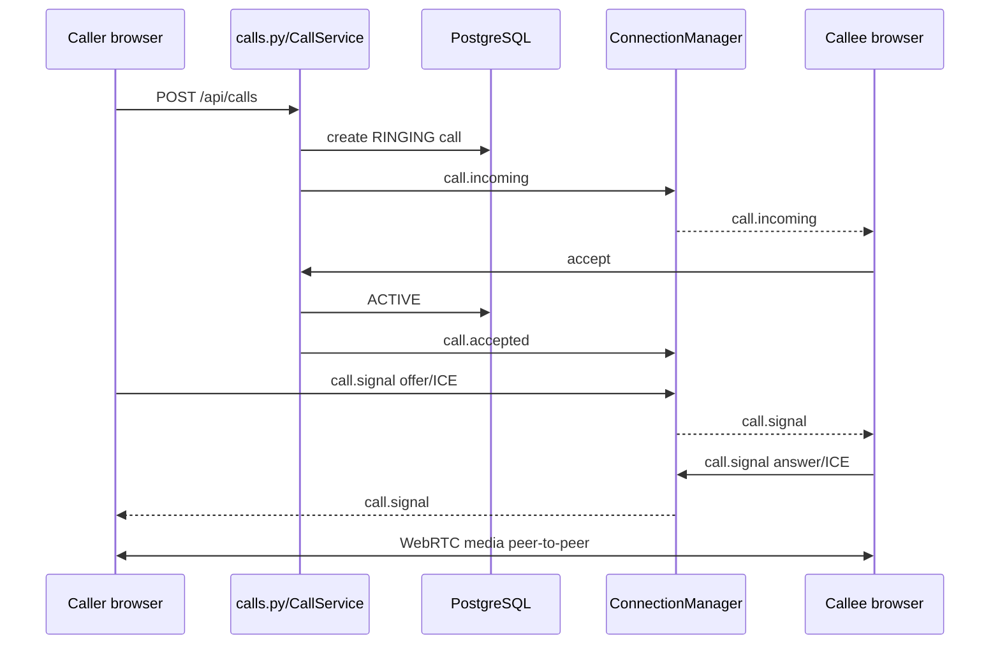

# 10. Call/video call

## Kiến trúc hiện tại

Backend không vận chuyển media. `frontend/js/call.js` dùng browser WebRTC mesh: mỗi participant tạo peer connection tới participant khác. Backend `CallService` lưu lifecycle/participant và chuyển tiếp signaling qua WebSocket. Có STUN cấu hình mặc định; không thấy TURN, SFU hay media server.

## Lifecycle

- Direct call (`DIRECT`): tạo ở `RINGING`, notify callee, timeout 30 giây; có accept/decline/end.
- Group call (`GROUP`): tạo `ACTIVE`, room-wide opt-in, tối đa 6 participant.
- Status domain: `RINGING`, `ACTIVE`, `ENDED`, `REJECTED`, `MISSED`, `CANCELED`.
- Signaling types: `offer`, `answer`, `ice`; payload tối đa 64 KB.

## Flow

Group call dùng `POST /api/calls/group`, `call.room_started/updated/ended` và participant events. `GET /api/calls/config` cung cấp cấu hình để frontend khởi tạo peer connection. Route room active call giúp UI hiển thị call đang chạy.

## Traceability

`call.js` -> `api.js`/`ws.js` -> `routers/calls.py` và `routers/ws.py` -> `services/call_service.py` -> `repositories/call_repo.py` -> `CallModel`/`CallParticipantModel`.
