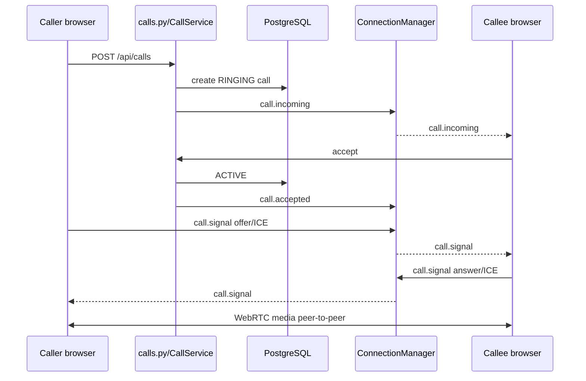

# 10. Call/video call

## Kiến trúc hiện tại

Backend không vận chuyển media. `frontend/js/call.js` dùng browser WebRTC mesh: mỗi participant tạo peer connection tới participant khác. Backend `CallService` lưu lifecycle/participant và chuyển tiếp signaling qua WebSocket. Có STUN cấu hình mặc định và hỗ trợ nhiều ICE server (STUN/TURN) từ `ICE_SERVERS`; có thể dùng `?relay=1` để ép trình duyệt chỉ dùng TURN khi kiểm thử. Không có SFU hay media server.

## Lifecycle

- Direct call (`DIRECT`): tạo ở `RINGING`, notify callee, timeout 30 giây; có accept/decline/end.
- Group call (`GROUP`): tạo `ACTIVE`, room-wide opt-in, tối đa 6 participant.
- Status domain: `RINGING`, `ACTIVE`, `ENDED`, `REJECTED`, `MISSED`, `CANCELED`.
- Signaling types: `offer`, `answer`, `ice`, `media`; payload tối đa 64 KB. `media` đồng bộ trạng thái camera/micro và trạng thái hiện tại được gửi cho participant mới.

## Flow

```mermaid
sequenceDiagram
    participant A as Caller browser
    participant API as calls.py/CallService
    participant DB as PostgreSQL
    participant WS as ConnectionManager
    participant B as Callee browser
    A->>API: POST /api/calls
    API->>DB: create RINGING call
    API->>WS: call.incoming
    WS-->>B: call.incoming
    B->>API: accept
    API->>DB: ACTIVE
    API->>WS: call.accepted
    A->>WS: call.signal offer/ICE
    WS-->>B: call.signal
    B->>WS: call.signal answer/ICE
    WS-->>A: call.signal
    A<<->>B: WebRTC media peer-to-peer
```

Group call dùng `POST /api/calls/group`, `call.room_started/updated/ended` và participant events. `GET /api/calls/config` cung cấp cấu hình để frontend khởi tạo peer connection. Route room active call giúp UI hiển thị call đang chạy.

Khi camera hoặc micro bị tắt, browser vẫn giữ media track nhưng frontend gửi trạng thái qua signaling để participant khác hiển thị avatar hoặc biểu tượng micro tắt. Query `?relay=1` chỉ có hiệu lực trong phiên trang hiện tại, không lưu vào `localStorage`; bỏ query để quay lại kết nối trực tiếp khi có thể.

## Traceability

`call.js` -> `api.js`/`ws.js` -> `routers/calls.py` và `routers/ws.py` -> `services/call_service.py` -> `repositories/call_repo.py` -> `CallModel`/`CallParticipantModel`.
