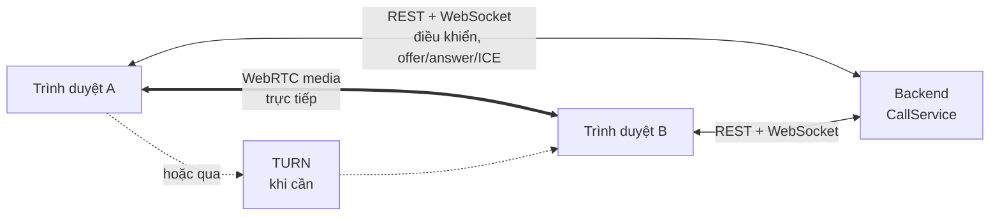
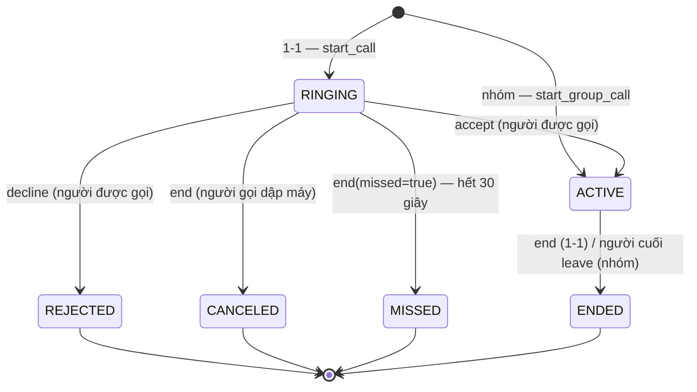
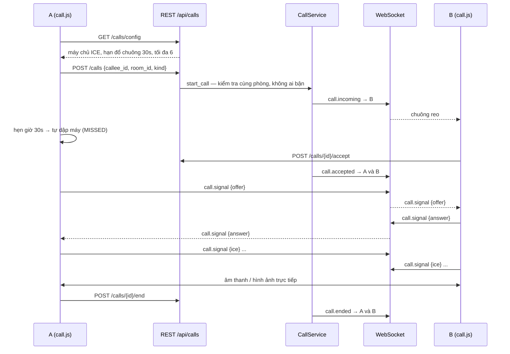
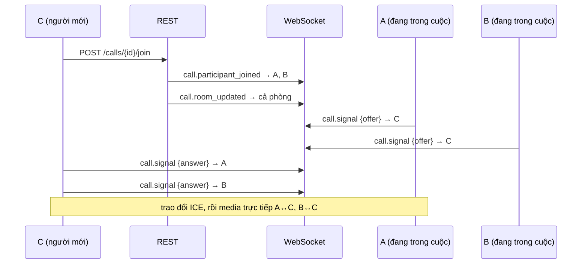

# 10. Tính năng gọi

## Ý tưởng chính: tách hai mặt phẳng

Một cuộc gọi có hai loại dữ liệu rất khác nhau, nên chúng đi hai đường khác nhau:

| Mặt phẳng | Gồm | Đi qua | Ai xử lý |
|---|---|---|---|
| **Điều khiển** (signaling) | Ai gọi ai, nhấc máy, dập máy, ai vào nhóm; offer/answer/ICE | REST + WebSocket qua backend | `CallService`, `Call` |
| **Media** | Âm thanh, hình ảnh | **Thẳng giữa hai trình duyệt** (hoặc qua TURN) | WebRTC của trình duyệt, `call.js` |

Backend **không bao giờ thấy** âm thanh hay hình ảnh. Kể cả khi đi qua TURN, TURN cũng chỉ
chuyển tiếp gói đã mã hóa (DTLS-SRTP), không giải mã được.


```mermaid
flowchart LR
    A[Trình duyệt A]
    B[Trình duyệt B]
    S[Backend<br/>CallService]
    T[TURN<br/>khi cần]
    A <-->|REST + WebSocket<br/>điều khiển, offer/answer/ICE| S
    B <-->|REST + WebSocket| S
    A <==>|WebRTC media<br/>trực tiếp| B
    A -.->|hoặc qua| T
    T -.-> B
```

## Hai chế độ

| | 1-1 (`DIRECT`) | Nhóm (`GROUP`) |
|---|---|---|
| Bắt đầu | Bấm gọi trên một thành viên đang online | Bấm gọi nhóm ở đầu phòng |
| Đổ chuông | Có, 30 giây | Không — cuộc gọi mở ngay, ai muốn thì vào |
| Trạng thái ban đầu | `RINGING` | `ACTIVE` |
| Người tham gia | Đúng 2 | Tối đa **6** |
| Kết thúc khi | Một bên dập máy | Người **cuối cùng** rời đi |
| Điều kiện | Cả hai cùng phòng; không ai đang bận cuộc gọi khác | Là thành viên phòng; không đang bận cuộc gọi khác |

Cả hai đều có loại `AUDIO` (chỉ micro) hoặc `VIDEO`. Không mở được camera thì tự chuyển sang
chỉ micro.

**Mỗi người tối đa một cuộc gọi đang mở tại một thời điểm.** Gọi người đang bận trả `409`.

## Máy trạng thái

Toàn bộ luật chuyển trạng thái nằm trong thực thể `Call` (`domain/models/call.py`). Service
chỉ gọi phương thức; gọi sai thời điểm thì thực thể từ chối.


```mermaid
stateDiagram-v2
    [*] --> RINGING: 1-1 — start_call
    [*] --> ACTIVE: nhóm — start_group_call
    RINGING --> ACTIVE: accept (người được gọi)
    RINGING --> REJECTED: decline (người được gọi)
    RINGING --> CANCELED: end (người gọi dập máy)
    RINGING --> MISSED: end(missed=true) — hết 30 giây
    ACTIVE --> ENDED: end (1-1) / người cuối leave (nhóm)
    REJECTED --> [*]
    CANCELED --> [*]
    MISSED --> [*]
    ENDED --> [*]
```

| Phương thức | Chỉ hợp lệ khi | Từ chối nếu |
|---|---|---|
| `accept(user)` | `RINGING` | Người gọi tự nhận; người lạ nhận |
| `decline(user)` | `RINGING` | Người gọi tự từ chối |
| `end(user, missed)` | Đang mở | Người không trong cuộc gọi |
| `join(user)` | Nhóm, `ACTIVE` | Đã đủ 6 người; không phải cuộc gọi nhóm |
| `leave(user)` | Đang trong cuộc gọi | — |

Mỗi người tham gia có trạng thái riêng (`CallParticipant`):

```
INVITED ──accept──► JOINED ──leave──► LEFT
   │                                    ▲
   └──decline──► DECLINED       join lại (nhóm)
```

Người từng rời cuộc gọi nhóm có thể vào lại; dòng `call_participants` cũ được dùng lại.

Mốc thời gian: `created_at` (bắt đầu), `answered_at` (nhấc máy — nhóm thì bằng lúc bắt đầu),
`ended_at`. Thời lượng = `ended_at − answered_at`.

## Luồng gọi 1-1


```mermaid
sequenceDiagram
    participant A as A (call.js)
    participant API as REST /api/calls
    participant S as CallService
    participant WS as WebSocket
    participant B as B (call.js)
    A->>API: GET /calls/config
    API-->>A: máy chủ ICE, hạn đổ chuông 30s, tối đa 6
    A->>API: POST /calls {callee_id, room_id, kind}
    API->>S: start_call — kiểm tra cùng phòng, không ai bận
    S->>WS: call.incoming → B
    WS-->>B: chuông reo
    A->>A: hẹn giờ 30s → tự dập máy (MISSED)
    B->>API: POST /calls/{id}/accept
    S->>WS: call.accepted → A và B
    A->>WS: call.signal {offer}
    WS-->>B: call.signal {offer}
    B->>WS: call.signal {answer}
    WS-->>A: call.signal {answer}
    A->>WS: call.signal {ice} ...
    B->>WS: call.signal {ice} ...
    A<<->>B: âm thanh / hình ảnh trực tiếp
    A->>API: POST /calls/{id}/end
    S->>WS: call.ended → A và B
```

## Luồng gọi nhóm: mesh

Gọi nhóm dùng mô hình **mesh**: mỗi người giữ một `RTCPeerConnection` riêng tới **từng**
người còn lại. Không có máy chủ media ở giữa.

```
4 người:   A ─── B        A giữ 3 kết nối (B, C, D), B cũng 3, ...
           │ ╲ ╱ │        Tổng: n(n−1)/2 = 6 kết nối
           │ ╱ ╲ │
           C ─── D
```

Trong `call.js`, `callUI.peers` là một `Map: user_id → { pc, stream, ... }`. Mỗi người mới vào
thì những người đang ở trong tạo thêm một kết nối:

```javascript
async onParticipantJoined(data) {
  // Mình đã ở trong cuộc gọi -> mình là bên gửi offer cho người mới
  await this.ensurePeer(newcomer, true);
}
```

**Quy ước ai gửi offer:** người **cũ** gửi offer cho người **mới**. Nếu cả hai cùng gửi offer
một lúc (gọi là *glare*), bắt tay WebRTC sẽ xung đột và kẹt.


```mermaid
sequenceDiagram
    participant C as C (người mới)
    participant API as REST
    participant WS as WebSocket
    participant A as A (đang trong cuộc)
    participant B as B (đang trong cuộc)
    C->>API: POST /calls/{id}/join
    API->>WS: call.participant_joined → A, B
    API->>WS: call.room_updated → cả phòng
    A->>WS: call.signal {offer} → C
    B->>WS: call.signal {offer} → C
    C->>WS: call.signal {answer} → A
    C->>WS: call.signal {answer} → B
    Note over A,C: trao đổi ICE, rồi media trực tiếp A↔C, B↔C
```

### Vì sao tối đa 6 người

Với mesh, mỗi máy phải **mã hóa và tải lên n−1 bản** hình của chính mình:

| Người | Kết nối mỗi máy | Băng thông tải lên (720p ≈ 1,5 Mbps/luồng) |
|---|---|---|
| 2 | 1 | ~1,5 Mbps |
| 4 | 3 | ~4,5 Mbps |
| 6 | 5 | ~7,5 Mbps |
| 10 | 9 | ~13,5 Mbps |

Mạng gia đình thường tải lên yếu hơn tải xuống nhiều lần, và CPU phải chạy n−1 bộ mã hóa video
cùng lúc. Giới hạn đặt trong thực thể (`Call.MAX_GROUP_PARTICIPANTS = 6`) để sửa frontend hay
gọi API trực tiếp cũng không vượt được.

Hiện camera luôn xin 720p bất kể số người. Hạ độ phân giải khi đông người là cách rẻ nhất để
nâng trần mà không cần hạ tầng mới.

### Mesh so với SFU

| | Mesh (hiện tại) | SFU (Teams, Google Meet, Zoom) |
|---|---|---|
| Tải lên mỗi máy | n−1 luồng | **1** luồng |
| Tải xuống mỗi máy | n−1 luồng | n−1 luồng (chất lượng tùy chỉnh theo người nhận) |
| Máy chủ media | Không cần | Cần (mediasoup, Janus, LiveKit) |
| Máy chủ thấy nội dung | Không | Có |
| Chi phí vận hành | 0 | Theo CPU và băng thông |
| Quy mô | ~6 người | Hàng trăm |

Mesh được chọn vì đây là chat nội bộ nhóm nhỏ: đổi toàn bộ chi phí hạ tầng lấy trần 6 người
là đổi có lợi. Chuyển sang SFU cũng **không đo được trên Kaggle** (không có camera, mạng không
giống người dùng thật), nên không hợp làm cải tiến pha 2.

## Tín hiệu WebRTC

Đi qua WebSocket, hành động `call.signal`:

```json
{"action": "call.signal", "call_id": 12, "to_user_id": 3,
 "signal": {"type": "offer", "sdp": "..."}}
```

| `signal.type` | Nội dung |
|---|---|
| `offer` | Mô tả phiên (SDP): codec, độ phân giải mình hỗ trợ |
| `answer` | Trả lời offer |
| `ice` | Một địa chỉ có thể kết nối tới mình (ICE candidate) |
| `media` | Trạng thái camera/micro đang bật hay tắt — để bên kia hiện biểu tượng |

`CallService.relay_signal()` kiểm tra trước khi chuyển:

1. `type` phải là một trong 4 loại trên.
2. Tối đa **64 KB**.
3. Cuộc gọi còn đang mở.
4. **Cả người gửi lẫn người nhận đều trong cuộc gọi đó.** Thiếu kiểm tra này thì WebSocket
   thành kênh cho phép bất kỳ ai nhắn thẳng tới bất kỳ ai.

Vì sao qua WebSocket mà không qua REST: ICE candidate sinh ra liên tục thành nhiều gói nhỏ,
mỗi gói một request HTTP thì quá nặng.

## Máy chủ ICE

Để hai trình duyệt tìm được đường tới nhau, WebRTC dùng hai loại máy chủ:

| Loại | Làm gì | Khi nào cần | Chi phí |
|---|---|---|---|
| **STUN** | Cho mỗi bên biết địa chỉ công khai của mình | Gần như luôn — mặc định dùng STUN của Google | Miễn phí, rất nhẹ |
| **TURN** | **Chuyển tiếp** media khi không nối thẳng được | Mạng 4G, mạng trường, mạng công ty, NAT chặt | Tốn băng thông, cần tài khoản |

Cùng mạng LAN thì chẳng cần cả hai. Khác mạng: STUN đủ với phần lớn mạng gia đình; còn lại
phải có TURN. Cấu hình bằng biến `ICE_SERVERS` trong `.env`, hai định dạng:

```bash
# Cách ngắn — mỗi mục: url hoặc url|username|credential, phân cách bằng dấu phẩy
ICE_SERVERS=stun:stun.l.google.com:19302,turn:vd.com:3478|user|pass

# Cách JSON — khi một máy chủ có nhiều url
ICE_SERVERS=[{"urls":["turn:vd.com:3478","turn:vd.com:3478?transport=tcp"],"username":"user","credential":"pass"}]
```

Cấu hình sai không làm sập backend: mục lỗi bị bỏ qua và ghi cảnh báo vào log. Frontend nhận
danh sách qua `GET /api/calls/config`.

⚠️ Đổi `.env` xong phải chạy `docker compose up -d`, **không phải** `restart` — `restart` không
đọc lại `.env`.

⚠️ Chromium **lặng lẽ bỏ qua** máy chủ TURN đặt ở địa chỉ loopback (`127.0.0.1`), không báo
lỗi gì. Dùng IP LAN thật.

Đăng ký TURN và chạy đường hầm: [15](15-third-party-services.md), [16](16-goi-xuyen-mang-lam-may-chu.md).

## Chế độ kiểm tra TURN: `?relay=1`

Mở app với `https://.../?relay=1` thì mọi kết nối bị ép `iceTransportPolicy: "relay"` —
**chỉ** được đi qua TURN, cấm đường trực tiếp. Gọi được ở chế độ này nghĩa là TURN chắc chắn
hoạt động.

Đây là công cụ kiểm tra, không dùng thường ngày: ép qua TURN làm tăng độ trễ và tốn băng thông
TURN không cần thiết. Giao diện hiện thông báo khi chế độ này đang bật, và `call.js` đọc cặp
candidate đang dùng (`detectPath`) để hiện đường đi thực tế là trực tiếp hay qua TURN.

## Dọn dẹp cuộc gọi treo

Cuộc gọi treo nguy hiểm vì nó khóa người dùng: còn một cuộc gọi "đang mở" là không ai gọi
được họ nữa.

| Tình huống | Xử lý |
|---|---|
| Không ai nhấc máy 30 giây | `call.js` bên gọi tự dập máy với `missed=true` → `MISSED` |
| Đóng tab cuối cùng | `ws.py` phát hiện mất kết nối cuối → `CallService.end_calls_of_user()`: 1-1 thì kết thúc, nhóm thì chỉ rời |
| Tắt máy, rớt mạng (TCP không báo) | Server đóng WebSocket sau 90 giây im lặng → dọn như trên |

## Lịch sử

Mọi cuộc gọi được lưu trong `calls` và `call_participants`, kể cả cuộc bị từ chối hay nhỡ.
`GET /api/calls` trả 30 cuộc gần nhất của mình. **Chưa có giao diện xem lịch sử.**
