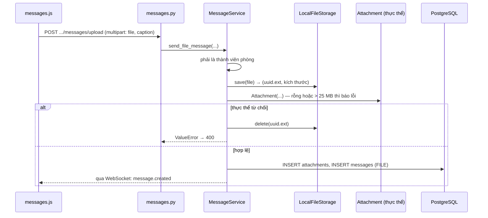

# 11. Lưu trữ tệp

## Ba loại tệp, một chỗ lưu

| Loại | Tải lên qua | Giới hạn | Định dạng | Ai xem được |
|---|---|---|---|---|
| Tệp đính kèm tin nhắn | `POST /api/rooms/{id}/messages/upload` | 25 MB | Bất kỳ | Thành viên phòng chứa tin |
| Ảnh đại diện người dùng | `POST /api/users/me/avatar` | 5 MB | JPEG, PNG, GIF, WEBP | **Công khai** (chỉ GET) |
| Ảnh đại diện phòng | `POST /api/rooms/{id}/avatar` | 5 MB | JPEG, PNG, GIF, WEBP | **Công khai** (chỉ GET) |

Cả ba đều nằm phẳng trong một thư mục: `/app/uploads` trong container `backend`, gắn với
Docker volume **`uploads`**. Volume tách khỏi mã nguồn và khỏi dữ liệu PostgreSQL, nên dựng
lại container không mất tệp.

## Kiến trúc: cổng `IFileStorage`

Service không biết tệp nằm ở đâu. Nó chỉ dùng cổng:

```python
class IFileStorage(ABC):
    def save(self, file_obj, original_filename) -> Tuple[str, int]  # (tên đã lưu, kích thước)
    def open_stream(self, stored_name) -> BinaryIO
    def exists(self, stored_name) -> bool
    def delete(self, stored_name) -> bool
```

Bộ chuyển đổi hiện tại là `LocalFileStorage` (`infra/storage/local_storage.py`), ghi xuống ổ
đĩa. Thay bằng S3 hay MinIO chỉ cần viết một lớp mới cài đặt bốn phương thức này và đổi một
dòng trong `api/dependencies.py`:

```python
file_storage = LocalFileStorage(settings.UPLOAD_DIR)   # đổi dòng này
```

Đây cũng là điều kiện để chạy nhiều máy chủ backend: ổ đĩa local thì mỗi máy một bản, còn
object storage thì dùng chung.

## Đặt tên tệp

Tệp **không** được lưu bằng tên gốc. `LocalFileStorage.save()` đặt tên mới:

```
<uuid4 hex 32 ký tự> + <phần mở rộng gốc, tối đa 20 ký tự>
ví dụ:  3f9a1c...e7b2.png
```

Lý do:

| Mối nguy | Cách tên UUID chặn |
|---|---|
| Hai người tải lên cùng tên `bao-cao.pdf` | Không bao giờ trùng |
| Tên gốc lộ thông tin | Tên trên ổ đĩa không nói gì |
| **Path traversal**: tên tệp `../../etc/passwd` | Không dùng tên gốc làm đường dẫn |

Thêm một lớp nữa ở `_safe_path()`: mọi đường dẫn đều cắt chỉ còn phần tên (`basename`), rồi
kiểm tra đường dẫn tuyệt đối sau khi giải vẫn nằm trong thư mục gốc. Áp dụng cho cả đọc và
xóa, không chỉ ghi.

Tên gốc được giữ trong bảng `attachments.filename` để hiển thị và đặt tên khi tải về.

## Luồng gửi tệp đính kèm



Lưu ý: tệp được **ghi xong rồi mới** kiểm tra kích thước, vì kích thước thật chỉ biết sau khi
ghi. Tệp quá lớn bị xóa ngay sau đó. nginx chặn trước ở mức 30 MB (`client_max_body_size`),
nên không ai đẩy được tệp khổng lồ vào đĩa.

## Tải tệp về

Tệp đính kèm cần quyền: `GET /api/attachments/{id}` kiểm tra người tải là thành viên phòng
chứa tin đó. Vì cần header `Authorization`, frontend **không** đặt URL thẳng vào ``
mà:

1. `fetch` có kèm token → nhận về `Blob`
2. `URL.createObjectURL(blob)` → địa chỉ `blob:...` chỉ sống trong tab đó
3. Gán địa chỉ này vào ``, `<video>`, `<audio>`

Việc này nằm ở `hydrateSecureMedia()` trong `messages.js`: mọi phần tử có thuộc tính
`data-secure-src` được thay bằng `blob:` URL sau khi hiển thị tin nhắn.

Ảnh đại diện thì ngược lại: là đường dẫn công khai, vì xuất hiện ở khắp nơi và tải bằng
`fetch` từng cái thì quá nặng. Đổi lại, ai biết `user_id` cũng xem được ảnh đại diện — chấp
nhận được với ảnh đại diện.

Đổi ảnh đại diện thì frontend thêm `?v=<thời điểm>` vào URL để trình duyệt không dùng lại ảnh
cũ trong cache.

## Xóa tệp

| Khi | Tệp trên ổ đĩa |
|---|---|
| Đổi ảnh đại diện (người hoặc phòng) | ✅ Ảnh cũ bị xóa |
| Tải lên quá giới hạn hoặc sai định dạng | ✅ Bị xóa ngay |
| Xóa tin nhắn (xóa mềm) | ❌ **Còn nguyên** |
| Xóa phòng | ❌ **Còn nguyên** — dòng `attachments` cũng còn |

Hai dòng cuối nghĩa là volume `uploads` chỉ lớn lên. Cần một tác vụ dọn tệp mồ côi nếu chạy
lâu dài.

## Sao lưu và xóa sạch

```bash
# Xem dung lượng
docker compose exec backend du -sh /app/uploads

# Xóa sạch MỌI tệp (không thể khôi phục)
docker compose down
docker volume rm team-chat_uploads
docker compose up -d
```

Xóa volume `uploads` mà giữ DB thì các tin nhắn tệp vẫn còn nhưng hiện "Không tải được tệp
đính kèm".
