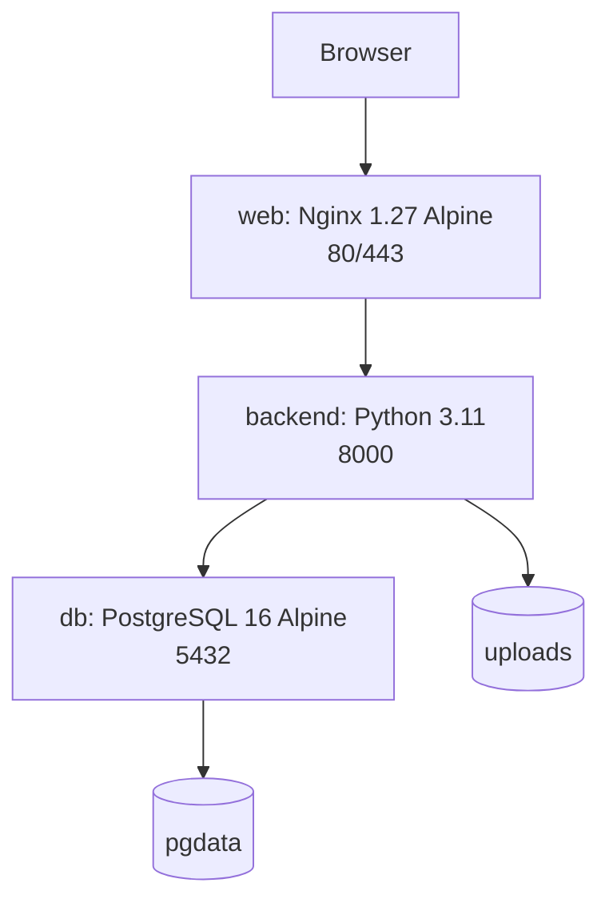

# 12. Deployment

## Compose topology

| Service | Runtime/ports | Volume | Dependency |
| --- | --- | --- | --- |
| `db` | `postgres:16-alpine`, host `${POSTGRES_PORT:-5432}` | `pgdata:/var/lib/postgresql/data` | healthcheck `pg_isready` |
| `backend` | Python 3.11, host `${PORT:-8000}` -> 8000 | `./backend:/app`, `uploads:/app/uploads` | chờ `db` healthy |
| `web` | Nginx 1.27 Alpine, `${HTTP_PORT:-80}`, `${HTTPS_PORT:-443}` | frontend read-only, `certs:/etc/nginx/certs` | backend started |

## Backend image

`backend/Dockerfile` cài requirements, tạo user `appuser`, đặt working directory và chạy Uvicorn. Runtime config đến từ `.env`/Compose; `DATABASE_URL` được dựng để trỏ host service `db`, `UPLOAD_DIR=/app/uploads`.

## Nginx

`deploy/nginx/nginx.conf` phục vụ `/` từ `/usr/share/nginx/html`, redirect HTTP sang HTTPS, proxy `/api/`, `/docs`, `/redoc`, `/health` đến `backend:8000`, và proxy `/ws` với WebSocket upgrade. Upload limit là `30m`.

`10-gen-cert.sh` tạo self-signed certificate với SAN cho localhost, `127.0.0.1` và IP trong `CERT_IPS`. HTTPS cần cho quyền microphone/camera của browser. Thư mục root `nginx/` hiện không được Compose sử dụng; cấu hình active nằm ở `deploy/nginx/`.

## Environment và lưu ý

Compose dùng `POSTGRES_USER`, `POSTGRES_PASSWORD`, `POSTGRES_DB`, `POSTGRES_PORT`, `PORT`, `HTTPS_PORT`, `HTTP_PORT`, `CERT_IPS`. Backend settings kỳ vọng tên JWT như `JWT_SECRET_KEY` và `ACCESS_TOKEN_EXPIRE_MINUTES`; cần kiểm tra `.env` thực tế vì README/RUN_GUIDE có thể dùng tên cũ `JWT_SECRET`/`JWT_EXPIRE_MINUTES`.
