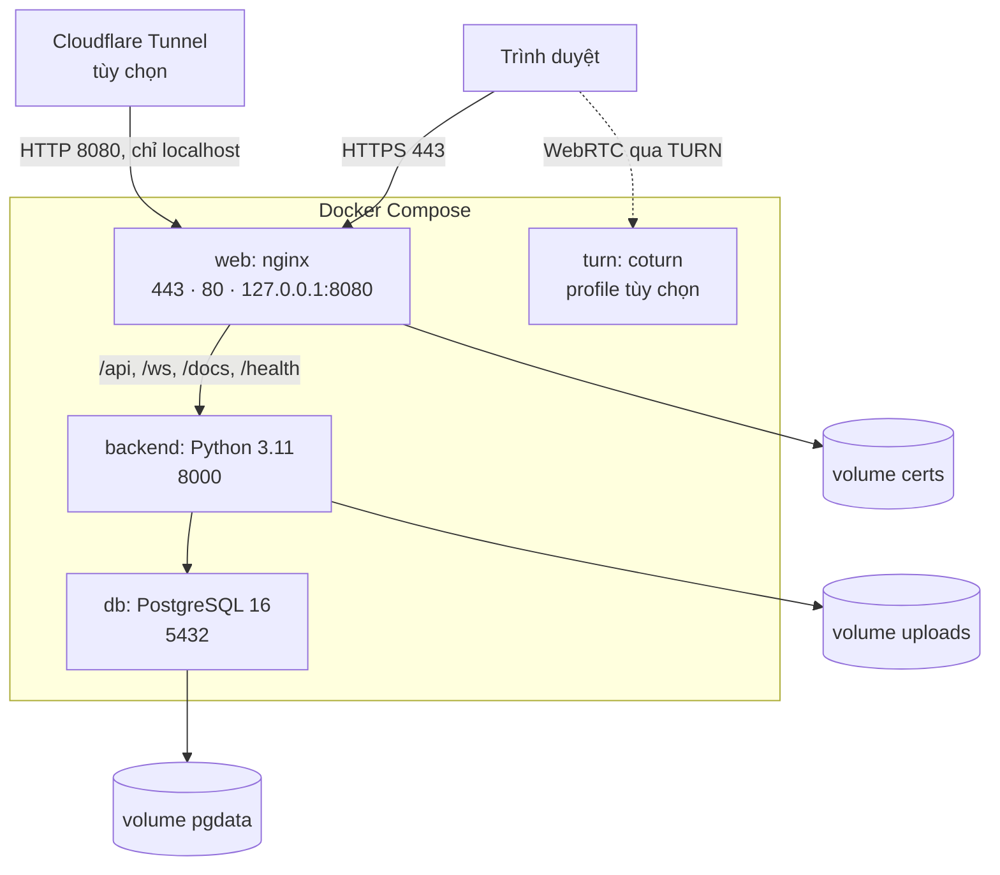

# 12. Triển khai

Hướng dẫn chạy từng bước cho người mới: [`RUN_GUIDE.md`](../RUN_GUIDE.md). Tài liệu này giải
thích **cấu trúc** triển khai và những điều cần biết khi vận hành.

## Sơ đồ container


```mermaid
flowchart TB
    Client[Trình duyệt]
    Tunnel[Cloudflare Tunnel<br/>tùy chọn]
    subgraph Docker Compose
        Web[web: nginx<br/>443 · 80 · 127.0.0.1:8080]
        Backend[backend: Python 3.11<br/>8000]
        DB[db: PostgreSQL 16<br/>5432]
        Turn[turn: coturn<br/>profile tùy chọn]
    end
    Uploads[(volume uploads)]
    Pgdata[(volume pgdata)]
    Certs[(volume certs)]
    Client -->|HTTPS 443| Web
    Tunnel -->|HTTP 8080, chỉ localhost| Web
    Web -->|/api, /ws, /docs, /health| Backend
    Backend --> DB
    Backend --> Uploads
    DB --> Pgdata
    Web --> Certs
    Client -. WebRTC qua TURN .-> Turn
```

| Service | Image | Cổng ra máy chủ | Volume | Chờ |
|---|---|---|---|---|
| `db` | `postgres:16-alpine` | `${POSTGRES_PORT:-5432}` | `pgdata` | — (có healthcheck `pg_isready`) |
| `backend` | build `backend/` | `${PORT:-8000}` | `./backend:/app` (mã nguồn), `uploads:/app/uploads` | `db` healthy |
| `web` | build `deploy/nginx/` | `443`, `80`, `127.0.0.1:8080` | `./frontend` (chỉ đọc), `certs` | `backend` |
| `turn` | `coturn/coturn` | host network, `3478`, UDP `50000–50010` | — | **chỉ chạy khi** `--profile turn` |

## Ba volume

| Volume | Chứa | Mất thì |
|---|---|---|
| `pgdata` | Toàn bộ CSDL | Mất tài khoản, phòng, tin nhắn — phải chạy lại `seed_users.py` |
| `uploads` | Tệp đính kèm, ảnh đại diện | Tin nhắn tệp còn nhưng không tải được |
| `certs` | Chứng chỉ HTTPS tự ký | Sinh lại khi khởi động, mọi trình duyệt phải chấp nhận cảnh báo lại |

`docker compose down -v` xóa **cả ba**. Muốn xóa riêng một cái:
`docker volume rm team-chat_<tên>` sau khi `down`.

## nginx

`deploy/nginx/nginx.conf` có ba khối `server`:

| Cổng | Làm gì |
|---|---|
| `80` | Chuyển hướng 301 sang HTTPS |
| `443` | HTTPS. Phục vụ `frontend/`; chuyển `/api/`, `/ws`, `/docs`, `/redoc`, `/health` về `backend:8000` |
| `8080` | Giống 443 nhưng **HTTP thường**, chỉ mở trên `127.0.0.1` — dành cho Cloudflare Tunnel (tunnel đã mã hóa sẵn) |

Cấu hình đáng chú ý:

| Cấu hình | Lý do |
|---|---|
| `client_max_body_size 30m` | Tệp đính kèm tối đa 25 MB, cộng phần đầu multipart |
| `/ws`: `Upgrade` + `Connection "upgrade"` | Bắt buộc để nâng HTTP lên WebSocket qua proxy |
| `/ws`: `proxy_read_timeout 3600s` | Mặc định 60 s sẽ cắt WebSocket đang im lặng |
| `proxy_request_buffering off` | Tải tệp lớn chuyển thẳng về backend, không đệm toàn bộ ở nginx |
| `try_files $uri $uri/ /index.html` | Mọi đường dẫn lạ đều trả giao diện |

Backend và frontend **cùng origin** sau nginx, nên không cần CORS khi dùng qua nginx.

### Vì sao bắt buộc HTTPS

Trình duyệt **chỉ cho dùng camera và micro trên HTTPS** (hoặc `localhost`). Không có HTTPS thì
không gọi được giữa hai máy trong LAN.

## Chứng chỉ

`deploy/nginx/10-gen-cert.sh` chạy mỗi lần container `web` khởi động:

- Đã có chứng chỉ trong volume `certs` → dùng lại, **không sinh mới**.
- Chưa có → sinh chứng chỉ tự ký 825 ngày, SAN gồm `localhost`, `127.0.0.1` và mọi IP trong
  biến `CERT_IPS`.

Chứng chỉ tự ký nên trình duyệt cảnh báo lần đầu; mỗi máy bấm **Nâng cao → Tiếp tục** một lần.

### Khi IP máy đổi

IP LAN đổi (đổi Wi-Fi, mạng trường cấp lại) thì chứng chỉ không còn khớp IP mới. Vì script
**không** tự sinh lại khi đã có chứng chỉ, phải xóa chứng chỉ cũ:

```bash
# 1. Sửa CERT_IPS trong .env (có thể ghi nhiều IP, phân cách dấu phẩy)
# 2. Xóa chứng chỉ cũ và dựng lại web
docker compose exec web rm -f /etc/nginx/certs/server.crt /etc/nginx/certs/server.key
docker compose up -d --force-recreate web
```

Sau đó **mọi** trình duyệt phải chấp nhận cảnh báo lại một lần, và các kết nối WebSocket đang
mở bị ngắt.

## Biến môi trường

Tạo `.env` từ `.env.example`. `.env` nằm trong `.gitignore` — không bao giờ commit.

| Biến | Dùng bởi | Ghi chú |
|---|---|---|
| `POSTGRES_USER`, `POSTGRES_PASSWORD`, `POSTGRES_DB` | db, backend | Compose tự dựng `DATABASE_URL` cho backend |
| `POSTGRES_PORT`, `PORT` | Compose | Cổng ra máy chủ |
| `JWT_SECRET_KEY` | backend | **Phải đổi** khi triển khai thật |
| `ICE_SERVERS` | backend | STUN/TURN — xem [10](10-call-features.md#máy-chủ-ice) |
| `GOOGLE_CLIENT_ID` | backend | Có giá trị mặc định của nhóm |
| `CORS_ORIGINS` | backend | Mặc định `*` |
| `CERT_IPS` | web | IP LAN đưa vào chứng chỉ |
| `HTTPS_PORT`, `HTTP_PORT`, `TUNNEL_PORT` | web | Mặc định 443, 80, 8080 |
| `TURN_EXTERNAL_IP`, `TURN_USER`, `TURN_PASSWORD` | turn | Chỉ khi dùng profile `turn`. IP phải là IP LAN thật |

## Những lệnh hay nhầm

| Muốn | Lệnh đúng | Sai thường gặp |
|---|---|---|
| Áp dụng thay đổi `.env` | `docker compose up -d` | `restart` — **không** đọc lại `.env` |
| Sau khi pull có đổi `requirements.txt` | `docker compose up -d --build` | `up -d` — dùng image cũ thiếu thư viện |
| Sửa code Python | `docker compose restart backend` | Không cần build: mã nguồn được mount vào container |
| Sửa frontend | Không cần gì, `Ctrl + F5` trên trình duyệt | |
| Giữ dữ liệu khi dừng | `docker compose down` | `down -v` — xóa sạch cả ba volume |

## Backend image

`backend/Dockerfile`:

- Gốc `python:3.11-slim`.
- Cài `requirements.txt` trước khi chép mã nguồn, để sửa code không phải cài lại thư viện.
- Tạo sẵn `/app/uploads` thuộc `appuser` — nếu không, volume gắn vào sẽ thuộc root và tiến
  trình không ghi được tệp.
- **Chạy bằng `appuser`, không phải root.** Kẻ tấn công chiếm được tiến trình cũng chỉ có quyền
  của `appuser`.
- Lệnh chạy: `uvicorn app.main:app --host 0.0.0.0 --port 8000` — **một worker**.

## Truy cập từ bên ngoài

| Người dùng ở | Cách | Cần thêm |
|---|---|---|
| Cùng máy | `https://localhost` | — |
| Cùng Wi-Fi | `https://<IP LAN>` | IP nằm trong `CERT_IPS`; tường lửa cho cổng 443; mạng không bật cách ly thiết bị |
| Mạng khác | Cloudflare Tunnel: `cloudflared tunnel --url http://localhost:8080` | TURN để gọi được |

Mạng trường học, quán cà phê thường bật **cách ly thiết bị** (client isolation): các máy cùng
Wi-Fi không nhìn thấy nhau. Khi đó cách "cùng Wi-Fi" không dùng được, phải dùng tunnel.

Qua tunnel, nút **Đăng nhập bằng Google không hoạt động** — địa chỉ `*.trycloudflare.com` đổi
mỗi lần chạy nên không khai báo trước với Google được. Dùng email + mật khẩu.

Chi tiết: [15](15-third-party-services.md), [16](16-goi-xuyen-mang-lam-may-chu.md).

## Kiểm tra sức khỏe

```bash
docker compose ps                          # cả 3 phải "Up", db phải "healthy"
curl -k https://localhost/health           # {"status":"ok", ..., "online_users": N}
docker compose logs backend --tail 50      # tìm "Application startup complete"
```
