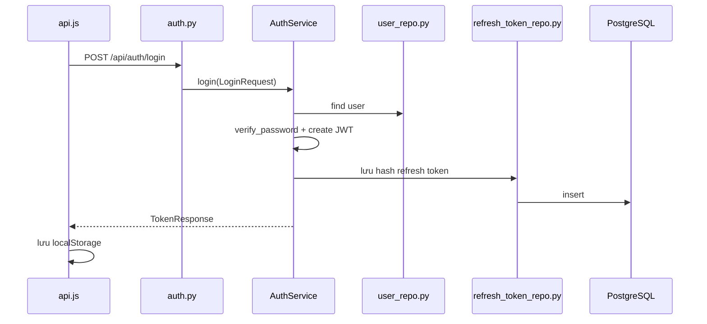
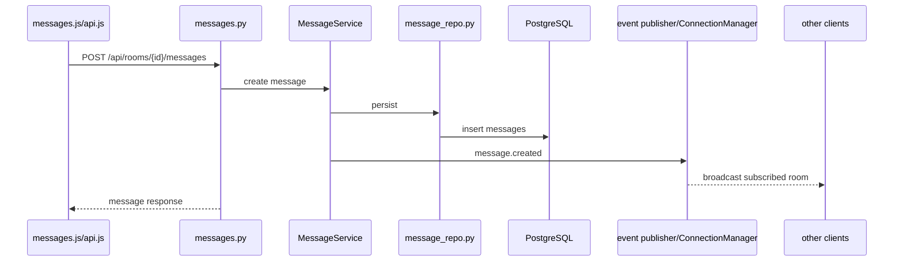

# 14. Code flow

## A. Login

## B. Send message

WebSocket không thay thế bước persistence; action `call.signal` là signaling riêng.

## C. Create room

`rooms.js -> POST /api/rooms -> rooms.py -> RoomService.create_room() -> room_repo.py -> rooms/room_members -> response + room event -> app.js cập nhật room list`. Owner được tạo cùng membership owner; private/public decision nằm trong request/schema/service.

## D. Upload file

`messages.js/profile.js/rooms.js -> multipart API -> router -> service -> LocalFileStorage.save() -> metadata/attachment repository hoặc avatar field -> uploads volume -> response`. Attachment download đi qua `GET /api/attachments/{attachment_id}` và kiểm tra quyền room.

## E. Call

`call.js -> POST /api/calls hoặc /api/calls/group -> CallService -> call_repo.py -> calls/call_participants -> call event qua ConnectionManager`. Sau đó `call.js` gửi `call.signal` (offer/answer/ice) qua `/ws`; backend relay signal, còn media chạy browser-to-browser WebRTC mesh.

## Traceability map

| Use case | Entry points | Core implementation |
| --- | --- | --- |
| Login/refresh | `frontend/js/api.js`, `auth.py` | `auth_service.py`, `jwt.py`, `password.py`, token repositories |
| Room/member | `frontend/js/rooms.js` | `rooms.py`, `room_service.py`, `room_repo.py` |
| Message | `frontend/js/messages.js` | `messages.py`, `message_service.py`, `message_repo.py` |
| Realtime | `frontend/js/ws.js` | `ws.py`, `connection_manager.py`, event publisher |
| Profile | `frontend/js/profile.js` | `users.py`, `user_service.py`, `user_repo.py` |
| Call | `frontend/js/call.js` | `calls.py`, `call_service.py`, `call_repo.py` |
| Files | `frontend/js/api.js` and feature modules | `file_storage.py`, `local_storage.py`, attachment/avatar routes |
