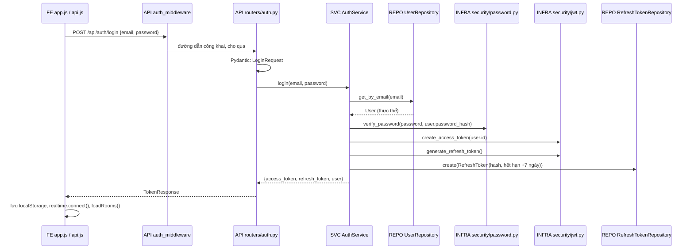
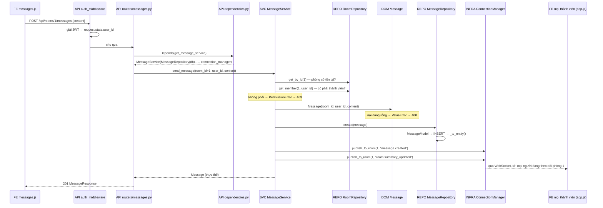
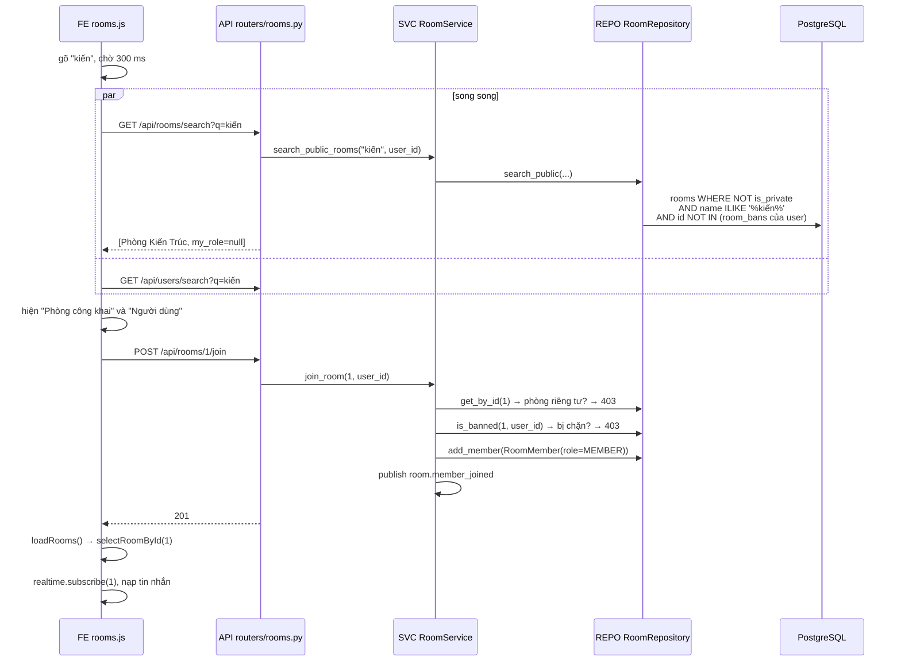
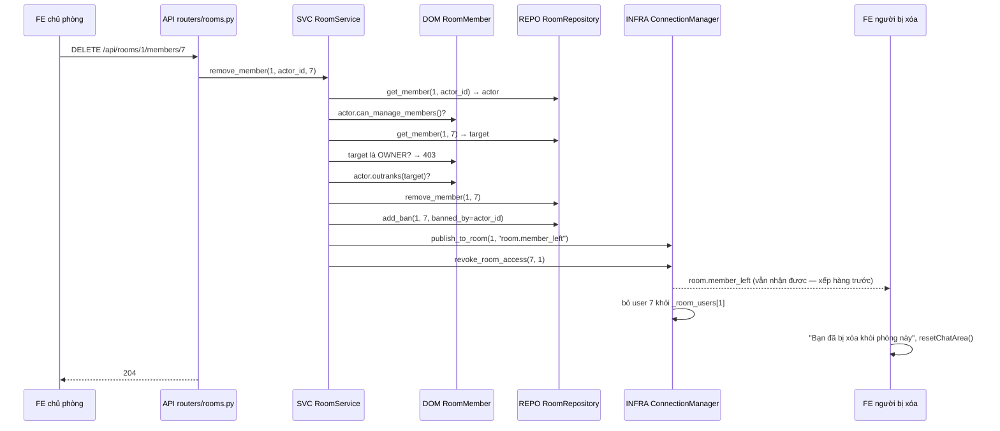
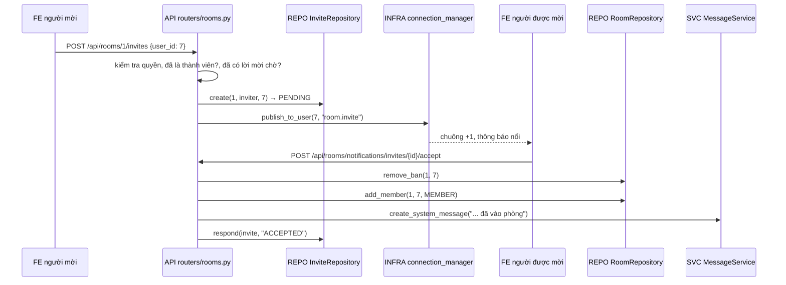
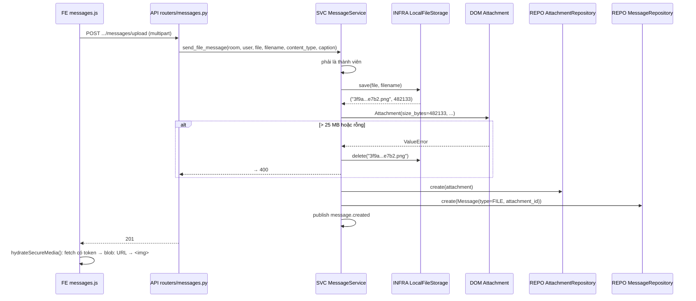
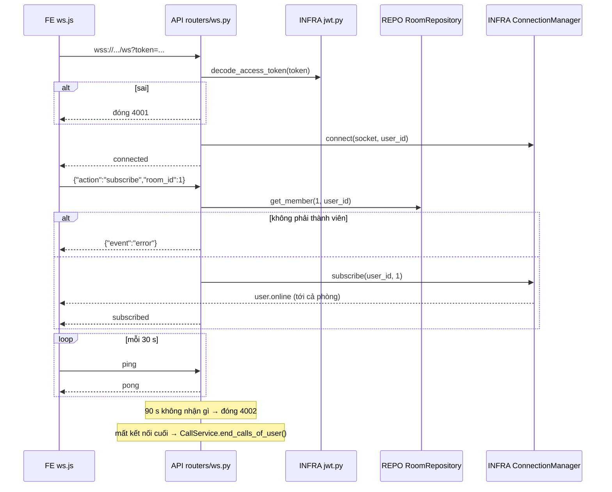
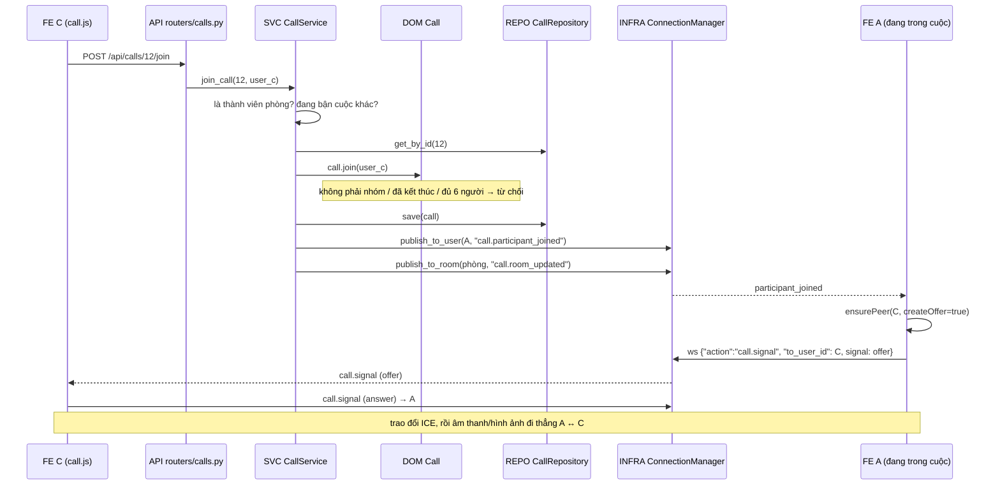

# 14. Luồng hoạt động

Mỗi luồng được vẽ **qua đủ các tầng**, với tên file và hàm thật, để có thể mở code ra đọc theo.
Cách các tầng nối với nhau về nguyên tắc: [02](02-architecture.md).

Ký hiệu tầng trong sơ đồ:

| Tiền tố | Tầng | Thư mục |
|---|---|---|
| **FE** | Frontend | `frontend/js/` |
| **API** | Giao tiếp | `backend/app/api/` |
| **SVC** | Ứng dụng | `backend/app/services/` |
| **DOM** | Nghiệp vụ lõi | `backend/app/domain/models/` |
| **REPO / INFRA** | Hạ tầng | `backend/app/repositories/`, `backend/app/infra/` |

---

## 1. Đăng nhập

```mermaid
sequenceDiagram
    participant FE as FE app.js / api.js
    participant MW as API auth_middleware
    participant R as API routers/auth.py
    participant S as SVC AuthService
    participant U as REPO UserRepository
    participant PW as INFRA security/password.py
    participant JWT as INFRA security/jwt.py
    participant RT as REPO RefreshTokenRepository
    FE->>MW: POST /api/auth/login {email, password}
    MW->>R: đường dẫn công khai, cho qua
    R->>R: Pydantic: LoginRequest
    R->>S: login(email, password)
    S->>U: get_by_email(email)
    U-->>S: User (thực thể)
    S->>PW: verify_password(password, user.password_hash)
    S->>JWT: create_access_token(user.id)
    S->>JWT: generate_refresh_token()
    S->>RT: create(RefreshToken(hash, hết hạn +7 ngày))
    S-->>R: {access_token, refresh_token, user}
    R-->>FE: TokenResponse
    FE->>FE: lưu localStorage, realtime.connect(), loadRooms()
```

Chỗ đáng chú ý: router không biết gì về bcrypt hay JWT; service không biết gì về HTTP. Sai mật
khẩu thì service ném `ValueError`, router dịch thành `401`.

---

## 2. Gửi tin nhắn

Luồng tiêu biểu nhất — đi qua cả bốn tầng và cả hai kênh REST lẫn WebSocket.

```mermaid
sequenceDiagram
    participant FE as FE messages.js
    participant MW as API auth_middleware
    participant R as API routers/messages.py
    participant D as API dependencies.py
    participant S as SVC MessageService
    participant RR as REPO RoomRepository
    participant E as DOM Message
    participant MR as REPO MessageRepository
    participant CM as INFRA ConnectionManager
    participant ALL as FE mọi thành viên (app.js)
    FE->>MW: POST /api/rooms/1/messages {content}
    MW->>MW: giải JWT → request.state.user_id
    MW->>R: cho qua
    R->>D: Depends(get_message_service)
    D-->>R: MessageService(MessageRepository(db), ..., connection_manager)
    R->>S: send_message(room_id=1, user_id, content)
    S->>RR: get_by_id(1) — phòng có tồn tại?
    S->>RR: get_member(1, user_id) — có phải thành viên?
    Note over S: không phải → PermissionError → 403
    S->>E: Message(room_id, user_id, content)
    Note over E: nội dung rỗng → ValueError → 400
    S->>MR: create(message)
    MR->>MR: MessageModel → INSERT → _to_entity()
    S->>CM: publish_to_room(1, "message.created")
    S->>CM: publish_to_room(1, "room.summary_updated")
    CM-->>ALL: qua WebSocket, tới mọi người đang theo dõi phòng 1
    S-->>R: Message (thực thể)
    R-->>FE: 201 MessageResponse
```

Người gửi nhận tin của chính mình **hai lần**: một lần trong phản hồi `201`, một lần qua
`message.created`. Frontend bỏ bản trùng theo `id`.

`publish_to_room` được gọi từ code đồng bộ trong threadpool; `ConnectionManager` dùng
`run_coroutine_threadsafe` đẩy việc gửi sang event loop chính.

---

## 3. Tìm và tham gia phòng công khai

```mermaid
sequenceDiagram
    participant FE as FE rooms.js
    participant R as API routers/rooms.py
    participant S as SVC RoomService
    participant RR as REPO RoomRepository
    participant DB as PostgreSQL
    FE->>FE: gõ "kiến", chờ 300 ms
    par song song
        FE->>R: GET /api/rooms/search?q=kiến
        R->>S: search_public_rooms("kiến", user_id)
        S->>RR: search_public(...)
        RR->>DB: rooms WHERE NOT is_private<br/>AND name ILIKE '%kiến%'<br/>AND id NOT IN (room_bans của user)
        R-->>FE: [Phòng Kiến Trúc, my_role=null]
    and
        FE->>R: GET /api/users/search?q=kiến
    end
    FE->>FE: hiện "Phòng công khai" và "Người dùng"
    FE->>R: POST /api/rooms/1/join
    R->>S: join_room(1, user_id)
    S->>RR: get_by_id(1) → phòng riêng tư? → 403
    S->>RR: is_banned(1, user_id) → bị chặn? → 403
    S->>RR: add_member(RoomMember(role=MEMBER))
    S->>S: publish room.member_joined
    R-->>FE: 201
    FE->>FE: loadRooms() → selectRoomById(1)
    FE->>FE: realtime.subscribe(1), nạp tin nhắn
```

---

## 4. Xóa thành viên (và chặn)

```mermaid
sequenceDiagram
    participant FA as FE chủ phòng
    participant R as API routers/rooms.py
    participant S as SVC RoomService
    participant M as DOM RoomMember
    participant RR as REPO RoomRepository
    participant CM as INFRA ConnectionManager
    participant FB as FE người bị xóa
    FA->>R: DELETE /api/rooms/1/members/7
    R->>S: remove_member(1, actor_id, 7)
    S->>RR: get_member(1, actor_id) → actor
    S->>M: actor.can_manage_members()?
    S->>RR: get_member(1, 7) → target
    S->>M: target là OWNER? → 403
    S->>M: actor.outranks(target)?
    S->>RR: remove_member(1, 7)
    S->>RR: add_ban(1, 7, banned_by=actor_id)
    S->>CM: publish_to_room(1, "room.member_left")
    S->>CM: revoke_room_access(7, 1)
    CM-->>FB: room.member_left (vẫn nhận được — xếp hàng trước)
    CM->>CM: bỏ user 7 khỏi _room_users[1]
    FB->>FB: "Bạn đã bị xóa khỏi phòng này", resetChatArea()
    R-->>FA: 204
```

Thứ tự hai lệnh cuối quan trọng: phát `member_left` **trước** rồi mới thu hồi, nên người bị xóa
còn kịp biết để đóng phòng. Hai coroutine vào event loop theo thứ tự xếp hàng.

Quyền kiểm tra ở hai nơi khác nhau: "có quyền quản lý thành viên không" và "ai cao hơn ai" là
câu hỏi gửi cho **thực thể** `RoomMember`; còn "người bị xóa không được vào lại" là việc của
**service**, vì nó cần ghi vào một bảng khác.

---

## 5. Lời mời

```mermaid
sequenceDiagram
    participant FA as FE người mời
    participant R as API routers/rooms.py
    participant IR as REPO InviteRepository
    participant CM as INFRA connection_manager
    participant FB as FE người được mời
    participant RR as REPO RoomRepository
    participant MS as SVC MessageService
    FA->>R: POST /api/rooms/1/invites {user_id: 7}
    R->>R: kiểm tra quyền, đã là thành viên?, đã có lời mời chờ?
    R->>IR: create(1, inviter, 7) → PENDING
    R->>CM: publish_to_user(7, "room.invite")
    CM-->>FB: chuông +1, thông báo nổi
    FB->>R: POST /api/rooms/notifications/invites/{id}/accept
    R->>RR: remove_ban(1, 7)
    R->>RR: add_member(1, 7, MEMBER)
    R->>MS: create_system_message("... đã vào phòng")
    R->>IR: respond(invite, "ACCEPTED")
```

⚠️ Luồng này **không có tầng service** — mọi kiểm tra nằm trong router, router gọi thẳng
repository và `connection_manager`. Đây là nợ kỹ thuật #1 ở
[02](02-architecture.md#nợ-kỹ-thuật). So với luồng 4 sẽ thấy khác biệt: không có thực thể nào
được hỏi ý kiến.

---

## 6. Gửi tệp

```mermaid
sequenceDiagram
    participant FE as FE messages.js
    participant R as API routers/messages.py
    participant S as SVC MessageService
    participant FS as INFRA LocalFileStorage
    participant A as DOM Attachment
    participant AR as REPO AttachmentRepository
    participant MR as REPO MessageRepository
    FE->>R: POST .../messages/upload (multipart)
    R->>S: send_file_message(room, user, file, filename, content_type, caption)
    S->>S: phải là thành viên
    S->>FS: save(file, filename)
    FS-->>S: ("3f9a...e7b2.png", 482133)
    S->>A: Attachment(size_bytes=482133, ...)
    alt > 25 MB hoặc rỗng
        A-->>S: ValueError
        S->>FS: delete("3f9a...e7b2.png")
        S-->>R: → 400
    end
    S->>AR: create(attachment)
    S->>MR: create(Message(type=FILE, attachment_id))
    S->>S: publish message.created
    R-->>FE: 201
    FE->>FE: hydrateSecureMedia(): fetch có token → blob: URL → <img>
```

---

## 7. Kết nối realtime và đăng ký phòng

```mermaid
sequenceDiagram
    participant FE as FE ws.js
    participant W as API routers/ws.py
    participant JWT as INFRA jwt.py
    participant RR as REPO RoomRepository
    participant CM as INFRA ConnectionManager
    FE->>W: wss://.../ws?token=...
    W->>JWT: decode_access_token(token)
    alt sai
        W-->>FE: đóng 4001
    end
    W->>CM: connect(socket, user_id)
    W-->>FE: connected
    FE->>W: {"action":"subscribe","room_id":1}
    W->>RR: get_member(1, user_id)
    alt không phải thành viên
        W-->>FE: {"event":"error"}
    else
        W->>CM: subscribe(user_id, 1)
        CM-->>FE: user.online (tới cả phòng)
        W-->>FE: subscribed
    end
    loop mỗi 30 s
        FE->>W: ping
        W-->>FE: pong
    end
    Note over W: 90 s không nhận gì → đóng 4002
    Note over W: mất kết nối cuối → CallService.end_calls_of_user()
```

---

## 8. Vào cuộc gọi nhóm đang diễn ra

```mermaid
sequenceDiagram
    participant C as FE C (call.js)
    participant R as API routers/calls.py
    participant S as SVC CallService
    participant E as DOM Call
    participant CR as REPO CallRepository
    participant CM as INFRA ConnectionManager
    participant A as FE A (đang trong cuộc)
    C->>R: POST /api/calls/12/join
    R->>S: join_call(12, user_c)
    S->>S: là thành viên phòng? đang bận cuộc khác?
    S->>CR: get_by_id(12)
    S->>E: call.join(user_c)
    Note over E: không phải nhóm / đã kết thúc / đủ 6 người → từ chối
    S->>CR: save(call)
    S->>CM: publish_to_user(A, "call.participant_joined")
    S->>CM: publish_to_room(phòng, "call.room_updated")
    CM-->>A: participant_joined
    A->>A: ensurePeer(C, createOffer=true)
    A->>CM: ws {"action":"call.signal", "to_user_id": C, signal: offer}
    CM-->>C: call.signal (offer)
    C->>CM: call.signal (answer) → A
    Note over A,C: trao đổi ICE, rồi âm thanh/hình ảnh đi thẳng A ↔ C
```

Toàn bộ luật "được vào không" nằm trong `Call.join()` — service chỉ nạp, gọi, lưu, phát. Âm
thanh và hình ảnh không bao giờ đi qua backend.

---

## Tóm tắt: mỗi tầng làm gì trong mọi luồng

| Tầng | Luôn làm | Không bao giờ làm |
|---|---|---|
| **FE** | Gọi REST để thay đổi; nghe WebSocket để cập nhật; escape dữ liệu trước khi hiển thị | Tự quyết định quyền — chỉ ẩn/hiện nút cho tiện |
| **API** | Kiểm tra định dạng; lấy `user_id`; gọi **một** phương thức service; dịch exception sang mã HTTP | Viết SQL; tự kiểm tra quyền *(trừ các chỗ nợ kỹ thuật)* |
| **SVC** | Kiểm tra là thành viên; hỏi thực thể; lưu qua cổng; phát sự kiện qua cổng | Import FastAPI, SQLAlchemy, WebSocket |
| **DOM** | Giữ quy tắc bất biến; từ chối trạng thái sai | Biết dữ liệu được lưu ở đâu, gửi đi đâu |
| **REPO / INFRA** | Chuyển thực thể ↔ bảng; nói chuyện với DB, đĩa, socket | Quyết định nghiệp vụ |
