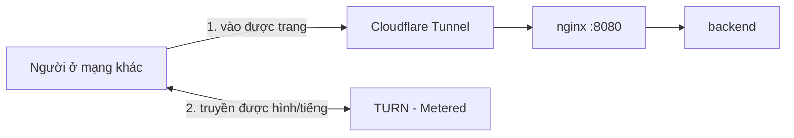

# 15. Dịch vụ bên thứ ba cho tính năng gọi

Tài liệu hướng dẫn đăng ký và chạy các dịch vụ ngoài mà tính năng gọi cần tới.

## Khi nào cần

| Tình huống | Cần gì |
| --- | --- |
| Gọi giữa hai cửa sổ trên cùng máy | Không cần gì thêm |
| Gọi giữa các thiết bị **cùng Wi-Fi** | Không cần gì thêm |
| Gọi giữa **hai mạng khác nhau** | Cloudflare Tunnel **và** TURN |

Nói cách khác, demo trong phòng học không cần dịch vụ nào. Chỉ khi muốn gọi từ nhà này sang nhà khác mới phải cấu hình.

Hai dịch vụ giải quyết hai vấn đề khác nhau, thiếu cái nào cũng không gọi được:



| Vấn đề | Giải pháp | Thiếu thì sao |
| --- | --- | --- |
| Server nằm sau NAT, người ngoài không truy cập được | **Cloudflare Tunnel** | Không mở nổi trang web |
| Router hai bên chặn kết nối trực tiếp | **TURN** | Mở được trang, chat được, nhưng gọi thì báo *"Không kết nối được tới người bên kia"* |

---

## A. TURN — Metered

TURN là máy chủ trung gian chuyển tiếp âm thanh/hình ảnh khi hai trình duyệt không nối thẳng được với nhau. Hệ thống đã cấu hình sẵn STUN của Google, đủ cho phần lớn mạng gia đình, nhưng 4G và mạng công ty/trường học thường chặn.

### A1. Đăng ký

1. Vào **metered.ca**, đăng ký tài khoản miễn phí (không cần thẻ)
2. Đặt **Metered Domain** — một tên miền con riêng, ví dụ `teamchat-ktpm`. Chỉ là định danh, nhiều dịch vụ không cho đổi về sau nên chọn tên gọn
3. Ở trang tổng quan, mục **TURN Server**, bấm **Create your first credential**
4. Trong hộp thoại: điền **Label** (ví dụ `team-chat-ktpm`) để sau này dễ quản lý, các ô còn lại để mặc định

Sau khi tạo, Metered hiện **username**, **password** và danh sách địa chỉ TURN. Có dịch vụ chỉ cho xem mật khẩu một lần, nên copy ngay.

Gói miễn phí hiện tại là **50 GB/tháng**. Lưu lượng chỉ bị tính khi cuộc gọi thực sự phải đi qua TURN; gọi trong cùng mạng không tốn gì.

### A2. Khai báo vào `.env`

Mở `.env` ở thư mục gốc dự án, sửa dòng `ICE_SERVERS`. Hai cách viết, dùng cách nào cũng được.

**Cách ngắn** — các mục cách nhau bằng dấu phẩy, TURN thêm `|username|password`:

```ini
ICE_SERVERS=stun:stun.relay.metered.ca:80,turn:global.relay.metered.ca:80|<username>|<password>
```

**Cách JSON** — khi muốn khai báo nhiều địa chỉ, tất cả phải nằm trên **một dòng**:

```ini
ICE_SERVERS=[{"urls":"stun:stun.relay.metered.ca:80"},{"urls":"turn:global.relay.metered.ca:80","username":"<username>","credential":"<password>"},{"urls":"turn:global.relay.metered.ca:443","username":"<username>","credential":"<password>"},{"urls":"turns:global.relay.metered.ca:443?transport=tcp","username":"<username>","credential":"<password>"}]
```

Nên khai nhiều địa chỉ: mạng chặn cổng 80 thì còn cổng 443, chặn UDP thì còn TCP.

> `.env` nằm trong `.gitignore` nên tài khoản TURN **không lên GitHub**. Đừng dán tài khoản thật vào `.env.example` hay bất kỳ file nào được commit.

### A3. Áp dụng và kiểm tra

```bash
docker compose up -d backend
```

> ⚠️ Phải dùng `up -d`, **không dùng** `restart`. Lệnh `restart` khởi động lại container với cấu hình cũ, không đọc lại `.env`, nên thay đổi sẽ không có tác dụng và rất khó nhận ra.

Kiểm tra máy chủ có sống và có đòi xác thực không:

```bash
docker compose exec backend python check_turn.py
```

Kết quả mong đợi:

```
turn:global.relay.metered.ca:80
   loại: TURN (chuyển tiếp) · global.relay.metered.ca:80/udp
   ✓ máy chủ TURN phản hồi và yêu cầu xác thực (đúng như mong đợi)
```

Script này chỉ xác nhận máy chủ tồn tại và phản hồi, **chưa chứng minh mật khẩu đúng**. Muốn chắc chắn, mở trang kèm tham số ép dùng TURN:

```
https://localhost/?relay=1
```

Chế độ này cấm mọi đường đi trực tiếp. Gọi thử giữa hai cửa sổ: nếu kết nối được và dòng trạng thái hiện *"Đang chuyển tiếp qua máy chủ trung gian (TURN)"* thì tài khoản TURN chính xác. Nếu sai mật khẩu, cuộc gọi sẽ không kết nối được.

Bỏ `?relay=1` khỏi địa chỉ là trở về bình thường — chế độ này không lưu lại ở đâu.

---

## B. Cloudflare Tunnel

Tunnel tạo một đường từ máy bạn ra Internet, cho người ở mạng khác truy cập được.

### B1. Cài đặt

```powershell
winget install --id Cloudflare.cloudflared
```

Cửa sổ PowerShell đang mở sẵn sẽ chưa nhận ra lệnh mới, phải đóng rồi mở lại.

Không cần đăng ký tài khoản.

### B2. Chạy

```bash
cloudflared tunnel --url http://localhost:8080
```

Nó in ra một khung chứa địa chỉ công khai:

```
+--------------------------------------------------------+
|  Your quick Tunnel has been created! Visit it at:       |
|  https://xxx-yyy-zzz.trycloudflare.com                  |
+--------------------------------------------------------+
```

Gửi địa chỉ đó cho người cần truy cập. Kèm theo là **chứng chỉ thật của Cloudflare**, nên không còn cảnh báo "Kết nối không riêng tư" như khi vào bằng IP nội bộ.

Ba điều cần nhớ:

- **Luôn copy địa chỉ từ cửa sổ đang chạy.** Mỗi lần chạy lại sinh một địa chỉ ngẫu nhiên mới, địa chỉ cũ chết ngay khi tiến trình cũ dừng
- **Giữ cửa sổ mở** suốt thời gian dùng; `Ctrl + C` để dừng
- Tắt máy là tắt hệ thống

Muốn địa chỉ cố định thì cần tài khoản Cloudflare và một tên miền.

### B3. Vì sao trỏ vào cổng 8080

`docker-compose.yml` mở ba cổng cho nginx:

| Cổng | Dùng cho |
| --- | --- |
| 443 | HTTPS cho LAN, dùng chứng chỉ tự ký |
| 80 | Chuyển hướng sang HTTPS |
| 8080 | **Dành riêng cho tunnel** — HTTP thuần, chỉ mở trên localhost |

Tunnel tự lo phần mã hóa, nên nếu trỏ vào cổng 443 thì nó sẽ vướng chứng chỉ tự ký. Cổng 8080 chỉ lắng nghe trên `127.0.0.1` nên người trong LAN không vào được bằng HTTP không mã hóa.

---

## C. TURN nội bộ bằng coturn (tùy chọn)

Dùng để **thử cơ chế relay trong LAN** mà không cần đăng ký dịch vụ nào. Không dùng được để gọi qua Internet, vì nó chạy trên máy bạn và nằm sau NAT.

Điền IP LAN thật của máy vào `.env`:

```ini
TURN_EXTERNAL_IP=192.168.1.18
TURN_USER=test
TURN_PASSWORD=test123
ICE_SERVERS=turn:192.168.1.18:3478|test|test123
```

```bash
docker compose --profile turn up -d
```

> ⚠️ **Không dùng `127.0.0.1` cho TURN.** Chromium lặng lẽ bỏ qua máy chủ TURN đặt ở địa chỉ loopback: không gửi gói tin nào, không báo lỗi gì. Đây là lỗi rất khó đoán nếu không biết trước.

Lấy IP LAN: `ipconfig` trên Windows, `hostname -I` trên Linux. Bỏ qua các dải `192.168.56.x` (card ảo VirtualBox).

---

## D. Chi phí và an toàn

**Tài khoản TURN sẽ lộ ra trình duyệt của mọi người dùng.** Đây là bản chất của WebRTC, không tránh được: trình duyệt phải biết mật khẩu mới kết nối tới TURN được, nên ai mở DevTools cũng đọc được.

Hệ quả cần lưu ý:

- Ai có địa chỉ tunnel đều dùng được hạn mức TURN của bạn
- Gói miễn phí 50 GB, vượt thì tính vào số dư nạp sẵn nếu tài khoản có bật
- Mật khẩu các tài khoản demo nằm công khai trong `seed_users.py`, nên bất kỳ ai cũng đăng nhập được vào bản chạy qua tunnel

Thực hành nên theo:

- **Tắt tunnel bằng `Ctrl + C` khi không dùng**
- Không đăng địa chỉ tunnel lên nơi công khai
- Thỉnh thoảng xem mục *Bandwidth today* trên trang Metered
- Thấy tiêu hao bất thường thì xóa credential đó và tạo cái mới
- Không nhập dữ liệu thật vào bản chạy qua tunnel

---

## E. Sự cố thường gặp

| Triệu chứng | Nguyên nhân | Cách xử lý |
| --- | --- | --- |
| Sửa `.env` rồi mà backend vẫn dùng cấu hình cũ | Dùng `docker compose restart` | Dùng `docker compose up -d backend` |
| `check_turn.py` báo *"địa chỉ loopback"* | Khai TURN là `127.0.0.1` | Đổi sang IP LAN thật |
| Trình duyệt không gửi gì tới TURN, không báo lỗi | Chromium bỏ qua TURN ở loopback | Như trên |
| Vào địa chỉ tunnel báo không tìm thấy trang | Địa chỉ của phiên tunnel đã dừng | Copy lại địa chỉ từ cửa sổ đang chạy |
| Cuộc gọi báo *"Không kết nối được tới người bên kia"* | Chưa cấu hình TURN, hoặc sai mật khẩu | Kiểm tra bằng `?relay=1` |
| `?relay=1` mà không kết nối được | TURN sai mật khẩu hoặc hết hạn mức | Tạo credential mới trên Metered |
| Dùng TURN công khai miễn phí trên mạng mà không chạy | Nhiều dịch vụ loại này đã ngừng hoạt động | Tự đăng ký tài khoản riêng |
| Cuộc gọi vẫn hiện *"Kết nối trực tiếp"* dù đã cấu hình TURN | Bình thường — hai máy nối thẳng được nên không cần TURN | Dùng `?relay=1` nếu muốn thấy TURN hoạt động |

---

## F. Checklist trước khi demo gọi qua Internet

- [ ] `docker compose ps` — ba service `Up`, `db` là `healthy`
- [ ] `docker compose exec backend python check_turn.py` — các máy chủ TURN đều ✓
- [ ] Mở `https://localhost/?relay=1`, gọi thử, thấy dòng *"Đang chuyển tiếp qua máy chủ trung gian"*
- [ ] `cloudflared tunnel --url http://localhost:8080` đang chạy, đã copy địa chỉ mới nhất
- [ ] Người ở mạng khác mở được địa chỉ đó và đăng nhập được
- [ ] Gọi thử thật giữa hai mạng, kiểm tra nghe và thấy hình

## Tham khảo

- Cấu hình: [`backend/app/config.py`](../backend/app/config.py) — cách `ICE_SERVERS` được đọc
- Kiểm tra: [`backend/check_turn.py`](../backend/check_turn.py)
- Hạ tầng: [`docker-compose.yml`](../docker-compose.yml), [`deploy/nginx/nginx.conf`](../deploy/nginx/nginx.conf)
- Hướng dẫn vận hành chung: [`RUN_GUIDE.md`](../RUN_GUIDE.md) mục 5B
- Chi tiết tính năng gọi: [10 - Call features](10-call-features.md)
