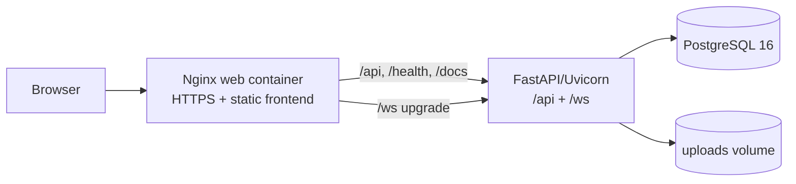

# Team Chat - Tài liệu kỹ thuật

Bộ tài liệu này mô tả implementation hiện tại của hệ thống Team Chat. Nguồn kiểm chứng là source code trong `backend/`, `frontend/`, `deploy/`, `docker-compose.yml` và các tài liệu gốc ở root.

## Hệ thống là gì?

Team Chat là ứng dụng chat nội bộ theo phòng, hỗ trợ tài khoản, phân quyền thành viên, tin nhắn văn bản/file, reaction, pin, trạng thái online/typing và cuộc gọi WebRTC. Backend lưu dữ liệu trong PostgreSQL, file trong filesystem/volume, còn các cập nhật tức thời đi qua WebSocket.

## Sơ đồ tổng thể

`docker-compose.yml` định nghĩa ba service: `db`, `backend`, `web`. Không có Redis, message broker, migration runner hoặc media server trong repository.

## Mục lục

| Tài liệu | Nội dung |
| --- | --- |
| [01 - Tổng quan hệ thống](01-system-overview.md) | Context, thành phần, giao tiếp, request flow |
| [02 - Kiến trúc](02-architecture.md) | Layer, dependency, pattern và ranh giới thực tế |
| [03 - Backend](03-backend.md) | FastAPI, cấu trúc module và dependency wiring |
| [04 - Frontend](04-frontend.md) | HTML/CSS/JavaScript và quan hệ module |
| [05 - Database](05-database.md) | ORM models, khóa và cardinality |
| [06 - Authentication](06-authentication-authorization.md) | Register/login/JWT/refresh/middleware/quyền |
| [07 - REST API](07-rest-api.md) | Danh mục endpoint theo router |
| [08 - WebSocket](08-websocket-realtime.md) | Protocol, presence, event và signaling |
| [09 - Chat features](09-chat-features.md) | Room, message, reaction, pin, presence |
| [10 - Call features](10-call-features.md) | Lifecycle và WebRTC signaling |
| [11 - File storage](11-file-storage.md) | Upload, avatar, attachment và volume |
| [12 - Deployment](12-deployment.md) | Compose, Dockerfile, Nginx, certificate |
| [13 - Security](13-security.md) | Cơ chế hiện có và rủi ro cần lưu ý |
| [14 - Code flow](14-code-flow.md) | Luồng login, message, room, upload, call |

## Traceability nhanh

- Authentication: `frontend/js/api.js` -> `backend/app/api/routers/auth.py` -> `backend/app/services/auth_service.py` -> `backend/app/infra/security/{jwt,password}.py` -> `backend/repositories/{user,refresh_token}_repo.py`.
- Room: `frontend/js/rooms.js` -> `backend/app/api/routers/rooms.py` -> `backend/app/services/room_service.py` -> `backend/repositories/room_repo.py`.
- Message: `frontend/js/messages.js`/`ws.js` -> `backend/app/api/routers/messages.py` hoặc `ws.py` -> `message_service.py` -> `message_repo.py` -> `messages` và related tables.
- Call: `frontend/js/call.js` -> `calls.py`/`ws.py` -> `call_service.py` -> `call_repo.py` -> `calls`/`call_participants`.

## Ghi chú độ chính xác

`README.md` root có một số mô tả cũ, như frontend chạy riêng ở port 3000 và Compose chỉ có hai service. Tài liệu này ưu tiên `docker-compose.yml`, `deploy/nginx/` và code runtime. Không có migration framework hoặc automated test suite được tìm thấy trong repository.
