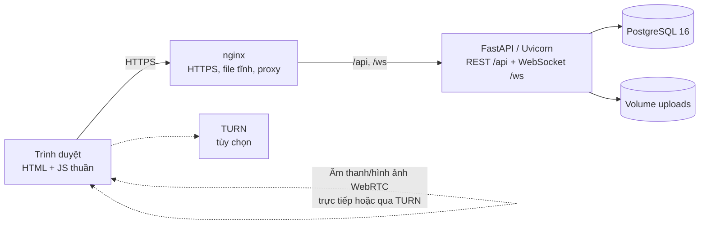

# Team Chat — Tài liệu kỹ thuật

Bộ tài liệu mô tả hệ thống **đúng như code hiện tại**. Mọi khẳng định đều có thể lần
ngược về file nguồn được nhắc tên. Khi tài liệu và code mâu thuẫn, code là đúng — hãy
sửa tài liệu.

## Hệ thống là gì

Team Chat là ứng dụng trò chuyện nội bộ theo phòng: tài khoản (mật khẩu hoặc Google),
phòng công khai/riêng tư, phân quyền ba cấp, tin nhắn văn bản và tệp, biểu cảm, ghim,
biệt danh, lời mời, cập nhật thời gian thực qua WebSocket, và gọi thoại/video WebRTC
(1-1 và nhóm tối đa 6 người).

```mermaid
flowchart LR
    B[Trình duyệt<br/>HTML + JS thuần]
    N[nginx<br/>HTTPS, file tĩnh, proxy]
    A[FastAPI / Uvicorn<br/>REST /api + WebSocket /ws]
    D[(PostgreSQL 16)]
    F[(Volume uploads)]
    T[TURN<br/>tùy chọn]
    B -->|HTTPS| N
    N -->|/api, /ws| A
    A --> D
    A --> F
    B <-.->|Âm thanh/hình ảnh WebRTC<br/>trực tiếp hoặc qua TURN| B
    B -.-> T
```

## Nên đọc theo thứ tự nào

| Bạn muốn | Đọc |
|---|---|
| Hiểu hệ thống trong 10 phút | [01](01-system-overview.md) → [02](02-architecture.md) |
| Hiểu các tầng nối với nhau thế nào | [02](02-architecture.md) → [14](14-code-flow.md) |
| Thêm một tính năng backend | [02](02-architecture.md) → [03](03-backend.md) → [05](05-database.md) |
| Làm frontend | [04](04-frontend.md) → [07](07-rest-api.md) → [08](08-websocket-realtime.md) |
| Chuẩn bị vấn đáp kiến trúc | [02](02-architecture.md) → [05](05-database.md) → [13](13-security.md) |
| Chạy và demo | [`RUN_GUIDE.md`](../RUN_GUIDE.md) → [12](12-deployment.md) → [15](15-third-party-services.md) |

## Mục lục

| # | Tài liệu | Nội dung |
|---|---|---|
| 01 | [Tổng quan hệ thống](01-system-overview.md) | Thành phần, công nghệ, phạm vi tính năng |
| 02 | [Kiến trúc](02-architecture.md) | 4 tầng, quy tắc phụ thuộc, cổng và bộ chuyển đổi, nợ kỹ thuật |
| 03 | [Backend](03-backend.md) | Cấu trúc thư mục, khởi động, vòng đời request, xử lý lỗi |
| 04 | [Frontend](04-frontend.md) | Các module JS, trạng thái, cách nhận sự kiện |
| 05 | [Thực thể và database](05-database.md) | Thực thể domain, bảng, ánh xạ giữa hai bên, sơ đồ ER |
| 06 | [Xác thực và phân quyền](06-authentication-authorization.md) | Mật khẩu, Google, JWT, refresh token, ma trận quyền |
| 07 | [REST API](07-rest-api.md) | Toàn bộ 52 endpoint |
| 08 | [WebSocket và realtime](08-websocket-realtime.md) | Giao thức, hành động, sự kiện, ai phát ai nhận |
| 09 | [Tính năng chat](09-chat-features.md) | Phòng, thành viên, chặn, lời mời, tin nhắn, biểu cảm, ghim |
| 10 | [Tính năng gọi](10-call-features.md) | Máy trạng thái cuộc gọi, mesh, signaling |
| 11 | [Lưu trữ tệp](11-file-storage.md) | Tệp đính kèm, ảnh đại diện, volume |
| 12 | [Triển khai](12-deployment.md) | Docker Compose, nginx, chứng chỉ, biến môi trường |
| 13 | [Bảo mật](13-security.md) | Cơ chế đã có và rủi ro còn lại |
| 14 | [Luồng hoạt động](14-code-flow.md) | Sơ đồ tuần tự đi qua từng tầng cho các luồng chính |
| 15 | [Dịch vụ bên thứ ba](15-third-party-services.md) | Đăng ký TURN (Metered), Cloudflare Tunnel |
| 16 | [Gọi xuyên mạng](16-goi-xuyen-mang-lam-may-chu.md) | Dùng máy cá nhân làm máy chủ cho người ở mạng khác |

## Lần ngược nhanh một tính năng

| Tính năng | Frontend | API | Service | Repository | Bảng |
|---|---|---|---|---|---|
| Đăng nhập | `api.js`, `app.js` | `routers/auth.py` | `AuthService` | `UserRepository`, `RefreshTokenRepository` | `users`, `refresh_tokens` |
| Phòng | `rooms.js` | `routers/rooms.py` | `RoomService` | `RoomRepository` | `rooms`, `room_members`, `room_bans` |
| Lời mời | `app.js`, `rooms.js` | `routers/rooms.py` | *(không có — xem [02](02-architecture.md#nợ-kỹ-thuật))* | `InviteRepository` | `room_invites` |
| Tin nhắn | `messages.js` | `routers/messages.py` | `MessageService` | `MessageRepository` | `messages`, `attachments`, `reactions` |
| Cuộc gọi | `call.js` | `routers/calls.py`, `ws.py` | `CallService` | `CallRepository` | `calls`, `call_participants` |
| Realtime | `ws.js`, `app.js` | `routers/ws.py` | qua cổng `IEventPublisher` | — | *(trong bộ nhớ)* |

## Những gì hệ thống KHÔNG có

Ghi rõ để không ai mô tả nhầm thành tính năng hiện có:

- Không có framework migration (Alembic). `main.py` chạy vài câu `ALTER TABLE` thủ công khi khởi động.
- Không có bộ kiểm thử tự động trong repository.
- Không có Redis hay message broker. Trạng thái kết nối realtime nằm trong bộ nhớ một tiến trình.
- Không có máy chủ media (SFU/MCU). Âm thanh/hình ảnh cuộc gọi không đi qua backend.
- Không có giao diện xem lịch sử cuộc gọi, dù API `GET /api/calls` có trả về.
